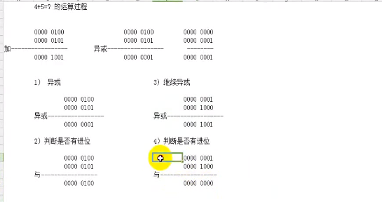
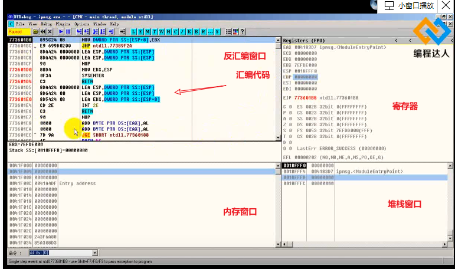
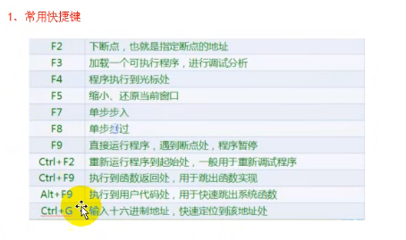
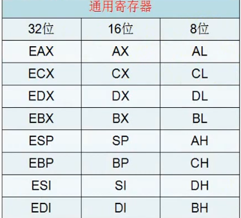

计算机加法实现过程



​	DTDbug工具
[使用教程](https://www.bcdaren.com/377636290935656448/video_content.html)





cpu>内存>硬盘

16位寄存器相当于32位寄存器用了一半



#### C语言简易程序

```
void Attack(){
    printf("*******attack*******");
	getchar();	
}
int main()
{
    printf("进行攻击")；
    getchar();
    while(1){
        Attack();
        sleep(3000);
    }
    getchar();
    return 0;
}
```

#### mov指令

```
mov edx ,eax       
```

 