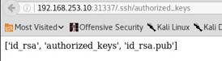

```
ctf工具网站
http://www.ctftools.com/down/
```


题目分类

```
web,PPC,crypto,pwn,REVERSE,STEGA,MISC
```

```
CRYPTO 密码学，加解密技术
pwn 攻破，取得权限，多为数据溢出类题目
ERVERSE 逆向工程，软件逆向破解技术
STEGA 隐写术
MISC 安全杂项 ，题目涉及流量分析，电子取证，数据分析
```

#### 获取Flag

##### linux中

```
&find / -name "flag.txt"
cat flag.txt
```


#### 敏感目录

```
robots.txt
.ssh
```




### flag

```
	  对应密文
flag  ZmxhZ3  #Base64加密

```

### gif隐写术

```
convert 1.gif 02d%.png #分离图片
binwalk 2.gif  #分析文件
binwalk -e  2.gif  #分离图片
foremost -T 2.gif #foremost分离

```


杂项
rar


