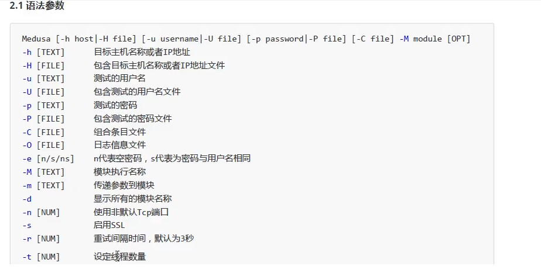

```
apt-get install terminator 安装新软件
apt-get install shellter 安装shellter
apt-get -f install #修复顺坏的软件包
```


#### kali主题

```
#在终端中输入以下命令切换主题
kali-undercover    #类似window10的一个主题
#这个命令诗歌伪装命令，只能在默认和win10间切换
```


```
find / -perm -4000 2 >dev/null #扫描具有root权限的文件
```

[ssh认证

[临时邮箱：protonmail.com
totanato加密邮箱](D:\Vs Workstation\note\网络安全\身份认证与加密)

### 信息收集

https://ip.tool.chinaz.com/ 站长查询

##### shodan搜索

```
FTP ANON SUCCESSFUL #FTP匿名登录
ssh default password#默认密码
net 110.180.14.0/24# 一个网段

```


##### google语法

```
site:    #指定网站
filetype: #指定文件类型
intile
inurl:
```


#### 步骤

```bash
#1.端口扫描
namp nikto
namp -sV ip 版本探测
#2.目录扫描
dirb
#漏洞扫描
#获取shell
#提权
#木马安装
#控制
```


#### 安装

```
账户名;slime
```

##### 1.安装与遇见的问题

###### 1.0 kali中文乱码

[中文乱码解决参考](https://itzhai.cn/jianzhanxiangguan/795.html)


```
local -a查看支持的字符集
dpkg-reconfigure locales #图像化配置
标记说明：空格是选择，Tab 是切换，*是选中
选中 en_US.UTF-8 和 zh_CN.UTF-8，确定后，将 en_US.UTF-8 选为默认
按空格键选中 zh_CN.UTF-8

安装中文字体：在终端中输入以下命令
 apt-get install xfonts-intl-chinese
 
apt-get install ttf-wqy-microhei
```

###### 1.1下载不了东西

```
vim /etc/apt/sources.list
修改源

    deb http://mirrors.aliyun.com/kali kali-rolling main non-free contrib
```

###### 1.2vm安装出现问题


这是因为没有用root执行

```
sudo ./vmware-install.pl
```

```
安装apt-get install fcitx-googlepinyin
安装了一堆东西
```

###### 1.3 输入法配置

下载sogou for linux

```
sudp dpkg -i xx.deb 
apt-get -f install # 可以解决出现的问题 修复损坏的包

img-config # 选择不同的输入法框架
dpkg-l|grep “sougou”  查看是否安装成功
```

###### 1.4docker安装

```
apt-get install docker
apt-get install docker.io
system docker start
system enable docker  #开机自启
```

```
最后的最后，因为国内网速问题，下载镜像比较慢所以可以使用国内大厂提供的加速器，我这里使用的是阿里云提供的加速器，使用镜像加速必须得改一下docker的配置文件 /etc/docker/daemon.json

sudo vim /etc/docker/daemon.json
在里面加入镜像加速器地址。。
{
  "registry-mirrors": ["https://vii0v3oj.mirror.aliyuncs.com"]
}
```

#### dirb 目录扫描工具

dirb是一个类似windows下御剑这些目录扫描工具

格式：dirb <url_base> [<wordlist_file(s)>] [options]

-a 设置user-agent

-p <proxy[:port]>设置代理

-c 设置cookie

-z 添加毫秒延迟，避免洪水攻击

-o 输出结果

-X 在每个字典的后面添加一个后缀

-H 添加请求头

-i 不区分大小写搜索


```bash
dirb 目标 字典路径 -a "ua"  -c "cookie"
dirb http://192.168.1.116 /usr/share/wordlists/dirb/big.txt 
dirb 目标 #使用默认扫描
#usr/share/wordlist/dirb目录下有常用的字典也可以自己写

```

```bash
#使用代理和输出结果
 dirb 目标 字典路径 -p ip:port -o result.txt
dirb 目标 字典路径 -p ip:port -o result.txt
#设置毫秒延迟
#如果目标存在一些安全程序爬扫描太快被屏蔽的话可以设置-z参数单位是毫秒
dirb 目标 字典路径 -z 1000 (1秒)
```

```

```


#### nikto 网站扫描

#### nmap端口扫描

```
nmap  -e  ppp0  -v  -n  -T4  -Pn  --unprivileged  192.168.1.1
-e <iface>: Use specified interface //使用指定的网卡 
--unprivileged: Assume the user lacks raw socket privileges //假设用户缺少原始套接字权限

```

```
#指定网卡
nmap -e 网卡 IP地址
#指定源 IP 地址
nmap -S 源IP地址 IP地址
#漏洞扫描
nmap --script=vuln ip


#伪装 MAC 地址
nmap --spoof-mac 伪造MAC IP地址

你可以通过指定供应商的名字来伪装 MAC 地址。可选的名字有 Dell、Apple、3Com。当然也可以手动指定 MAC 地址的值。或者为了简单起见，可以在上面 “伪造IP” 的地方填写数字 0，这将生成一个随机的 MAC 地址。
```

#### 	OpenVAS 漏扫

kali默认没带

```
apt-get update
apt-get dist-upgrade  #kali升级

apt-get install openvas 
openvas-setup

openvasmd --user=admin --new-password=password
vim /lib/systemd/system/greenbone-se
```


#### hydra暴力破解


```
-l #login 用户
-L #LOgin 指定一个账号字典 后面跟文件 
-P password.txt #-P 密码
-M targets.txt #machine 主机 后面跟字典
-o file.txt #保存结果输出到一个文件中
```


```
hydra -L userlist.txt -P passlist.txt -M hostlist ssh -O
```

##### Medusa 暴力破解



```
Medusa -M 模块执行名称
Medusa -t 设定线程数量
-s 启用 ssl
-P 密码文件
-U 用户文件
-H IP地址文件按
-h 目标主机ip

```


#### binwalk 固件分析

#### cupp字典生成


#### 常见的user-agent

```

User-Agent:的值
 
1) Chrome(谷歌)
Win7:
Mozilla/5.0 (Windows NT 6.1; WOW64) AppleWebKit/535.1 (KHTML, like Gecko) Chrome/14.0.835.163 Safari/535.1
Win10:
Mozilla/5.0 (Windows NT 10.0; Win64; x64) AppleWebKit/537.36 (KHTML, like Gecko) Chrome/73.0.3683.103 Safari/537.36
Chrome 17.0 – MAC
Mozilla/5.0 (Macintosh; Intel Mac OS X 10_7_0) AppleWebKit/535.11 (KHTML, like Gecko) Chrome/17.0.963.56 Safari/535.11 
 
 
2) Firefox(火狐)
Win7:
Mozilla/5.0 (Windows NT 6.1; WOW64; rv:6.0) Gecko/20100101 Firefox/6.0
Firefox 4.0.1 – MAC
Mozilla/5.0 (Macintosh; Intel Mac OS X 10.6; rv:2.0.1) Gecko/20100101 Firefox/4.0.1
 
 
3) Safari(Safari是苹果计算机的操作系统Mac OS中的浏览器)
safari 5.1 – MAC
Mozilla/5.0 (Macintosh; U; Intel Mac OS X 10_6_8; en-us) AppleWebKit/534.50 (KHTML, like Gecko) Version/5.1 Safari/534.50
safari 5.1 – Windows
Mozilla/5.0 (Windows; U; Windows NT 6.1; en-us) AppleWebKit/534.50 (KHTML, like Gecko) Version/5.1 Safari/534.50
 
 
4) Opera(欧朋浏览器可以在Windows、Mac和Linux三个操作系统平台上运行)
Opera 11.11 

```


#### python命令语句

```
python -c "print('hello');print('world')"
count = 0;while (count < 9):print 'The count is:',count;count = count + 1
```

