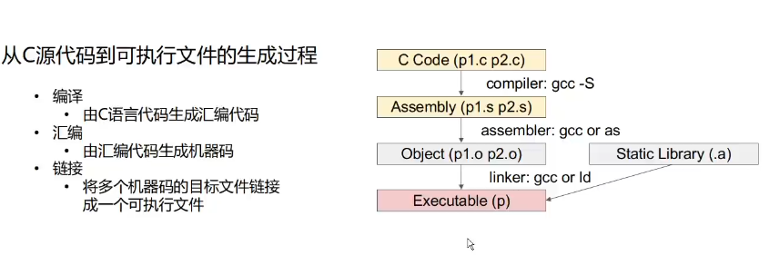
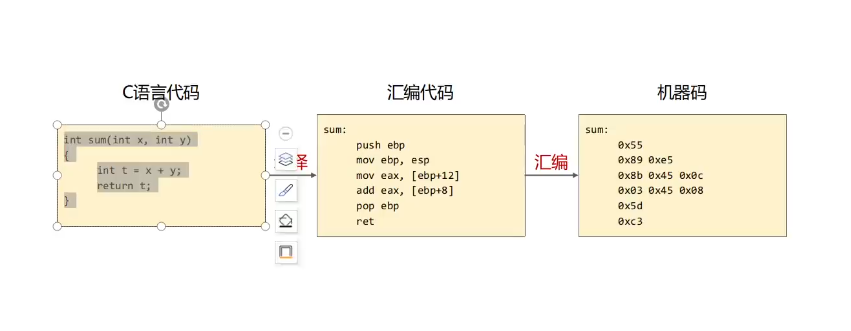
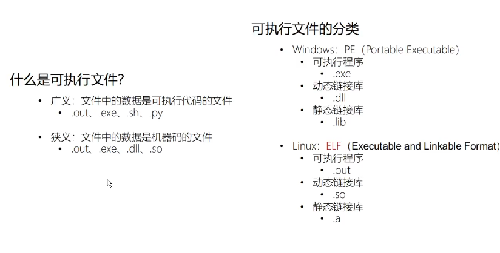
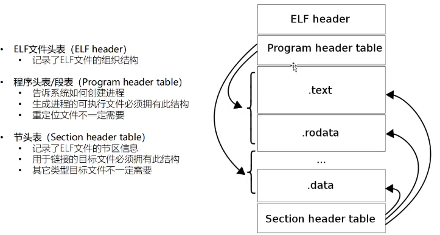
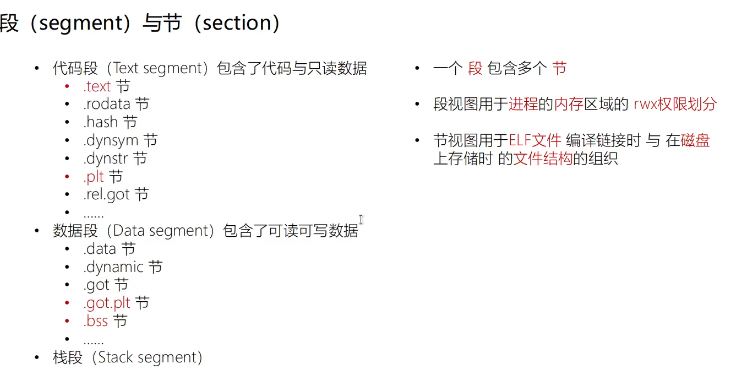
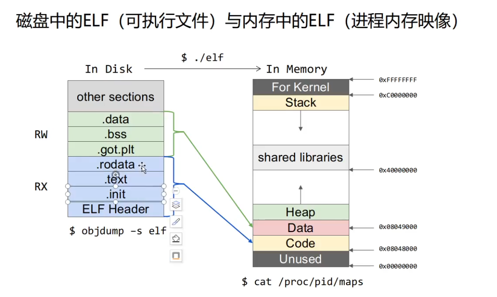

```
学习指南
https://cloud.tencent.com/developer/article/1584897?from=information.detail.python%20pwn
看雪
合天网络安全实验室
```

```
入门文章
https://www.anquanke.com/post/id/85138
```

```
入门靶场
http://pwnable.kr/play.php
							攻防世界
https://ctf.show/challenges 
bugku

```

#### 工具

* pwntools

* pwndbg

* IDA

* checksec

* ROPgadget

* one_gadget  

  ```
  sudo apt install ruby
  gem install one_gadget
  ```

* libcsearch

  ```
  #github上直接搜索
  #libc.blukat.me 网站可以直接找
  #可能没有效果
  github.com/IZAY01/py_main_areana_offset
  ```

  

```bash
apt-get install nasm gdb gcc binutils hexedit
```

```
checksec

```







#### ELF

elf为linux下的可执行文件格式


ELF header记录了文件整体信息


段与节
段视图是内存中权限划分

节是磁盘中功能划分的区域

```
#code里记录是机械嘛，权限相同，功能差不同
.TEXT #用户的代码
.PLT #动态链接的
#data里记录是数据
不能执行
```



```
不同的节可能同属一个段
段是在内存中启作用的
```



```
.init #节 程序初始化工作
.text #自己实现的内容
.bss  # 保存的是全局偏移量的地址
.data #数据
.dynamic #动态链接需要的数据结构
```



#### 安装

##### pwntools

```
sudo apt-get install libffi-dev
sudo apt-get install libssl-dev
sudo apt-get install python
sudo apt-get install python-pip
pip install pwntools
```


```
import pwn
pwn.asm("xor eax,eax")
返回'1\xc0'
则成功
```

##### pwgdb

github搜索pwngdb 下载cd pwngdb&& ./install.sh 就行了

使用

```
pwngdb 文件名 ： 调式文件
r 运行
disass 函数名 ：查看函数的反汇编代码
b 函数名/*地址：下断点（地址前面要加**号）
i （空格）b :查看断点
d(空格) 断点编号 ：删除断点
```

```

```

