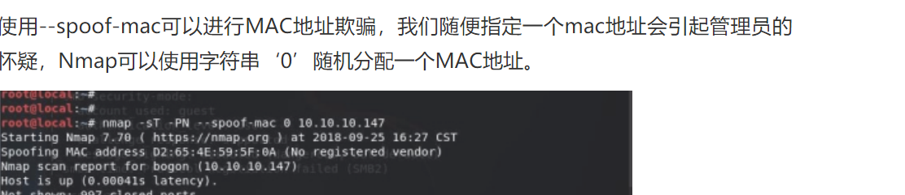

Linux下通过nmap扫描局域网内设备，获取ip地址和mac地址
``

```
sudo nmap -sP -PI -PT 192.168.1.0/24
```

mac欺骗




#### namp扫描

#### 1.半开放扫描

```
nmap -sS 192.168.100.69

这种扫描方式不需要建立完整的TCP三次握手，速度快，是常用的端口探测方法之一
```

通过抓取数据包可以看到，只要目标端口回复SYN+ACK包，就可证明此端口开放。

#### 2.开放扫描

```
nmap -sT 192.168.100.69
这种扫描方式需要建立完整的TCP三次握手，优点是探测准确率最高，缺点是速度慢，且容易被发现。
通过抓包可以看到，只有建立了完整的三次握手，才可证明端口是开放的
```

#### 3.隐蔽扫描（TCP FIN）

```
nmap -sF 192.168.139.69
这种扫描隐蔽性高，不会被目标主机记录到日志中，但扫描结果往往也不理想
```

```
从扫描结果看，端口是全部开启或者有防火墙


抓包可以看出，FIN扫描会向目标主机发送FIN包，若到达关闭端口，数据包丢弃，并返回RST包；若到达打开端口，只会丢掉数据包，不返回RST。这也造成如果对方开启防火墙，FIN包会被防火墙直接丢掉，导致上图结果。
```


#### TCP ACK扫描

```
nmap -sA 192.168.139.69
这种扫描是通过向目标主机发送ACK包，若收到目标机返回的RST包，则说明该端口没有被屏蔽，反之端口被屏蔽。

ACK扫描只能用于确认防火墙是否屏蔽端口，如下图所示，端口均被屏蔽
```

#### UDP扫描

```
nmap -sU 192.168.139.69
向目标主机UDP端口发探测包，如果收到目标主机发送的“ICMP port unreachable”，说明端口关闭，没收到则可能是开放或被防火墙屏蔽。
```


#### 特定端口扫描


```
nmap -sS -p 445 192.168.139.0/24
有时我们只需要探测某个特定端口，这时就可以使用-p参数。
```


#### 快速扫描模式

```
nmap -sS -F 192.168.139.0/24

一般情况下，不设置扫描端口，nmap会扫描默认使用率排行前1000的端口，如果只是扫单个IP还好，但是如果扫描一个网段，速率将很慢。如果想提高扫描速度，那只能减少扫描端口数量。-F参数，是扫描排行前100的端口。

若你觉得扫100个端口还是有点慢或者觉得100个端口有点少，使用–top-ports参数可以自己指定扫描排行前多少的端口。我设置的是扫描排行前50的端口。
nmap -sS --top-ports 50 192.168.139.0/24
```


#### 设置扫描速率

```
-T用来设置扫描速度，从0到5，数字越大，扫描速度越快。
nmap -sS -T4 192.168.139.69
```

#### 多IP探测

```
nmap -iL ip.txt
这时可以选择导入文件扫描。
扫描一个连续的IP段，但要排除某个IP，这又该怎么办？这时可以使用-exclude参数。


nmap -sn 192.168.139.0/24 -exclude 192.168.139.3

如果要排除多个IP，那么也可以将这些IP写一个文档，加载文档进行排除。
nmap -sn 192.168.139.0/24 -excludefile ip.txt
```

####  查看扫描过程


通过-vv参数，nmap会将扫描过程打印出来

```
nmap -vv -sS 192.168.139.69
```

## 规避防火墙或入侵检测设备

方式一：原地址欺骗
 使目标主机认为是另外一个地址进行扫描。

```
nmap -e eth0 192.168.139.69  -S 192.168.139.225  -Pn
```


 -e指定网卡，-S指定伪装成的地址，-Pn不进行主机发现，默认主机存活。
 
 通过抓包可以看到已经伪装成IP为192.168.139.225的地址。

## 使用nse脚本

可以通过写nse脚本进行对你的nmap进行扩展，nse脚本需要使用Lua语言编写。

创建一个nse后缀的文件
 (我创建的是test_80.nse)
 写入以下代码：
 
 这段代码的含义就是当检测到80端口开放时，会输出当前ip开启80端口的提示

移动代码到nmap路径下:
 mv test_80.nse  /usr/share/nmap/scripts/
 测试代码，这里我用百度网站进行测试

```
nmap --script=test_80 www.baidu.com
```


## 漏洞扫描

漏洞扫描原理如同上边描述的nse脚本，这里的脚本已经有大神发布到github上，我们只需要下载即可使用。

在nmap的script目录下安装vulners（kali下在/usr/share/nmap/scripts），使用git命令下载文件：
 git clone <https://github.com/vulnersCom/nmap-vulners.git>

探测目标主机可能存在的漏洞

```
nmap --script nmap-vulners  -sV 192.168.139.106
```


 扫描特定漏洞，这里给大家举例熟悉的永恒之蓝漏洞。

```
nmap --script smb-vuln-ms17-010 192.168.139.3
```


## Nmap 参数详解：**

**Nmap支持主机名，ip，网段的表示方式：**

**例如：blah.highon.coffee，http://namp.org/24，192.168.0.1；10.0.0-25.1-254**

**-iL < inputfilename >：从文件中读取待检测的目标，文件中的表示 方法支持机名，ip，网段 。**

**-iR < num hosts>： 随机选取，进行扫描。如果 -iR 指定为 0，则是 无休止的扫描 。**

**--exclude < host1 [，host2 ] [，host3 ]，... >： 从扫描任务中需要排除的主机 。**

**--excludefile < exclude_file >： 排除文件中的 IP，格式和 -iL 指定扫描文件 的格式相同 。**

## **主机发现：**

**-sL ：仅仅是显示，扫描的 IP 数目，不会进行任何扫描 。**

**-sn ：ping 扫描，即主机发现 。**

**-Pn ：不检测主机存活 。**

**-PS / PA / PU / PY [ portlist ] ：TCP SYN Ping / TCP ACK Ping / UDP Ping 发现 。**

**-PE / PP / PM ：使用 ICMP echo， timestamp and netmask 请求 包发现主机 。**

**-PO [ prococol list ] ：使用 IP 协议包探测对方主机是否开启 。**

**-n / -R ：不对 IP 进行域名反向解析/为所有的 IP 都进行域名 的反响解析 。**

**--dns-servers < serv1 [，serv2 ]，... >： 指定自定义DNS服务器 。**

**--system-dns： 使用操作系统的DNS解析器 。**

**--traceroute：跟踪到每个主机的跳路径 。**

## **扫描技巧：**

**-sS / sT / sA / sW / sM ：TCP SYN / TCP connect（） / ACK / TCP 窗口扫描 / TCP Maimon 扫描 。**

**-sU ： UDP 扫描 。**

**-sN / sF / sX ： TCP Null，FIN，and Xmas 扫描 。**

**--scanflags < flags >：自定义 TCP 包中的 flags 。**

**-sI < zombie host [：probeport ] >： 空闲扫描 。**

**-sY / sZ ：SCTP INIT / COOKIE - ECHO 扫描 。**

**-sO ：使用 IP protocol 扫描确定目标机支持 的协议类型 。**

**-b < FTP relay host >： 使用 FTP bounce scan 指定端口和扫描顺序 。**

## **指定端口和扫描顺序：**

**-p < port ranges >： 特定的端口 -p80，443 或者 -p1-65535 。**

**--exclude-ports < port ranges >： 排除指定端口扫描 。**

**-F： 快速扫描模式,比默认的扫描端口还少 。**

**-r ： 不随机扫描端口，默认是随机扫描的 。**

**--top-ports < number >： 扫描开放概率最高的 number 个端口，出现的概率需要 参考 nmap-services 文件， ubuntu 中该文件位于 / usr / share / nmap.nmap 默认扫前 1000 个 。**

**--port-ratio < ratio >： 扫描指定频率以上的端口 。**

## **服务版本识别：**

**-sV ： 开放版本探测，可以直接使用 -A 同时打开 操作系统探测和版本探测 。**

**--version-intensity < level >：设置版本扫描强度,强度水平说明了应该使 用哪些探测报文。数值越高，服务越有可能被正确识别 。默认是 7 。**

**--version-light ：打开轻量级模式，为 --version-intensity 2 的别名 。**

**--version-all ：尝试所有探测，为 --version-intensity 9 的别名 。**

**--version-trace ：显示出详细的版本侦测过程信息 。**

## **脚本扫描：**

**-sC ：根据端口识别的服务，调用默认脚本 。**

**--script=<Lua scripts>： 调用的脚本名 。**

**--script-args=<n1=v1,[n2=v2,...]>： 调用的脚本传递的参数 。**

**--script-args-file=filename： 使用文本传递参数 。**

**--script-trace ： 显示所有发送和接收到的数据 。**

**--script-updatedb ：更新脚本的数据库 。**

**--script-help=<Lua scripts>： 显示指定脚本的帮助 。**

## **OS 识别：**

**-O ：启用操作系统检测，-A 来同时启用操作系统检测和版本检测 。**

**--osscan-limit ： 针对指定的目标进行操作系统检测 （至少需确知该主机分别有 一个 open 和 closed 的端口） 。**

**--osscan-guess ： 推测操作系统检测结果，当 Nmap 无法确定所检测的操作系统 时，会尽可能地提供最相近的匹配，Nmap 默认进行这种匹配 。**

## **时间与性能：**

**选择“<时间>”的选项以秒为单位，或追加“毫秒”（毫秒），s（秒）、M（分钟），或 “ H ” （小时）的值（如30m）。**

**-T < 0-5 >： 设置时序模板（更高更快）。**

**--min-hostgroup / max-hostgroup < size >：并行主机扫描组大小 。**

**--min-parallelism / max-parallelism < numprobes >：探针并行 。**

**--min-rtt-timeout / max-rtt-timeout / initial-rtt-timeout < time >： 指定探头往返时间 。**

**--max-retries < tries >： 扫描探针重发的端口盖数 。**

**--scan-delay / --max-scan-delay < time >： 调整探针间的延迟 。**

**--min-rate < number >： 每秒发送的数据包不比 < 数字 > 慢 。**

**--max-rate < number >： 发送包的速度不比 < 每秒 > 数字快 。**

## **防火墙/ IDS逃避和欺骗：**

**-f； --mtu < val > ： 指定使用分片、指定数据包的 MTU 。**

**-D < decoy1 , decoy2 [，ME ]，... >： 使用诱饵隐蔽扫描 。**

**-S < IP_Address >： 源地址欺骗 。**

**-e < interface >：使用指定的接口 。**

**-g / --source-port < portnum >： 使用指定源端口 。**

**--proxies < url1，[ url2 ]，... >：使用 HTTP 或者 SOCKS4 的代理 。**

**--data < hex string >： 向发送的数据包追加自定义有效载荷 。**

**--data-string < string >： 添加一个自定义的ASCII字符串发送的数据包 。**

**--data-length < num >： 填充随机数据让数据包长度达到 NUM 。**

**--ip-options < options >： 使用指定的 IP 选项来发送数据包 。**

**--ttl < val >： 设置 IP time-to-live 域 。**

**--spoof-mac < mac address / prefix / vendor name >： MAC 地址伪装 。**

**--badsum ： 使用错误的 checksum 来发送数据包 。**

## **Nmap 输出：**

**-oN ：将标准输出直接写入指定的文件 。**

**-oX ：输出 xml 文件 。**

**-oS ：将所有的输出都改为大写 。**

**-oG ：输出便于通过 bash 或者 perl 处理的格式,非 xml 。**

**-oA < basename >： 可将扫描结果以标准格式、XML 格式和 Grep 格式一 次性输出 。**

**-v ：提高输出信息的详细度 。**

**-d level ： 设置 debug 级别,最高是 9 。**

**--reason ：显示端口处于带确认状态的原因 。**

**--open ：只输出端口状态为 open 的端口 。**

**--packet-trace ：显示所有发送或者接收到的数据包 。**

**--iflist ：显示路由信息和接口，便于调试 。**

**--append-output ：追加到指定的文件 。**

**--resume < filename >： 恢复已停止的扫描 。**

**--stylesheet < path / URL >： 设置 XSL 样式表，转换 XML 输出 。**

**--webxml ：从 http://namp.org 得到 XML 的样式 。**

**--no-sytlesheet ：忽略 XML 声明的 XSL 样式表** 。

## **其他 nmap选项：**

**-6 ：开启 IPv6 。**

**-A ：OS 识别,版本探测,脚本扫描和 traceroute 。**

**--datadir < dirname >： 说明用户 Nmap 数据文件位置 。**

**--send-eth / --send-ip： 使用原以太网帧发送/在原 IP 层发送 。**

**--privileged ：假定用户具有全部权限 。**

**--unprovoleged ：假定用户不具有全部权限，创建原始套接字需要 root 权限 。**

**-V ：打印版本信息 。**

**-h ：输出帮助 。**

**例子：nmap -v -A http://scanme.nmap.org**

**nmap -v -sn 192.168.0.0/16 10.0.0.0/8**

**nmap -v -iR 10000 -Pn -p 8**

**0看到你的网页 ( Chapter 15. Nmap Reference Guide ) 期权和有趣的例子 。**