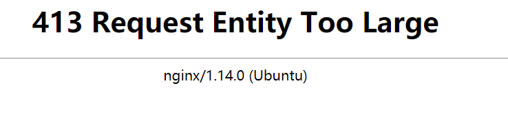
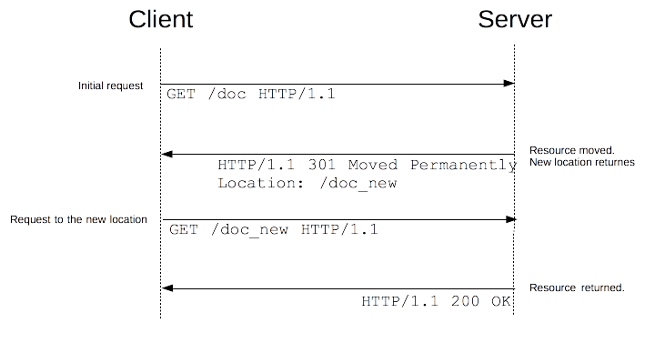

#### cookie的管理

1.js获取cookie

```
document.cookie
```

2.浏览器插件

#### post的方法

1.hackbar
2.[在线post](http://coolaf.com/)
3.html写个表单

```html
<form action="http://220.249.52.134:49661/?a=1" method="post">
Name: <input type="text" name="a" value="2"><br>
E-mail: <input type="text" name="b" value="2"><br>
<input type="submit">
</form>
```

4.curl发个post

```shell
curl -X POST -d "b=2" http://220.249.52.134:49661/?a=1
#get 传a post 传 b
```

5.python写脚本

```python
importrequests
value{'b':2}
demo=requests.post("http://111.198.29.45:41645/？a=1",value)
print(demo.text)
```

6.burpsuit中抓包params中添加body （将RAW中的get改为POST）


post与get相比多出连个头参数


7.在浏览器的console进行post

```js
var url = "http://220.249.52.134:49661/?a=1";
var params = "b=2";
var xhr = new XMLHttpRequest();
xhr.open("POST", url, true);
xhr.setRequestHeader("Content-type","application/x-www-form-urlencoded"); 
xhr.onload = function (e) {
  if (xhr.readyState === 4) {
    if (xhr.status === 200) {
      console.log(xhr.responseText);
    } else {
      console.error(xhr.statusText);
    }
  }
};
xhr.onerror = function (e) {
  console.error(xhr.statusText);
};
xhr.send(params);
```


8.当然也可以利用postman

9.火狐浏览器F12的网络部分
可以发送数据包


#### http协议

HTTP 协议的 8 种请求类型介绍

```
HTTP 协议中共定义了八种方法或者叫“动作”来表明对 Request-URI 指定的资源的不同操作方式，具体介绍如下：

-  **OPTIONS**：返回服务器针对特定资源所支持的HTTP请求方法。也可以利用向Web服务器发送'*'的请求来测试服务器的功能性。
-  **HEAD**：向服务器索要与GET请求相一致的响应，只不过响应体将不会被返回。这一方法可以在不必传输整个响应内容的情况下，就可以获取包含在响应消息头中的元信息。
-  **GET**：向特定的资源发出请求。
-  **POST**：向指定资源提交数据进行处理请求（例如提交表单或者上传文件）。数据被包含在请求体中。POST请求可能会导致新的资源的创建和/或已有资源的修改。
-  **PUT**：向指定资源位置上传其最新内容。
-  **DELETE**：请求服务器删除 Request-URI 所标识的资源。
-  **TRACE**：回显服务器收到的请求，主要用于测试或诊断。
-  **CONNECT**：HTTP/1.1 协议中预留给能够将连接改为管道方式的代理服务器。

虽然 HTTP 的请求方式有 8 种，但是我们在实际应用中常用的也就是 **get** 和 **post**，其他请求方式也都可以通过这两种方式间接的来实现。
```

#### 请求头

##### X-Forwarded-For

 X-Forwarded-For:简称XFF头，它代表客户端，也就是HTTP的请求端真实的IP，只有在通过了HTTP 代理或者负载均衡服务器时才会添加该项

##### Referer

HTTP Referer是header的一部分，当浏览器向web服务器发送请求的时候，一般会带上Referer，告诉服务器我是从哪个页面链接过来的

##### "Content-type"

"application/x-www-form-urlencoded" post的时候需要添加这个以表单的形式

#### 响应头

##### location

重定向


#### get post的区别

```
POST和GET都是向服务器提交数据，并且都会从服务器获取数据。

区别：

1、传送方式e69da5e887aa62616964757a686964616f31333365656532：get通过地址栏传输，post通过报文传输。

2、传送长度：get参数有长度限制（受限于url长度），而post无限制

3、GET和POST还有一个重大区别，简单的说：

GET产生一个TCP数据包；POST产生两个TCP数据包

长的说：

对于GET方式的请求，浏览器会把http header和data一并发送出去，服务器响应200（返回数据）；

而对于POST，浏览器先发送header，服务器响应100 continue，浏览器再发送data，服务器响应200 ok（返回数据）。

也就是说，GET只需要汽车跑一趟就把货送到了，而POST得跑两趟，第一趟，先去和服务器打个招呼“嗨，我等下要送一批货来，你们打开门迎接我”，然后再回头把货送过去。

因为POST需要两步，时间上消耗的要多一点，看起来GET比POST更有效。因此Yahoo团队有推荐用GET替换POST来优化网站性能。但这是一个坑！跳入需谨慎。为什么？

1. GET与POST都有自己的语义，不能随便混用。

2. 据研究，在网络环境好的情况下，发一次包的时间和发两次包的时间差别基本可以无视。而在网络环境差的情况下，两次包的TCP在验证数据包完整性上，有非常大的优点。

3. 并不是所有浏览器都会在POST中发送两次包，Firefox就只发送一次。

建议：

1、get方式的安全性较Post方式要差些，包含机密信息的话，建议用Post数据提交方式；

2、在做数据查询时，建议用Get方式；而在做数据添加、修改或删除时，建议用Post方式；

案例：一般情况下，登录的时候都是用的POST传输，涉及到密码传输，而页面查询的时候，如文章id查询文章，用get 地址栏的链接为：article.php?id=11，用post查询地址栏链接为：article.php， 不会将传输的数据展现出来。

拓展资料：

GET在浏览器回退时是无害的，而POST会再次提交请求。

GET产生的URL地址可以被Bookmark，而POST不可以。

GET请求会被浏览器主动cache，而POST不会，除非手动设置。

GET请求只能进行url编码，而POST支持多种编码方式。

GET请求参数会被完整保留在浏览器历史记录里，而POST中的参数不会被保留。

GET请求在URL中传送的参数是有长度限制的，而POST么有。

对参数的数据类型，GET只接受ASCII字符，而POST没有限制。

GET比POST更不安全，因为参数直接暴露在URL上，所以不能用来传递敏感信息。

GET参数通过URL传递，POST放在Request body中。


```

**post方式多了3行: Content-Type: application/x-www-form-urlencoded，Content-Length: 82，和数据前的空行。**


#### 浏览器复制请求为curl语句


```
curl 'http://220.249.52.134:49661/?a=1' -H 'Origin: http://220.249.52.134:49661' -H 'Accept-Encoding: gzip, deflate' -H 'Accept-Language: zh-CN,zh;q=0.9' -H 'User-Agent: Mozilla/5.0 (Windows NT 10.0; WOW64) AppleWebKit/537.36 (KHTML, like Gecko) Chrome/75.0.3770.100 Safari/537.36' -H 'Content-type: application/x-www-form-urlencoded' -H 'Accept: */*' -H 'Referer: http://220.249.52.134:49661/?a=1' -H 'Connection: keep-alive' --data 'b=2' --compressed --insecure
```

#### **post **json格式请求

```js
var url = "/dict/test";//地址
var params = {advertiserUid: 1232131, advertiserWeiboNickname: "18"};//数据包
var xhr = new XMLHttpRequest();
xhr.open("POST", url, true);
xhr.setRequestHeader("Content-Type", "application/json");
xhr.onload = function (e) {
  if (xhr.readyState === 4) {
    if (xhr.status === 200) {
      console.log(xhr.responseText);
    } else {
      console.error(xhr.statusText);
    }
  }
};
xhr.onerror = function (e) {
  console.error(xhr.statusText);
};
xhr.send(JSON.stringify(params));
```

#### get，post缓存区溢出

服务端程序在接收客户端表单提交的数据时，需要先将数据存储到一个内存空间，然后做解析等后续工作，这个内存空间一般称之为接收缓冲区。对于post数据因为有Content-Length标记，服务端可以按标记的长度创建一个等于或稍大于提交数据的缓冲区；对于get，因为事先不知道提交的数据有多少，需要估计缓冲区长度，如果缓冲区很大而接收数据很小会造成内存浪费，而如果缓冲区小于接收数据，就可能造成缓冲区溢出。

post虽然是没有限制

当请求过大时会出现以下提示



#### 浏览器开发者工具

**名词**

**All**:该页面所有资源文件

**XHR**:异步请求资源

#### http重定向

在 HTTP 协议中，重定向操作由服务器通过发送特殊的响应（即 redirects）而触发。HTTP 协议的重定向响应的状态码为 3xx 。

浏览器在接收到重定向响应的时候，会采用该响应提供的新的 URL ，并立即进行加载；大多数情况下，除了会有一小部分性能损失之外，重定向操作对于用户来说是不可见的。



##### 重定向死锁（循环）

当后续的重定向路径重复之前的路径的时候，重定向循环就产生了。换句话说，就是陷入了无限循环当中，不会有一个最终的页面返回。


### curl使用

#### **-b**

`-b`参数用来向服务器发送 Cookie。

> ```bash
> $ curl -b 'foo=bar' https://google.com
> ```

> ```bash
> $ curl -b cookies.txt https://www.google.com
> ```

上面命令读取本地文件`cookies.txt`，里面是服务器设置的 Cookie（参见`-c`参数），将其发送到服务器。

#### **-A**

`-A`参数指定客户端的用户代理标头，即`User-Agent`。curl 的默认用户代理字符串是`curl/[version]`。

> ```bash
> $ curl -A 'Mozilla/5.0 (Windows NT 10.0; Win64; x64) AppleWebKit/537.36 (KHTML, like Gecko) Chrome/76.0.3809.100 Safari/537.36' https://google.com
> ```

上面命令将`User-Agent`改成 Chrome 浏览器。

> ```bash
> $ curl -A '' https://google.com
> ```

上面命令会移除`User-Agent`标头。

也可以通过`-H`参数直接指定标头，更改`User-Agent`。

> ```bash
> $ curl -H 'User-Agent: php/1.0' https://google.com
> ```

#### **-c**

`-c`参数将服务器设置的 Cookie 写入一个文件。

> ```bash
> $ curl -c cookies.txt https://www.google.com
> ```

上面命令将服务器的 HTTP 回应所设置 Cookie 写入文本文件`cookies.txt`。

#### **-i**

`-i`参数打印出服务器回应的 HTTP 标头。

> ```bash
> $ curl -i https://www.example.com
> ```

上面命令收到服务器回应后，先输出服务器回应的标头，然后空一行，再输出网页的源码。

#### **-I**

`-I`参数向服务器发出 HEAD 请求，然会将服务器返回的 HTTP 标头打印出来。

> ```bash
> $ curl -I https://www.example.com
> ```

#### **-o**

`-o`参数将服务器的回应保存成文件，等同于`wget`命令。

> ```bash
> $ curl -o example.html https://www.example.com
> ```

上面命令将`www.example.com`保存成`example.html`。

#### **-u**

`-u`参数用来设置服务器认证的用户名和密码。

> ```bash
> $ curl -u 'bob:12345' https://google.com/login
> ```

上面命令设置用户名为`bob`，密码为`12345`，然后将其转为 HTTP 标头`Authorization: Basic Ym9iOjEyMzQ1`。

#### **-X**

`-X`参数指定 HTTP 请求的方法。

> ```bash
> $ curl -X POST https://www.example.com
> ```

`-d`参数可以读取本地文本文件的数据，向服务器发送。

> ```bash
> $ curl -d '@data.txt' https://google.com/login
> ```

上面命令读取`data.txt`文件的内容，作为数据体向服务器发送。