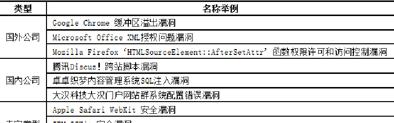
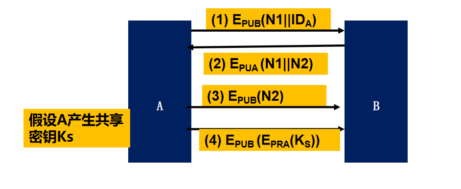

### 1.信息安全简介


#### 什么是信息安全

* 信息的可用性
* 信息的完整性
* 信息的保密性

##### 计算机病毒

病毒：编制者在计算机程序中插入破坏计算机功能或者数据的代码，影响计算机使用，并实现自我复制

蠕虫：病毒+利用网络传播

破坏可用性：占用内存、死机、破坏数据等


**社会工程学**——“人类硬件漏洞”
通过与他人的合法交流，来使其心理受到影响，做出某些动作或者是透露一些机密信息的方式。
这通常被认为是欺诈他人以收集信息、行骗和入侵计算机系统的行为。
**常见方式:**
假托
调虎离山
在线聊天
等价交换
同情心


##### 隐写术 

```
在CMD中执行
copy /b 文件1.jpg + 文件2.rar newimage.jpg
```


网络安全防护体系

PDRR: Protection-Detection-Response-Recovery


#### 1.CVE

通用漏洞和曝光
(CVE, Common Vulnerabilities and Exposures)
是Mitre,公司开发的项目,致力于漏洞名称的标准化工作,提供正式的通用漏洞命名标准服务。网址是www.cve.mitre.org

#### 2.CERT

是Computer Emer Response Team的缩写,是世界上第一个计算机安全应急响应组织,该组织发布漏洞信息,提供漏洞数据库,可以通过名字、ID号、CVE名字、公布日期、更新日期、严重性等方法查询漏洞信息。漏洞记录包括漏洞描述、影响、解决方案、受影响系统等信息。网址是http://www.cert.org


#### 漏洞命名规范

厂商名称+产品名称+漏洞存在位置+漏洞类型



国家信息安全漏洞库
http://www.cnnvd.org.cn/web/index.html
国家信息安全漏洞共享平台
https://www.cnvd.org.cn/

### 2.网络攻击手段

#### 2.0攻击的主要形式与分类

（1）中断【Interruption】

（2）截取【Interception】

（3）篡改【Modification】

（4）伪造【Fabrication】

（5）重放【Replay】

#### 2.1网络攻击链

中文版本


英文版本


#### 2.2信息探测

##### TCP全连接扫描


个人理解：

端口服务如果开启，那么对应的软件就会一直监听端口，建立连接时就会得到相应

那么就可以根据是否相应来判断是否开启此端口

建立连接后 目标主机就会一直等待连接 并生成一个tcp连接表

tcp全连接扫描缺点:会被对应主机记录在防火墙 ，就有了半连接扫描


##### SYN半连接扫描


PING扫描
UDP扫描

#### 

##### SQL注入

##### arp欺骗


[**构造并解析arp包**](https://www.cnblogs.com/wd1001/p/4596945.html)

##### LAND攻击(tcp攻击)


##### ip欺骗攻击

攻击者与服务器不在同一网络

攻击者X假冒A，与服务器B发起TCP会话。
1. X->B，seq=M, SRC IP=A
2. B->A，seq=N, ack = M+1
若A收到，会发送RST给B，从而中止TCP会话
阻止A响应：例如SYN flooding攻击等DOS
3. X->B，akc=N+1
B如何猜测N+1？


##### TCP会话劫持 


问题2：受害者长时间没有收到服务器的报文，会发送终止连接信号，从而引起服务器注意
解决方法：禁止受害者发送相关信息，如进行DDOS攻击

问题1：攻击者如何在TCP流上冒充受害方？
攻击者只需要伪造IP？
服务器会用与受害方协商的序列号来进行可靠性验证，若与之前确认号相差太大，会要求重发


##### SYN FLOOD

伪造地址进行SYN请求，产生半开连接；
服务器消耗大量的资源（内存为主）维护半开连接表；
服务器表现为netstat –an 看到大量的SYN_RECV（>500或总连接数的10％）；
大多数的服务器在 20Mbps/4wpps情况下基本瘫痪。


##### 网卡工作方式

网卡工作方式：
单播：接受目的地址的本地的报文
多播：接受类型为多播的组报文
广播：接收特定的组报文
混杂模式：对报文中的目的地址不进行检测，全部接收；

##### 交换机工作方式


#### 交换网络监听

**1.交换机+集线器**


##### **2.端口监听**


##### 3.MAC洪泛


#### 登录重放攻击

MD5加密[重放攻击-实例解析](https://www.cnblogs.com/sharphui2018727-WYH/p/10068383.html)

主要讲两点**一**，是么是重放攻击？

​         **二**，怎么样防止重放攻击？

**一**，重放攻击：顾名思义，重：再次放的意思。

主机A要给主机B发送报文，中间重放攻击的主人可以是A，或者是攻击者C

：当是A时，表示A会重复发送相同的报文给B，

：当是C时，表示C截获了A发送给B的报文，然后再伪装成A给B发送其截获的报文

重放攻击的含义：主机A给主机B发送的报文被攻击者C截获了，然后C伪装成A给B发送其截获来的报文，而B会误以为C就是A，就把回应报文发送给了C。

虽然A是加密的，但C根本不用破译。

实例分析：登录验证

登录验证的基本流程：（4步）

1，前端：


   用户输入账号，密码，然后登录

2，用户在发送登录请求之前，web端会**首先**对明文密码进行md5加密（而加密后的密码会储存于后端的数据库中）

3，提交账号及md5加密后的密码

4，请求到达后端，将 从数据库中提取的账号与密码和现在提交的账号与密码进行比较，如果相同，则登录成功。

那么在这中间会出现什么问题呢？

**思考**：这个过程安全吗？

我们知道，在此过程中传输的是经过md5加密后的密码，即使被监听者截取到，而md5是不可逆的，明文密码也不会泄露的 。

其实不然，监听者无需解出密码明文，即可登录——因为监听者只需将监听到的URL（uniform ）重放一下，即可冒充你的身份登录系统。

下面我们讲解一下稍微安全一点的登录：

关键是：进行了两次加密，且攻击者的session中的随机码与数据库中的随机码相同的概率可以忽略。

1，进入前端用户登陆界面时生成一个随机码（盐值）（此随机码会在客户端和后端session中各保存一个）

2，用户在发送登录请求之前，web端**首先会对明文密码进行md5加密，存于数据库中**，然后**加密后的密码**再与盐值连接，再进行md5加密

最后密码=md5{[md5（明文密码）]+随机码}

3，请求到达后端后，将 从数据库中提取的md5加密后的密码+后端session中的盐值进行md5加密，与发送来的密文进行对比，若相同，则成功。

 更安全的登陆流程：

1，系统随机生成一个**固定盐值**，uerooejioeueo%@*?.,*6hgk,>ikuolm 足够复杂

2，当用户注册，修改密码时，明文密码会**先于**固定盐值连接，进行md5加密，然后再与随机码连接再次进行md5加密

最后密码=md5{【md5（明文密码+固定盐值）】+随机码}

最后更加完善的方式：

1，设置登陆验证码、

2，错误达到一定次数，锁定账号几分钟

3，**存数据库前再加一次盐，然后再md5一次，防止拖库被猜密码**

**二**，防御方案：

1，加随机数：双方只需要记住各自使用过的随机数，不能有重复数，如果报文中有以前使用过的随机数，则被认为是重放攻击

​           优点：双方不需要保持时间的同步，

​           缺点：**需要额外保存**使用过的随机数，则需要保存和查询开销

2，加时间戳：时戳——代表当前时刻的数

​            而重放的时戳将相对远离当前时刻

​           优点：不需要内存开销

​           缺点：**通信各方的计算机时钟必须保持同步**（同步越好，受攻击的可能性越小）

3，加流水号：双方在报文中添加一个逐步递增的整数，则只要收到一个不连续的流水号报文（太大或者太小）就认为有重放威胁

​            优点：不需要时间同步，保存的信息量小

​            缺点：攻击者如果对报文解密成功，就获得了流水号进而会伪造数据


### 3.身份认证

**身份认证的两个步骤**：
识别：用户向系统提供身份
验证：系统验证声明有效性的手段


**验证身份的主要方法**

* 基于知识的身份认证——知道什么
  例如，密码、口令
* 基于所有权的身份认证——拥有什么
  例如，令牌、短消息验证
* 基于生物特征的身份认证——是什么
  例如：虹膜、指纹、姿态等

根据**认证环境分类**，可分为：

* 本地认证：在本地环境中验证用户身份
* 远程认证：在网络环境中验证用户身份


#### 安全密钥分发与认证

**KDC 密钥分发中心**

##### .1密钥分级


##### N-S 协议

**基于对称加密的认证协议 N-S协议**


N1:该次传输的唯一标识N1，称为临时交互号(nonce)。临时交互号可以选择时间戳、随机数或者计数器等。

改进后的ns协议（增加一步随机数认证）


具体步骤

1、A以明文形式向KDC发送会话密钥请求包。包括通话双方A、B的身份以及该次传输的唯一标识N1，称为临时交互号(nonce)。
临时交互号可以选择时间戳、随机数或者计数器等。KDC可根据临时交互号设计防重放机制。
2、KDC返回的信息包括两部分。第一部分是A想获取的信息，用A的主密钥KA加密，包括通话密钥Ks和KDC收到的请求包内容用以验证消息到达KDC前是否被修改或者重放过。第二部分是B想获取的信息，用B的主密钥KB加密，包括通话密钥Ks和A的身份。A收到后这部分消息便原样发给B。
3、为保证A发给B的会话密钥信息未被重放攻击，A、B使用会话密钥进行最后的验证。
B使用新的会话密钥Ks加密临时交互号N2并发给A。A对N2进行一个函数变换后，用会话密钥发给B验证。
对于大型网络，可以建立KDC的层次体系来使得主密钥分发的开销最小化。


##### 非对称密钥加密


思考以上协议可能存在的主动和被动攻击？
中间人攻击：攻击者C冒充用户A，向B发送消息PUC||IDA，使得B以为自己在和A进行认证
解决方法：
设计的协议不仅要保护密钥保密性，同时要进行双向握手认证





利用对称加密的对称密钥分发/认证
需要第三方密钥分发机构
典型协议：N-S协议
应用领域：在局域网内，有KDC，为通信双方分发共享密钥进行身份认证

利用非对称加密的对称密钥分发/认证
无需第三方密钥分发机构


#### 数字证书

证实了实体所申明的**身份**和其**公钥绑定关系**的一种**电子文档**，是将公钥和确定他的某些信息（比如该密钥对持有者的姓名，电子邮件或则密钥对的有效期等信息）相绑定的数字申明

是由可信的CA认证机构颁发

目前，工业界的证书标准是X.509


##### 1.数字整数的产生和验证


##### 2.证书内容

（1）颁证机构
（2）整数持有者的名字
（3）整数持有者的公钥
（4）证书有效期
（5）证书颁发机构的签名


##### 3.证书链


实际情况


#### 3.3 Kerberos

Kerberos是美国麻省理工学院（MIT）开发的一种**身份鉴别服务**

主要特点：
提供了一个集中式的认证服务器结构，认证服务器的功能是实现用户与其访问的服务器间的相互鉴别 
建立了一个实现身份认证的框架结构，其实现采用的是对称密钥加密技术，而未采用公开密钥加密 


问题1：(身份)口令明文多次传送，访问多个服务器则需多次申请票据（即口令多次使用）
问题2：票据的有效性（多次使用）

问：用户能不能只需要出示一次身份ID，获得许可后，此后多次访问应用服务器而无需再出示身份ID？
思路：
原始关系：身份ID(多)->电影票(多)的线性关系
扩展为非线性关系：身份ID(1次使用)->购票资格(多次使用)->电影票(多次使用)
->表示换取
实现：引入票据许可服务器（TGS）
用于向用户分发服务器的访问票据；认证服务器 AS 并不直接向客户发放访问应用服务器的票据，而是由 TGS 服务器来向客户发放。

票据许可票据（ Tickettgs ）
由AS发放的Tickettgs，是客户访问 TGS 服务器需要提供的票据；目的是为了申请某一个应用服务器的“服务许可票据”
Tickettgs 在用户登录时向 AS 申请1次，可多次重复使用

服务许可票据（ TicketV ）
是客户访问应用服务需要提供的票据

### 4.SSL与TLS

**SSL: Secure Sockets Layer protocol
SSL is a secure protocol between application layer and TCP layer**

如何实现web安全性

三种实现方法

* 实现在IP层：对终端用户和应用完全透明
  IPsec
* 实现在传输层：对应用完全透明，所有应用都可以使用
  SSL/TLS
* 实现在应用层：用于特定的安全通信
  Kerberos


### 5.防火墙

##### 1.包过滤防火墙

对于每个进来的包，使用一组规则，然后决定转发或者丢弃该包，往往配置成双向的

如何过滤：

* 过滤的规则以**ip和传输层**的头的域为基础，包括源和IP地址，ip协议域，和目标端口号
* 过滤器往往建立一组规则，根据ip包是否匹配规则中指定的条件来决定
* * 如果匹配规则，则根据此规则来决定转化或者丢弃
  * 如果所有规则都不匹配，则根据缺省

优点

1.简单，易于处理，实现低层本

2.处理开销小，因此对使用该技术的防火墙的性能影响不大

缺点

* 包过滤防火墙不检查上层数据，无法防范利用特定应用的攻击
* 可用信息有限，提供的日志功能也十分有限
* 不支持高级用户认证方案
* 易受tcp/ip协议栈漏洞攻击，如**ip地址欺骗**
* 对由于**不恰当设置引起的安全防范有限**


##### 2.状态检测防火墙

状态检测技术是指根据协议数据的状态来实现包过滤功能的访问控制技术。


状态检测既要根据IP包头信息也要根据协议的状态信息来制定过滤规则。
什么是**状态？**
在TCP/IP协议中， 状态是指协议过去执行的历史信息
 例如， 对于TCP而言， 要进行数据通信， 必须建立三次握手，因此对于使用TCP进行数据传输的应用来说， TCP的三次握手所建立的连接信息就是其状态。
在TCP/IP协议族中， 有些协议是有状态的协议（如TCP协议等），有些协议是无状态协议（如UDP协议等） 。


**状态包过滤技术**

优点：

1.安全性好
2.灵活性好
3.扩展性好
4.应用范围好
缺点

1.计算开销大
2.处理计算慢
3.规则管理复杂


##### 3.应用级防火墙

应用代理防火墙

代理，就是帮别人获得某项服务的人或机构。例如、保险代理、 法务代理
应用代理 ：在应用层提供代理服务的代理
应用代理技术是通过具有访问应用， 使得不具备访问权限的用户可以访问网络服务一种代理服务技术。
例如， 用户A本身不具备访问外部FTP服务的权限。但一个主机B不仅具备访问外部FTP的权限， 而且还提供代理服务基于应用代理技术， 用户A可以借助于主机B的帮助而获得外部FTP服务的访问权限

NAT地址转换


**优点：**

* 应用代理技术提供更高层次的安全性

* 易于审计

* 有助于提高访问速度

* 具备细粒度的过滤检测

* 隐蔽性较强

  

**缺点：**
处理开销大
扩展性弱，每个应用需要一个对应的代理
代理服务不能避免协议本身的缺陷

##### 4.电路级防火墙


**常见防火墙系统，一般按照四种模型配置**
简单的包过滤路由器模型
单宿主堡垒主机（屏蔽主机防火墙）模型
双宿主堡垒主机模型（屏蔽防火墙系统模型）
屏蔽的子网防火墙模型

几个概念
**堡垒主机(Bastion Host)：**对外部网络暴露，同时也是内部网络用户的主要连接点
**单宿主主机(single-homed host)**：只有一个网络接口的通用计算机系统
**双宿主主机(dual-homed host)：**至少有两个网络接口的通用计算机系统
**DMZ(Demilitarized Zone，非军事区或者停火区)**：在内部网络和外部网络之间增加的一个子网


**防火墙定义一个必经之点，包含以下三种基本功能**
可以限制未授权的用户进入内部网络，过滤不安全的服务和非法用户
防止入侵者接近网络防御设施
限制内部用户访问特殊站点

**防火墙的局限：**

（1）不能防范来自内部网络的攻击
（2）不能消除来自内部的威胁
（3）不能防止传送已感染病毒的软件或文件
（4）不能阻止绕过防火墙的攻击


#### SSL会话


