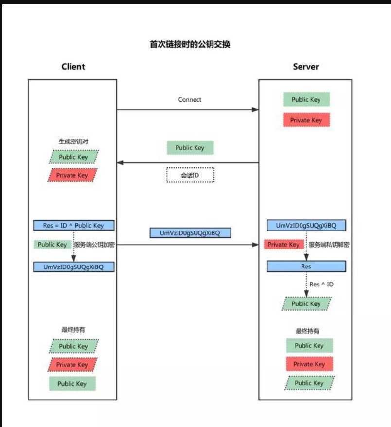

思考：如果在这个过程中只发送这个加密后的密文 岂不是只需要实现拦截就可以

讲正确的密码加密串发送过去 服务器会以为我是这个用户

# ssh私钥泄露破解

```
解密ssh秘钥信息使用ssh2john将id isa秘钥信息转换为john可以识别的信息。
chmod 600 id isa
ssh2john id isa > isacrack
利用字典解密isacrack信息
zcat /usr/share/wordlists/rockyou.txt.gz | john--pipe-rules     isacrack

#最后获得密码
```


# ssh配置

查看和更改配置文件：/etc/ssh/sshd_config

```bash
root@ubuntu-s-1vcpu-1gb-sfo2-01:~# vim /etc/ssh/sshd_config
PasswordAuthentication yes　　　　　　# 口令登录
RSAAuthentication yes　　　　　　　　　# RSA认证
PubkeyAuthentication yes　　　　　　　# 公钥登录 
```

```
cat id_rsa.pub >> ~/.ssh/authorized_keys
#将公钥添加在目标主机上的aytherized_key
```

# scp

```
# scp file.txt host-two:/tmp  #将file文件拷贝到例外一台主机
# scp joe@host-two:/www/*.html /www/tmp
# scp -r joe@host-two:/www /www/tmp
```

# **ssh keygen**


ssh 公钥认证是ssh认证的方式之一。通过公钥认证可实现ssh免密码登陆，git的ssh方式也是通过公钥进行认证的。

在用户目录的home目录下，有一个.ssh的目录，和当前用户ssh配置认证相关的文件，几乎都在这个目录下。

ssh-keygen 可用来生成ssh公钥认证所需的公钥和私钥文件。

使用 ssh-keygen 时，请先进入到 ~/.ssh 目录，不存在的话，请先创建。并且保证 ~/.ssh 以及所有父目录的权限不能大于 711

```
$ chmod 700 -R .ssh
 $ chmod 600 authorized_keys 
#保证.ssh和authorizzed_key只有自己有读写权限
```

生成的文件名和文件位置

使用 ssh-keygen 会在~/.ssh/目录下生成两个文件，不指定文件名和密钥类型的时候，默认生成的两个文件是：

id_rsa

id_rsa.pub

第一个是私钥文件，第二个是公钥文件。

```
ssh-keygen -t rsa -f test -C "test key"
#-f生成指定的文件名  -c备注
ssh-keygen
#如果没有指定文件名，就会询问文件名
#之后还会询问是否需要密码 这里密码是用于私钥认证的密码
# -ts加密方式选 rsa|dsa均可以，默认dsa
```


```
公钥登录
ssh -i id_rsa root@142.93.198.56
```


单项登录操作

```bash
  1、登录A机器 
 

  2、ssh-keygen -t [rsa|dsa]，将会生成密钥文件和私钥文件 id_rsa,id_rsa.pub或id_dsa,id_dsa.pub
 

  3、将 .pub 文件复制到B机器的 .ssh 目录， 并 cat id_dsa.pub >> ~/.ssh/authorized_keys
 不同的账户复制在不同的家目录下
  4、大功告成，从A机器登录B机器的目标账户，不再需要密码了；（直接运行
   #ssh 192.168.20.60
   登录的用户就是有这个公钥的目标账户
   ）
```


---


# 图解SSH原理及两种登录方法 

2018-09-27 10:14

SSH（Secure Shell）是一套协议标准，可以用来实现两台机器之间的安全登录以及安全的数据传送，其保证数据安全的原理是**非对称加密**。

传统的**对称加密**使用的是一套秘钥，数据的加密以及解密用的都是这一套秘钥，可想而知所有的客户端以及服务端都需要保存这套秘钥，泄露的风险很高，而一旦秘钥便泄露便保证不了数据安全。

**非对称加密**解决的就是这个问题，它包含两套秘钥 - 公钥以及 私钥，其中公钥用来加密，私钥用来解密，并且通过公钥计算不出私钥，因此私钥谨慎保存在服务端，而公钥可以随便传递，即使泄露也无风险。

保证SSH安全性的方法，简单来说就是客户端和服务端各自生成一套私钥和公钥，并且互相交换公钥，这样每一条发出的数据都可以用对方的公钥来加密，对方收到后再用自己的私钥来解密。


链接创建

由上一张图可以看出来，两台机器除了各自的一套公、私钥之外，还保存了对方的公钥，因此必然存在一个交换各自公钥的步骤。实际上并不是简单的各自发送公钥，而是存在一些专门的算法。这一步在首次链接时、数据传送之前发生。

http://5b0988e595225.cdn.sohucs.com/images/20180927/0ea739d0deba4933bed98d86571fb6b7.jpeg



1. 客户端发起链接请求
2. 服务端返回自己的公钥，以及一个会话ID（这一步客户端得到服务端公钥）
3. 客户端生成密钥对
4. 客户端用自己的公钥异或会话ID，计算出一个值，并用服务端的公钥加密
5. 客户端发送加密后的值到服务端，服务端用私钥解密
6. 服务端用解密后的值异或会话ID，计算出客户端的公钥（这一步服务端得到客户端公钥）
7. 至此，双方各自持有三个秘钥，分别为自己的一对公、私钥，以及对方的公钥，之后的所有通讯都会被加密

这里有一个有趣的地方，两台机器第一次使用SSH链接时，当服务端返回自己的公钥（第2步）的时候，客户端会有一条信息提示，大意是无法验证对方是否可信，并给出对方公钥的MD5编码值，问是否确定要建立链接。

这是因为SSH虽然传输过程中很安全，但是在首次建立链接时并没有办法知道发来的公钥是否真的来自自己请求的服务器，如果有人在客户端请求服务器后拦截了请求，并返回自己的公钥冒充服务器，这时候如果链接建立，那么所有的数据就都能被攻击者用自己的私钥解密了。这也就是所谓的**中间人攻击**。


利用密码登录

SSH还常用来远程登录到别的机器，有两种常用的方法，第一种便是账号密码登录。


1. 服务端收到登录请求后，首先互换秘钥，详细步骤如上一节所述。
2. 客户端用服务端的公钥加密账号密码并发送
3. 服务端用自己的秘钥解密后得到账号密码，然后进行验证
4. 服务端用客户端的公钥加密验证结果并返回
5. 服务端用自己的秘钥解密后得到验证结果

利用公钥登录

有些时候并不是开发者手动去连接服务器，而是客户端的程序需要连接到服务器，这时候用密码登录就比较不方便，一是需要处理输入密码的问题，二是需要想办法安全的储存密码到程序里，这种情况下便可以利用公钥来进行无密码登录。


1. 客户端用户必须手动地将自己的公钥添加到服务器一个名叫authorized_keys的文件里，顾名思义，这个文件保存了所有可以远程登录的机器的公钥。
2. 客户端发起登录请求，并且发送一个自己公钥的指纹（具有唯一性，但不是公钥）
3. 服务端根据指纹检测此公钥是否保存在authorized_keys中
4. 若存在，服务端便生成一段随机字符串，然后利用客户端公钥加密并返回
5. 客户端收到后用自己的私钥解密，再利用服务端公钥加密后发回
6. 服务端收到后用自己的私钥解密，如果为同一字符串，则验证通过

利用公钥登录的关键是必须手动将客户端的公钥添加到服务端，比如GitHub便有这一步骤，添加了之后便可无密码登录。


