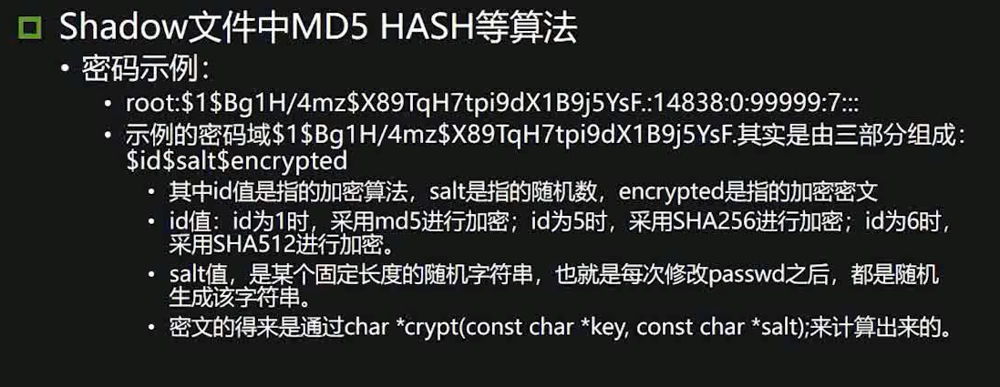
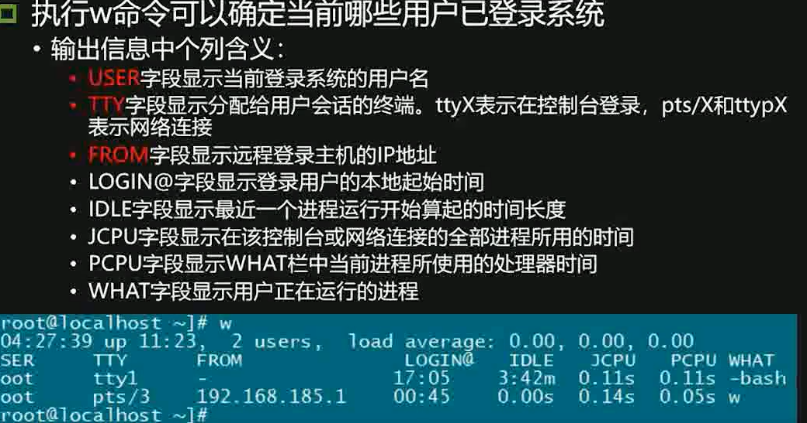
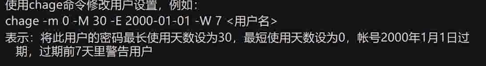

```
netstat -pan 
#查看当前开放的端口
lsof -i 
#显示进程和端口对应的关系
ps -aux
#查看进程
chkconfig --list
#查看服务启动信息
```

shadow文件






加固

重要目录加固

```
chmod -R 750 /etc/rc.d/init.d/*
#只给root设置了读。写和执行的权限
```

设置umask

```
vi /etc/profile 添加umask 027
#新建文件的全新都为750
```

bash历史命令加固

```
检查方法


```


```
vim /etc/profile 
修改Histsize=5 和HISTFILESIZE=5即可保留最新执行的五条命令
```

登陆超时

```
cat /etc/profile|grep TMOUNT
vi /etc/profile 
修改配置 添加TMOUT=180 ，即超时时间为3分钟
```

禁用无用账户

```
cat /etc/passwd
ftp等服务帐户 shell应该用 /sbin/nplogin
passwd -l <user> #锁定不必要的账户

```

账户策略


防止暴力破解

```
cat /etc/pam.d/system-auth
#查看
vi /etc/pam.d/system-auth
添加auth required  pam_tally.so onerr=fail deny =10 unlock_time=300
```

检查特殊账户

```
awk -F: '($2=="")' /etc/shadow
#查看空口令账户
awk -F: '($3==0)' /etc/passwd
#查看uid为零的账户
```

加固

```
passwd <usr> 为空口令设置账户密码
usermod -u UID <用户名>
```


口令周期配置

```
cat /etc/login.defs|grep PASS
vi /etc/login.defs
#修改配置文件
PASS_MAX_DAYS 90 #新建用户密码使用最长天数
PASS_MIN_DAYS 0 #新建用户最短使用天数


```

