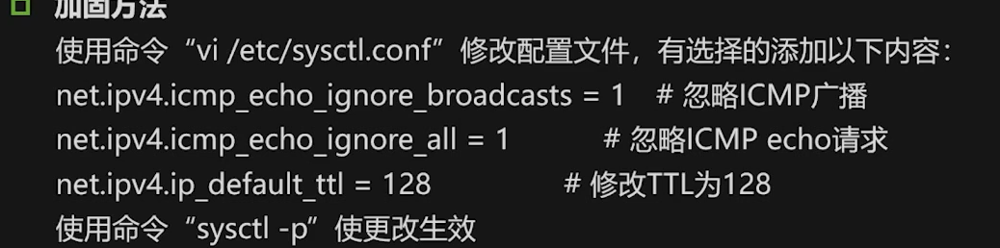
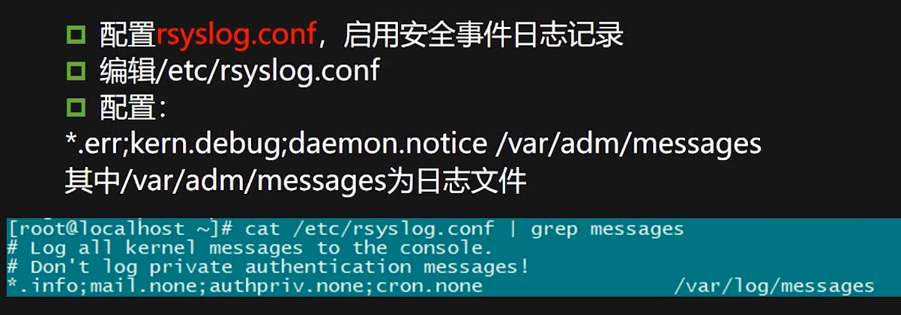

#### 目录md5使用


#### 加固方式

```
端口
防火墙

日志
打补丁
```

#### 口令策略

```
cat /etc/login.defs|grep PASS
#查看密码策略设置
```

```
awk -F ":"'($7=="/bin/bash"){print$1}'/etc/passwd
awk -F ":"'($2=="!!"){print$1}'/etc/shadow
#检查shadow中的空账号口令
```

```
cat /etc/ssh/sshd_config|grep Max AuthTries
```


```
cat /etc/passwd #查看所有用户情况
passwd -S查看用户密码状态
```


#### 主机访问控制

```
/etc/hosts.allow
/etc/hosts.deny
```


```
/etc/ssh/sshd_config
```

关闭不必要的系统服务

```
chkconfig -list
chkconfig --level 35 off
```

#### 网络参数配置

```
sysctl -a  #查看当前网络参数
vi /etc/sysctl.conf #修改配置文件

net.ipv4.icmp_echo_igrore_ breoadcasts =1 #忽略icmp广播

```




##### 内核禁止ping

```
临时
echo 1 >/proc/sys/net/ipv4/icmp_echo_ignore_all
```

```
echo net.ipv4.icmp_echo_ignore_all=1 >> /etc/sysctl.conf
sysctl -p  # 执行这条命令使更改后的 /etc/sysctl.conf 配置文件生效
```

**1、允许ping设置**

临时

```
echo 0 >/proc/sys/net/ipv4/icmp_echo_ignore_all
```

永久

```
echo net.ipv4.icmp_echo_ignore_all=0 >> /etc/sysctl.conf
sysctl -p # 执行这条命令使更改后的 /etc/sysctl.conf 配置文件生效
```

##### 防火墙禁止ping

注：使用以下方法的前提是内核配置是默认值，也就是内核没有禁ping

**1、允许PING设置**  

```
      iptables -A INPUT -p icmp --icmp-type echo-request -j ACCEPT
      iptables -A OUTPUT -p icmp --icmp-type echo-reply -j ACCEPT
```

**2、禁止PING设置**

```
      iptables -A INPUT -p icmp --icmp-type 8 -s 0/0 -j DROP

      --icmp-type 8 echo request  表示回显请求（ping请求）

      0/0 表示所有 IP
```


#### iptables使用




