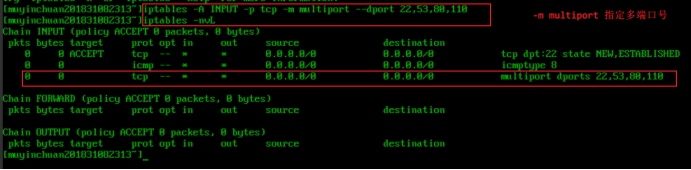
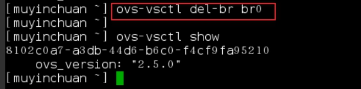

#### 网络基础

##### 网桥 bridge 

网桥也是数据链路层设备，把一个局域网一分为2，中间用网桥连接，这样A发给BCD的数据就不会再广播到EFGH了


##### 交换机 switch


##### 路由器 router

 路由器工作在网络层，可以根据IP来选择对应的端口，当然，这里选择的依据就是路由表。

##### 网关 gateway

​	

常见缩写

```
lo 回环接口  Local Loopback 
eth0 以太网接口  Ethernet
br0 网桥接口
wlan0 无线接口
tap 虚拟网卡
vm 虚拟机
```


### iptables

语法

```bash
iptables -A INPUT -p tcp -j ACCEPT  #添加规则
iptables -D INPUT -p 
iptables -F # 清楚当前的表的所有规则
iptables -N test #再指定表新建链test 
iptables -X A #删除指定表中的自定义链A
```


##### iptables日志字段解释(编号21后为未用到的字段)

Jan 12 18:24:05 [localhost] kernel: iptables icmp-localhost IN=lo OUT= MAC=00:00:00:00:00:00:00:00:00:00:00:00:08:00 SRC=127.0.0.1 DST=127.0.0.1 LEN=84 TOS=0x00 PREC=0x00 TTL=64 ID=8718 PROTO=ICMP TYPE=0 CODE=0 ID=9413 SEQ=1

| **编号** | **字段**                                      | **说明**                                                     |
| -------- | --------------------------------------------- | ------------------------------------------------------------ |
| 1        | Jan  12 18:24:05                              | 日期时间，由syslog生成                                       |
| 2        | localhost                                     | 主机名称                                                     |
| 3        | kernel                                        | syslogd获取kernel产生的日志                                  |
| 4        | iptables  icmp-localhost                      | 记录前缀，由用户指定—log-prefix “iptables icmp-localhost”    |
| 5        | IN=lo                                         | 数据包进入的接口，若为空表示本机产生                         |
| 6        | OUT=                                          | 数据包流出的接口，若为空表示本机产生                         |
| 7        | MAC=00:00:00:00:00:00:00:00:00:00:00:00:08:00 | 前6段为源MAC, 后6段为目的MAC                                 |
| 8        | 08:00                                         | 08:00  为上层协议代码，即表示IP协议                          |
| 9        | SRC=127.0.0.1                                 | 源IP地址                                                     |
| 10       | DST=127.0.0.1                                 | 目的IP地址                                                   |
| 11       | LEN=84                                        | IP封包+承载数据的总长度(MTU)                                 |
| 12       | TOS=0x00                                      | IP包头内的服务类型字段，能反应服务质量包括延迟、可靠性和拥塞等 |
| 13       | PREC=0x00                                     | 服务类型的优先级字段                                         |
| 14       | TTL=64                                        | IP数据包的生存时间                                           |
| 15       | ID=8718                                       | IP数据包标示                                                 |
| 16       | PROTO=ICMP                                    | 协议ICMP                                                     |
| 17       | TYPE=0                                        | ICMP类型                                                     |
| 18       | CODE=0                                        | ICMP代码                                                     |
| 19       | ID=9413                                       | ICMP  ID                                                     |
| 20       | SEQ=1                                         | ICMP  SEQ                                                    |
| 21       | DF                                            | 表示不分段，此字段还可能为MF/FRAG                            |
| 22       | SPT                                           | TCP或UDP中的源端口                                           |
| 23       | DPT                                           | TCP或UDP中的目的端口                                         |
| 24       | LEN                                           | 传输层协议头长度                                             |
| 25       | SEQ                                           | TCP序列号                                                    |
| 26       | ACK                                           | TCP应答号                                                    |
| 27       | WINDOWS                                       | IP包头内的窗口大小                                           |
| 28       | RES                                           | TCP-Flags中ECN bits的值                                      |
| 29       | CWR/ECE/URG/ACK/PSH/RST/SYN/FIN               | TCP标志位                                                    |
| 30       | URGP                                          | 紧急指针起点                                                 |
| 31       | OPT                                           | IP或TCP选项                                                  |
| 32       | INCOMPLETE                                    | 不完整的数据包                                               |
| 33       | SPI                                           | 当协议为AHESP时出现                                          |
| 34       | [  ]                                          | 中括号出现在两个地方，在ICMP协议中作为协议头的递归使用；在数据包长度出现非法时用于指出数据实际长度 |

**(5)** **日志策略**

- a、 获取所有TCP日志

\# iptables -A INPUT -p tcp -j LOG —log-prefix “iptables TCP “

- b、 获取所有UDP日志

\# iptables -A INPUT -p udp -j LOG —log-prefix “iptables UDP “

- c、 获取ssh的日志

\# iptables -A INPUT -p tcp —dport 22 -j LOG —log-prefix “iptables SSH “

### namespace


#### 实验一  iptales与ovs安装


 


 

 

 

 

 

 

 

 

 

 

为FORWARD链添加默认规则


添加自定义链 与删除自定义链

 

 

 

 

 

 

 

 

 

 

 

 

#### 实验二 iptables配置

1.匹配指定协议

```
iptables -A INPUT -p tcp -j ACCEPT
```

 

2.源地址匹配包

 

3.目的地址匹配包

 

 

4.以包进入本地使用的网络接口匹配包

 

5.以包离开本地所使用的网络接口匹配包

 

6.以匹配通信源端口匹配包

--source -sport
 

 

7.匹配通信目的端口

2.状态检测

 

 

\3. 特殊参数
--icmp-type 指定ICMP的类型编号

 

 

 

-m multiport 指定多端口号


 

-m iprange指定ip段

 

-m connlimit 连接限定

 

-m limit 限定连接速率也就是限定匹配数据包的个数

 

 

 

-m string按字符串限定


 

 

配置iptables策略

 

验证规则

 

 

 

查看日志

Echo “kern.warning /var/log/iptables.log” >> /etc/rsyslog.conf


tail -f /var/log/iptables.log

 

 

 

 

 

自定义策略

 

状态为已连接的放行

 

 

 

Limit 实现dos攻击防范

 

 

 

 

 

#### 实验三 虚拟网络设备

***\*概述\****

***\*（1）Open vSwitch\****
Open vSwitch（简称为 OVS）是由 Nicira Networks 主导的，运行在虚拟化平台（例如 KVM，Xen）上的虚拟交换机。在虚拟化平台上，OVS 可以为动态变化的端点提供 2 层交换功能，很好的控制虚拟网络中的访问策略、网络隔离、流量监控等等。

OVS遵循 Apache 2.0 许可证, 能同时支持多种标准的管理接口和协议。OVS 也提供了对 OpenFlow 协议的支持，用户可以使用任何支持 OpenFlow 协议的控制器对 OVS 进行远程管理控制。

***\*（2）网络名称空间netns\****

netns是在linux中提供网络虚拟化的一个项目，使用netns网络空间虚拟化可以在本地虚拟化出多个网络环境。netns可以让一台机器上模拟多个网络设备，是网络虚拟化的重要组成，将不同类型的网络应用隔离。
一个net namespace拥有独立的独立的网卡空间，路由表，ARP表，ip地址表，iptables等。

 

1.软件安装
yum -y install openvswitch


设置openvswitch并设置为自启


安装网络抓包工具tcpdump 网络配置工具bridge	-utils


3ip link使用


新建网络接口

 

查看网络接口
\# ip link show

\# ip link show type veth

\# ip link show type vlan

\# ip -d link show type veth

\# ip -d link show type vlan

\# ethtool -S veth1


 

启动接口

\#ip link set eth0.10 up

\#ip link set veth1 up
\#ip link set veth2 up

 

删除接口
\#IP link del dev eth0.10
\#ip link del dev veth1


ip netns使用

（1）查看帮助
\#ip netns help

 

(2)

\#ip nets add test					创建一个名为test的namespace
\#ip netns list || ip netns  			查看所有的namespace
\#ip netns exec test ip addr show 	查看名为test的namespace


(3) 进入名为testde1namespace ,执行网络命令

\#exit 退出namespace


(4)

***\*给test 添加接口tap1\****

\# ip link add tap1 type dummy

\# ip link set tap1 netns test

\# ip netns exec test ip link show

 

启用tap1虚拟接口

 

给tap1虚拟接口配置IP
\#ip netns exec test ip addr add dev tap1 192.168.0.1/24


***\*删除test namespace\****

\# ip netns del test

 

 

***\*openvswitch使用\****

**(1)** ***\*查看openvswitch安装的命令工具\****

 

######  

***\*(2)添加网桥br0\****

\# ovs-vsctl add-br br0

(3)列出open vswitch中所有的网桥

\# ovs-vsctl list-br

 

***\*4)判断网桥是否存在\****

\# ovs-vsctl br-exists br0

***\*(5)将网卡添加到网桥br0\****

\# ip link add tap1 type dummy

\# ovs-vsctl add-port br0 tap1

***\*(6)查看open vswitch的网络状态\****

\# ovs-vsctl show


***\*(7)在网桥br0中新建openvswitch网口\****

\# ovs-vsctl add-port br0 tap2 — set interface tap2 type=internal

 

***\*(8)列出网桥br0中所有端口\****

\# ovs-vsctl list-ports br0

***\*(9)列出所有连接到网卡tap2的网桥\****

\# ovs-vsctl port-to-br tap2

***\*(10)删除网桥br0上的网口tap2\****

\# ovs-vsctl del-port br0 tap2

 

***\*11)设置网口tap1的vlan tag为10\****

\# ovs-vsctl set port tap1 tag=10

***\*(12)查看网口tap1的属性\****

\# ovs-vsctl list port tap1

 

***\*(13)从网桥br0删除网口tap1, 并从系统删除虚拟网口tap1\****

\# ovs-vsctl del-port br0 tap1

\# ip link del dev tap1

 

***\*(14)删除网桥br0\****

\# ovs-vsctl del-br br0

 

 

 