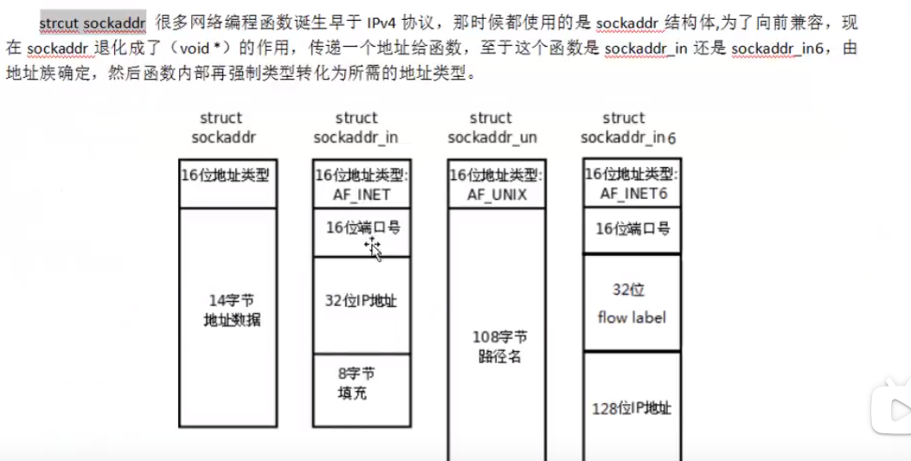
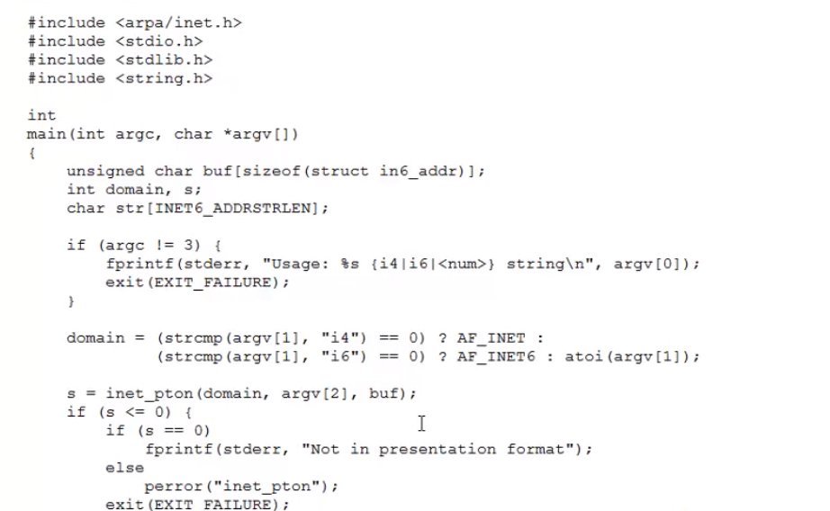
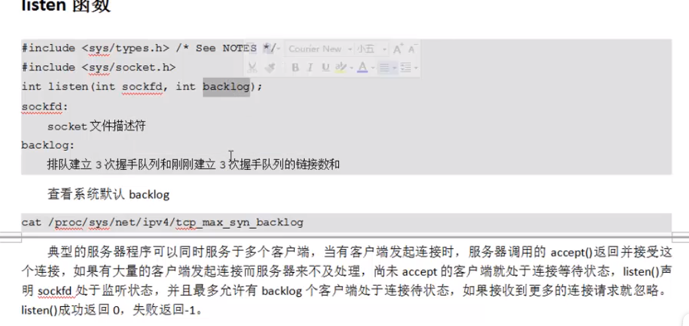
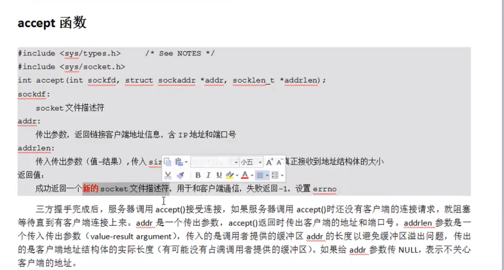
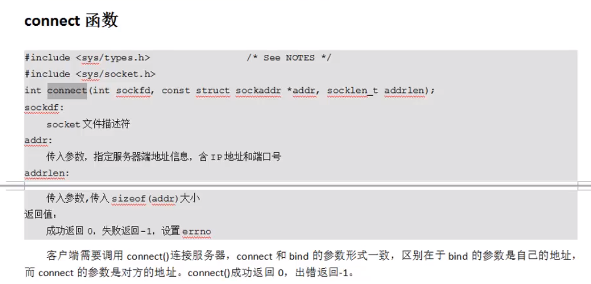

#### 链接库

动态链接库与静态链接库

```bash
静态库制作步骤##################
gcc -c add.c -o add.o
使用ar工具
ar rcs lib库名.a add.o div.o
#静态库中添加这几个函数
add(x,y)
div(x,y)
链接阶段出错没有行号提示
gcc test.c lib库名.a -o test
#讲库函数编译到执行文件中
动态库制作######################
objdump -dS test 反汇编
制作动态库时生成的.o文件与静态库有差别
1.gcc -c add.c -o add.o -fPIC(生成与位置无关的代码)

使用gcc -shared的选项来制作动态库
2.gcc -shared -o lib库名.so add.o sub.o div.o
3.编译可执行文件时指定使用的动态库
4.指定所使用的动态库 -l使用库名 -L指定库路径
gcc test.c -o a.out -lmymath  -L ./lib

###设置动态链接库的环境变量###
LD_LIBRARY_PATH=./lib
export LD_LIBRARY_PATH=./lib


```


```bash
头文件首位  mymath.h
#ifndef _MYMATH_H
#define _MYMATH_H
int add(int ,int);
int sub(int ,int);
int div1(int,int);
#endif
文件中
#include "mymath.h"
```


sizeof与strlen

```
size_t strlen(char const* str);
```

size_t 类型（即无符号整型）而 size_t 类型绝不可能是负的。因此，语句“if(strlen(x)-strlen(y)>=0）”将永远为真。

> strlen不包含null结束字符

> sizeof 包含结束字符 

```
sizeof是算符，strlen是函数。
```


#### 文件描述符

0 — STDIN_FILENO
1— STDOUT_FILENO
2— STDERR_FILENO

fd打开从3开始

```
/dev/tty --终端文件

```

read=-1   Eerror 设置EAGAIN或EWOULDBLOCK

如果是EAGAIN说明read在以非阻塞方式读一个设备文件


##### gcc 编译的四步骤

1.预处理，汇编，汇编，链接

##### gdb使用方法

```  
gcc -g test.c -o app//使用gcc进入调试模式
list (l) n1,n2   //查看第n1行到n2行
break (b) n      //在n行设置断点
run  （n）          //开始运行程序
print i或者print n  //查看变量
continue (c)      //继续执行
```

##### Main函数的argc 与argv

```
int main(int argc, char* argv[])
argc: 整数,用来统计你运行程序时送给main函数的命令行参数的个数
argv 是argument vector的缩写，表示传入main函数的参数序列或指针。
argv[0] 指向程序运行的全路径名
argv[1] 指向在DOS命令行中执行程序名后的第一个字符串
argv[2] 指向执行程序名后的第二个字符串

#include <stdio.h>
int main(int argc, char *argv[ ])
{
printf("%d\n",argc);
while(argc)
printf("%s\n",argv[--argc]);
return 0;
}
```

##### 1.linux下c文件操作

###### open函数

```c++
open()函数需要的头文件
#include <sys/types.h>
#include <sys/stat.h>
#include <fcntl.h>
```

```
open函数原型
int open(const char *pathname, int flags);
int open(const char *pathname, int flags, mode_t mode);
```

```
参数 pathname flags mode 
pathname 要打开的文件路径名称
flags   O_RDONLY	只读方式打开文件	这三个参数互斥
        O_WRONLY	只写方式打开文件
        O_RDWR		读写方式打开文件
        O_CREAT		如果文件不存在，则创建该文件	 
        O_TRUNC		如文件已经存在，则删除文件中原有数据	 
        O_APPEND	以追加方式打开文件
```

```
成功	大于等于0 的整数（即文件描述符）
失败	-1,并且errno会被设置
```

###### close函数

```
功能 关闭文件并释放相应资源
头文件  #include<unistd>
原型 	
int close(int fd);
参数	      fd	要关闭的文件的描述符
```

```
ulimit -a # 查看打开的文件限制
ulimit -n 1024 # 设置文件上限
```

###### 文件描述符

###### sprintf函数

###### read函数

```
#include <unistd.h>
ssize_t read(int fd, void *buf, size_t count);
```


| 参数 | fd    | 将数据写入到文件fd 中 （fd是某个文件的描述符）   |
| ---- | ----- | ------------------------------------------------ |
|      | buf   | 指向即将要写入的数据，（要写的数据的内存首地址） |
|      | count | 要写入的字节数                                   |

###### write 函数

```c
//一个简单的文件读写操作实例
#include <stdio.h>
#include <stdlib.h>
#include <unistd.h>
#include <sys/types.h>
#include <sys/stat.h>
#include <fcntl.h>
void main()
{
	int fdsrc,fddes,nbytes,wtype;
	char str[30];
	if((fddes=open("pass",O_CREAT|O_TRUNC|O_WRONLY,0600))<0)
	{
		printf("打开（创建）文件pass失败！");
		exit(1);
	}
	if((fdsrc=open("/etc/passwd",O_RDONLY))<0)
	{
		printf("打开文件失败！");
		exit(1);
	}
	while((nbytes=read(fdsrc,str,30))>0)
	{
		if((wtype=write(fddes,str,30))<0)
			printf("写入文件失败");
	}
	close(fdsrc);
	close(fddes);
}
```

##### lseek()函数

设置文件的读写位置

```
 lseek(fd,o,SEK_SET); #设置为起始位置
 
```

### 共享内存映射


```
mmap (void* addr,size_t length ,int prot ,int flags ,int fd ,off_t offset)
创建共享内存映射
addr NULL 系统自动分配
length 共享内存大小（<=文件的大小）
prot 共享内存区的读写属性  PROT_EXEC 执行   PROT_READ|PROT_WRITE  		读写
flags 标注共享内存的共享属性  MAP_SHARED/MAP_PRIVATE
fd    用于创建共享内存应映区的文件的文件描述符
offset 偏移位置
返回值:
	成功:成功返回映射区的首地址
	失败:MAP_FAILED  返回一个-1的void*强转


```

### 信号

简单，不能携带大量信息，满足条件才能发送
信号是软件层面的中断（时钟中断才是硬件层面的中断）

所有的进程收到的信号都是由内核负责发送的

产生信号的五种方式

```
1.按键产生  ctrl+c ctrl+z
2.系统调用  kill ,ralse,abort
3.软件条件的产生  alarm
4.硬件
5.命令 kill
```

```
递达与未决
信号处理方式：1.执行 2.忽略3.捕捉 
```


### 守护进程

daemon进程 ，通常在操作系统后台运行，一半不与用户直接交互，周期的等待某一个事情发生 
通常以d结尾的命名方式

```
1.创建子进程，终止父进程
fork() 
2.在子进程中创建会话
setsid()
3，改变当前目录
chdir()
4.重设文件权限掩码
umask
5.关闭或者重定向文件描述符
close(fd)
6.开始执行守护进程核心工作守护进程退出处理程序模型

```


#### fork函数

**1）在父进程中，fork返回新创建子进程的进程ID；**
    **2）在子进程中，fork返回0；**
    **3）如果出现错误，fork返回一个负值；**


**getppid()**  获取父进程号

 **getpid()** 获取进程号

| > -1 | 成功 |
| ---- | ---- |
| ==-1 | 失败 |


```
#include<stdio.h>
#include<stdlib.h>
#include<unistd.h>


main(){
    
    pid_t pid;
    if((pid=fork())==-1)
    {
        
        perror("fork");
        exit(EXIT_FAILURE);
    }
    printf("hello \n");
    return 0;
    swith(pid)
    {
        case -1:perror("fork");
				break;
		case 0: printf("THIS is child process,pid =%d ,ppid%d!\n",gitpid());
				break;
		default:sleep(1);
				printf("this is parent process, pid =%d,chilidpid =%d \n",gitpid(),pid);
				break;
        
        
    }
    return 0;
}
```


像这种打印奇怪的原因是因为父进程结束了，在程序最后加一个循环while(1)
不让这个程序结束就行了，不过这也可能会造成孤儿进程的出现


执行完fork后，进程1的变量为count=0，fpid！=0（父进程）。进程2的变量为count=0，fpid=0（子进程），这两个进程的变量都是独立的，存在不同的地址中，不是共用的，这点要注意。可以说，我们就是通过fpid来识别和操作父子进程的。
    还有人可能疑惑为什么不是从#include处开始复制代码的，这是因为fork是把进程当前的情况拷贝一份，执行fork时，进程已经执行完了int count=0;fork只拷贝下一个要执行的代码到新的进程。


#### wait

暂停当前进程直到子进程结束，并取回子进程结束的状态

**#include<sys/wait.h>**

#### exit

exit 表示正常终止一个进程

```
exit(EXIT_FAILURE);
exit(EXIT_SUCCESS)
```


#### waitpid()

参数
 PID
 STATLOC   子进程终止状态的地址
OPTIONS	控制操作方式的选项

WHOHANG 等待子进程的过程中，父进程不被堵塞

PID == -1 便是等任意一个子进程结束

```c
//示例等待子进程退出

#include<stdlib.h>
#include<stdio.h>
#include<unistd.h>
#include<sys/wait.h>

int main(){
    
    int pid;;
    if((pid=fork())<0){
        perror("fork");
        exit(EXIT_FAILURE);;
        
    }
    else if(pid == 0){
        
        sleep(3);
        printf("now child is exiting \n");
        exit(EXIT_SUCCESS);
    }
    else {
        
        
        waitpid(-1,NULL,WHOHANG);
        printf("parent process is waiting child to exit \n");
    }
}
```


```
waitPID(-1,NULL,WHOHANG)
```

**二、fork进阶知识**

#### 循环使用fork

```
#include<stdio.h>
#include<unistd.h>
#include<sys/types.h>


main(){
    pid_t pid;
    int i=1;
    while(i<4)//会有五个进程
    {
        pid = fork();
        if(pid == 0)
        {
            printf("no.%d process,my pid %d",i,getpid());
            if(i!=0)
            return 0;
        }
        i++;
        
    }
       
}
```


为了避免循环让fork一直创建子进程，没判断一次pid==0就break一次

```
    for(int i=0;i<n;i++){

        if((pif=fork())==0){
            break;
        }
    }
```


#### getenv函数


```c
#include <stdio.h>
#include <stdlib.h>

int main ()
{
   printf("PATH : %s\n", getenv("PATH"));
   printf("HOME : %s\n", getenv("HOME"));
   printf("USER : %s\n", getenv("USER"));

   return(0);
}
/*
PATH : /usr/local/sbin:/usr/local/bin:/usr/sbin:/usr/bin:/sbin:/bin:/usr/games:/usr/local/games:/snap/bin
HOME : /home/myc
USER : myc

*/
```


#### vfork()

**头文件#include<unistd.h>**


#### 僵尸进程

子进程结束后 pcb 仍然存在内核空间中

```
#include<stdio.h>
#include<stdlib.h>


main(){
    
    pid_t pid;
    if((pid=fork())<0){
        perror("fork");
    }else if(pid == 0)
    {
        
        printf("child process %d will be azomble!",getpid());
          exit(EXIT_SUCCESS);
    }
    else{
        
        sleep(2);
        system("ps u");
         exit(EXIT_SUCCESS);
      
    }
    
    
}
```

#### 孤儿进程

父进程先于子进程退出，则子进程变成孤儿进程

```C
#include<stdio.h>
#include<stdlib.h>
#include<unistd.h>
#include<sys/types.h>

main(){
    
    pid_t pid;
    if((pid=fork())<0){
        perror("fork");
    }else if(pid == 0)
    {
        
        printf("pid=%d,ppid=%d\n",gitpid() ,getppid());
        sleep(3);
         printf("pid=%d,ppid=%d\n",gitpid() ,getppid());
        //父进程推出后，子进程成为孤儿进程，则其ppid会变成一号进程
    }
    else{
        
        printf("parent process Pid=%d \n",gitpid());
        exit(EXIT_SUCCESS);
    }
    
}
```


#### execvp

**问题：一个程序如何运行另一个程序？**

**答：程序调用execvp**

execvp有两个参数：

要运行的程序名和那个程序的命令行参数。

当程序运行时命令行参数以argv[]传给程序。最后一个参数必须为NULL。

```
#include<stdio.h>
main(){
    char *arglist[3];
    arglist[0]="ls";
    arglist[1]="-l";
    arglist[2]=0;   //参数字符串必须以0结束
    printf("********About to execute ls -l\n");
    execvp("ls",arglist);
    printf("********ls is done.bye\n");
}
```

```
#include<stdio.h>
#include<unistd.h>
int main(){
    
    
    char *argv[]={"cp","/etc/passwd","tmppass",NULL};
    printf("let's use execvp\n ");
    execvp("cp",argv);
    printf("******This is the end******");
}
```

#### execve

execve（执行文件）在[父进程](https://baike.baidu.com/item/%E7%88%B6%E8%BF%9B%E7%A8%8B/614062)中fork一个子进程，在子进程中调用exec函数启动新的程序。exec函数一共有六个，其中execve为内核级[系统调用](https://baike.baidu.com/item/%E7%B3%BB%E7%BB%9F%E8%B0%83%E7%94%A8/861110)，其他（execl，execle，execlp，execv，execvp）都是调用execve的[库函数](https://baike.baidu.com/item/%E5%BA%93%E5%87%BD%E6%95%B0/3471322)


```c
#include<unistd.h>
main()
{
char * argv[ ]={"ls","-al","/etc/passwd",(char *)0};
char * envp[ ]={"PATH=/bin",0};
execve("/bin/ls",argv,envp);
}
```

### 重定向与管道

```c
#include <stdio.h>
FILE * popen(const char *command , const char *type );
int pclose(FILE *stream);
```

popen()函数通过创建一个管道，调用fork()产生一个子进程，执行一个shell以运行命令来开启一个进程。这个管道必须由pclose()函数关闭，而不是fclose()函数。pclose()函数关闭标准I/O流，等待命令执行结束，然后返回shell的终止状态。如果shell不能被执行，则pclose()返回的终止状态与shell已执行exit一样。

```c
#include<stdio.h> 
  #include<unistd.h> 
  #include<string.h>   
  int main() 
  { 
    FILE *fp=NULL; 
    FILE *fh=NULL; 
    char buff[128]={0};   
   memset(buff,0,sizeof(buff)); 
   fp=popen("ls -l","r");//将命令ls-l 同过管道读到fp 
   fh=fopen("shell.c","w+");// 创建一个可写的文件 
   fread(buff,1,127,fp);//将fp的数据流读到buff中 
   fwrite(buff,1,127,fh);//将buff的数据写入fh指向的文件中   
   pclose(fp); 
   fclose(fh);   
   return 0;   
   } 
```

运行结果

```
[lol@localhost practice]$ ``ls
popen popen.c shell.c
[lol@localhost practice]$ ``cat` `shell.c
total 12
-rwxrwxr-x. 1 lol lol 5478 May 24 15:39 popen
-rw-rw-r--. 1 lol lol 473 May 24 15:39 popen.c
-rw-rw-r--. 1 lol lol  [lol@localhost practice]$ vim popen.c
[lol@localhost practice]$
```


###  线程

- LWP：light weight process **轻量级的进程**，本质仍是**进程**(在Linux环境下)
- 进程：独立地址空间，拥有PCB
- 线程：也有PCB，但没有独立的地址空间(共享)
- 区别：在于是否共享地址空间。 独居(进程)；合租(线程)。
- Linux下： 线程：**最小的执行单位，调度的基本单位。**
- 进程：**最小分配资源单位，可看成是只有一个线程的进程**

### 线程锁

给占有资源的那个进程加锁，保证线程的顺序执行，资源不被抢占

try锁 

尝试加锁  ，加不了返回错误信息

读写锁1


#### pthread

**头文件 #include<pthread.h>**

**pthread_self函数  获取线程ID。其作用对应进程中 getpid() 函数。**

- pthread_t pthread_self(void); 返回值：成功：0； 失败：无！

**pthread_create函数  创建一个新线程。 其作用，对应进程中fork() 函数。**

- int pthread_create(pthread_t *thread, const pthread_attr_t *attr, void *(*start_routine) (void *), void *arg);

pthread_exit 结束调用线程

* void pthread_exit(void *retval); retval 为void类型指针，指向退出信息

| 功能      | 线程                                   | 进程                                                 |
| --------- | -------------------------------------- | ---------------------------------------------------- |
| 创建      | pthread_create                         | fork,vfork                                           |
| 退出      | return，pthread_exit                   | exit,return,_exit                                    |
| 等待      | pthread_join                           | wait waitpid                                         |
| 取消/终止 | pthread_concel                         | abort                                                |
| 读取ID    | pthread_self                           | getpid                                               |
| 调度策略  | SCHED_OTHER,SCHED_FIFO,SCHED_RR        | SCHED_OTHER，SCHED_FIFO,SCHED_RR                     |
| 通信机制  | 信号量，信号，信号锁，条件变量，读写锁 | 匿名管道，命名管道，信号，消息队列，信号量，共享内存 |


线程入口可以传入参数


创建线程

```c
#include<stdio.h>
#include<pthread.h>
#include<unistd.h>
#include<stdlib.h>


void *tfn (void *arg){
    
    
    printf("tfn--pid=%dd,tid=%lu\n",gitpid(),pthread_self);
    return (void*)0;
}

int main(){
    pthread_t tid;
	printf("main--pid=%d,tid=%lu\n",gitpid,pthread_self());
    int ret=pthread_create(&tid,NULL,tfn,NULL);
    if(ret!=0){
        
        fprintf(stderr,"pthread_createerror:%s\n",strerror(ret));
        exit(1);
    }
    sleep(1);
	return 0;
    
    
    return 0;
}
```

#### 返回消息pthread_exit 与pthread_join 

```c
#include<stdio.h>
#include<stdlib.h>
#include<pthread.h>
#include<sys/types.h>
#include<unistd.h>

int var =0;

void* tfn(  void* argc){
  char *data ="son thread exit message";
  var++;
  printf("tid :%lu  var: %d\n",pthread_self(),var);
  pthread_exit((void*)data);

}

int main(){
    void *thread_ret;
    pthread_t tid1;
    pthread_create(&tid1,NULL,tfn,NULL);
    pthread_join(tid1,&thread_ret);

    printf("main:%s\n",(char*)thread_ret);
    sleep(2);
    return 0;
}
```


#### sys/types.h

\#include <sys/types.h>

基本系统数据类型

是Unix/Linux系统的基本系统数据类型的头文件，含有size_t，time_t，pid_t等类型。


____


### socket编程


网络数据采用大端存储模式，而计算机采用小端存储模式

### 字节序转换

```
#include<arpa/inet.h>

uint32_t htonl(uint32_t hostlong);
uint16_t htons(uint16_t hostshort);
uint32_t ntohl(uint32_t netlong);
uint16_t ntohs(uint16_t netshort);
```

```c
inet_pton()  #直接将字符串转为网咯字节序
inet_ntop()  #将网络字节序直接转化为点分十进制字符串

int inet_pton(int af,const char *src,void *dst)
af: AF_INET(ipv4)  AF_inet6
src:192.168.1.1
dst:

const char *inet_ntop(int af,const void *src, char *dst ,socket_t size );


struct sockaddr  //地址结构体
    
struct sockaddr_in addr;
bind(   ,(struct sockaddr *)&addr);

```

listen() 同时允许多少个客户端建立连接



sockaddr_in 结构体


```
struct sockaddr_in{
sa_family_t sin_family
in_port_t sin_port
struct in_addr sin_addr
}
struct in_addr{
    uint32_t      s_addr;
}
```

inet _pton的源码












建立三次握手的连接总和

头文件#include<sys/socket.h>**

#### 1.socket()

**int socket(int domain, int type, int protocol);**

##### 1.1 int domain

```
domain：指定通信域，选择通信时的协议族。常用设置为：
 AF_INET：网络通信
 AF_UNIX：本地通信
```

##### 1.2 int type

```
type：指定socket的连接类型，其常用取值分别为：
 SOCK_STREAM：TCP协议
 SOCK_DGRAM：UDP协议
 SOCK_RAW：ICMP协议
```

##### 1.3 int protocol

```
protocol：一般设置为0，表示使用默认协议
```

#### 2.bind()

**功能**：使服务器端的一个socket文件与网络中的一个进程进行绑定； 

• 文件描述符标识socket文件，“主机IP+端口号”标识网络中的唯一进程； 

• bind()函数实际上是将服务器端的socket文件与网络中的进程地址进行绑定。

**int bind(int sockfd, const struct sockaddr *addr, socklen_t addrlen);**

##### 2.1 int sockfd

```
sockfd：socket文件的文件描述符，一般由socket()函数返回；
```

##### 2.2 const struct sockaddr *addr

```
addr：需要与服务器进行通信进程的地址，struct sockaddr结构体定义如下：
struct sockaddr {
sa_family_t sa_family;
char sa_data[14];     //进程地址
}
```

##### 2.3 addrlen

```
addrlen：参数addr的长度
```

#### 3.listen()

**int listen(int sockfd, int backlog);**

```
 sockfd：socket文件描述符
 backlog：设置请求队列的最大长度
```

#### 4 **accept()**

accept()在listen()之后使用，阻塞等待客户端的连接请求。在sys/socket.h中： 

int accept(int sockfd, struct sockaddr *addr, socklen_t *addrlen);

三次握手”后，服务器调用accept()处理连接请求，此时若没有客户端的请
求到达，阻塞等待调用accept()函数的进程，直到接收到客户端的请求

ccept()函数接收到客户端的请求，传出客户端的地址。

#### 5.recv()

从已连接的套接字中接收信息。存在于函数库sys/socket.h中：

ssize_t recv(int sockfd, void *buf, size_t len, int flags);

此外，read()函数、recvfrom()函数和recvmsg()函数也可用于接收信息

#### 6.close()

```
释放系统分配给套接字的资源，存在于函数库unistd.h中：
int close(int fd);
```

• fd：文件描述符，当其用于scoket编程中时，需传入socket文件描述符


 #### **网络字节序**


Linux系统提供了一些字节序转换的函数，存在于函数库arpa/inet.h中： 

```c
uint32_t htonl(uint32_t hostlong); 

uint16_t htons(uint16_t hostshort); 

uint32_t ntohl(uint32_t netlong); 

uint16_t ntohs(uint16_t netshort);
```

inet_pton()和inet_ntop()来转换IP地址，


```
IPv4和IPv6的地址格式定义在netinet/in.h中:
 IPv4地址用结构体sockaddr_in表示，包含16位端口号和32位IP地址；
 IPv6地址用结构体sockaddr_in6表示，包含16位端口号、128位IP地址和一些
控制字段；
 Unix Domain Socket的地址格式在sys/un.h中，用结构体sock_addr_un表示。
```

