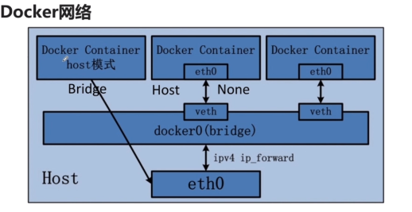

docker 加入开机启动

```
systemctl enable docker
```

```
2048小游戏
http://192.168.220.139:8080/
```

<https://www.daocloud.io/>

daocloud   在线快速部署docker镜像
也可以拉去网易镜像中心的镜像

我看的教程是imooc上的一个老师讲的docker


```shell
docker启动命令,docker重启命令,docker关闭命令

启动        systemctl start docker
守护进程重启   sudo systemctl daemon-reload
重启docker服务   systemctl restart  docker
重启docker服务  sudo service docker restart
关闭docker service docker stop 
关闭docker systemctl stop docker
```


```
docker 部署nignx后
docker exec -it f4 bash
就会进入ngnix这个容器的伪终端
```

### 重启docker

```
systemctl restart docker
```

### 查看进程

```
docker ps 查看正在进行的容器
```

```
docker ps -a 查看所有的容器
```

### 查看容器ip

```
docker exec -it xxx sh 进入容器终端
cat /etc/hosts 显示ip所在的配置文件
```


## docker网络

### docker 端口映射




```
docker stop f4  停止f4开头的容器
```

```
docker run -d -p 8080:80 hub.c.163.com/public/nginx:1.2.1
映射到8080 端口

docker run -d -P hub.c.163.com/public/nginx:1.2.1
P相当于开放容器所有的端口进行随机映射
```

```
netstat -na|grep 8080 查看端口状态
```


## Dcokerfile

docker bulid
Jpress :http://jpress.io/   (   开源的javaweb  wordpress的java版本)

TEST/    Dockerfile    jpress

### 什么是 Dockerfile？

Dockerfile 是一个用来构建镜像的文本文件，文本内容包含了一条条构建镜像所需的指令和说明。

```
from  hub.c.163.com/library/tomcat

MAINTAINER muyinchuan myc2019410@163.com

COPY jpress.war  usr/local/tomcat/webapps
```


```
docker build -t jpress:latest .  指定名字
```

```
docker run -t -d
```

### 容器数据卷


```
docker cp  #复制文件到容器
```

```
docker run it   -v /mydatavolume:/datavolumeContainer  镜像名
```

