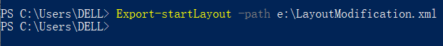
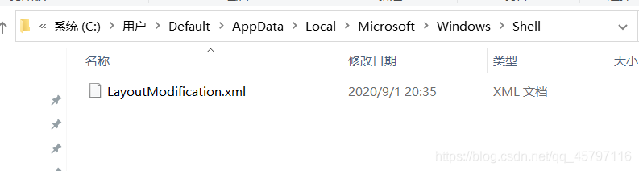

#### windows此贴备份

**2、导出“开始”屏幕布局**
设置好你希望看到的“开始”屏幕布局时，在开始菜单，然后选择Windows PowerShell，
在 Windows PowerShell 命令提示符下，输入以下命令：

```typescript
Export-startLayout -path e:\LayoutModification.xml
1
```



------

在前面的命令中:
-path 是指定导出文件的路径和文件名的所需参数
e:\ 是就是E盘嘛，LayoutModification.xml 就是我们需要的自定义布局文件生成的布局文件示例

如比较熟悉了，直接改这个文件里面的代码也可以设置成你想要的样子

------

**3、把导出的 LayoutModification.xml 文件放到系统的\Users\Default\AppData\Local\Microsoft\Windows\Shell\ 目录**

如图:


到此，自定义“开始”屏幕磁贴菜单布局，就完成了。然后安装好系统“开始”屏幕布局就是之前设置好的样子了。（其实在你的最初电脑中有一个同文件尾缀名的系统默认文件，其保存的是最初默认开始栏样式，在这里我的已删除~）