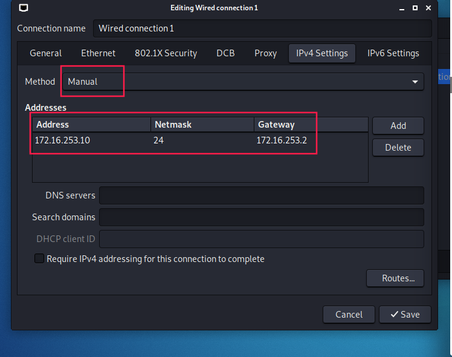
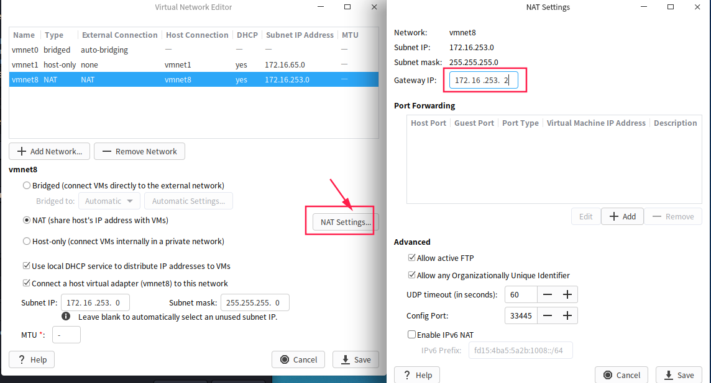
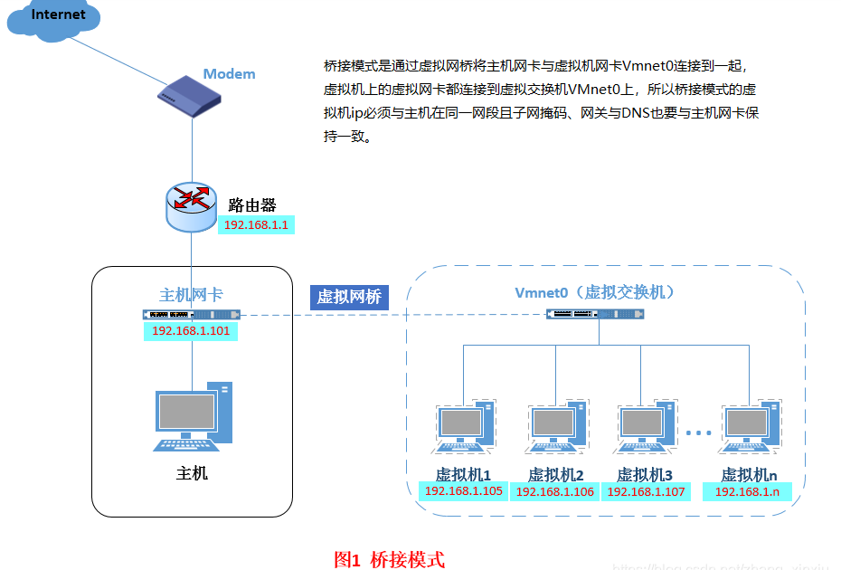
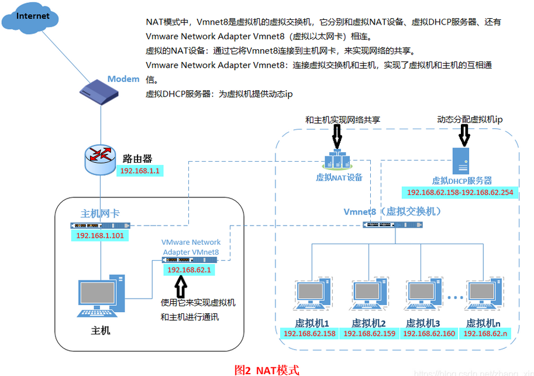

问题1:kali连不上网 


将网卡设置为NAT

然后修改网络配置信息
改为手
地址为vm nat局域网存在的网络ip 




设置NAT网关




然后再重启网卡 即可

```
物理方法:右下角标志右键
命令方法:ifconfig eth0 down 
ifconfig eth0 up
```


分为NAT 与桥接 host only三种模式

nat为一个局部内网

需要主机设定在规定的网段不然不能上网

```
VMnet0：用于虚拟桥接网络下的虚拟交换机

VMnet1：用于虚拟Host-Only网络下的虚拟交换机

VMnet8：用于虚拟NAT网络下的虚拟交换机
```

桥接


nat

