中断发生原理
溢出


### 2.数据

数据的表示与运算

冯诺依曼思想包含哪些要点？

1. ```
   1. 计算机硬件系统由五大部件（存储器，运算器，控制器，输入设备，输出设备）组成；
   2. 计算机中采用二进制形式表示信息（数据，指令）；
   3. 采用存储程序的工作方式；
   ```

   

计算机有哪些主要性能指标？


基本字长/外频/cpu的综合性能/数据的通路宽度与数据传输率/存储容量

#### 计算机性能指标

##### 系统整体的性能指标


##### 存储器

MAR MDR


##### CPU

CPU时钟周期，时钟频率，CPI ，IPS


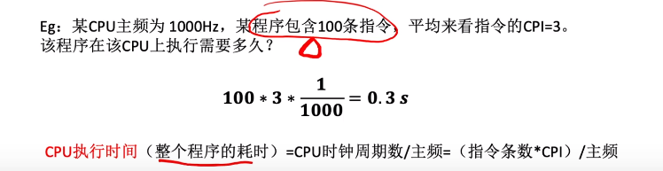


主频是每秒钟又多少个时钟周期


#### 进制转换


#### 计算机硬件的典型框架


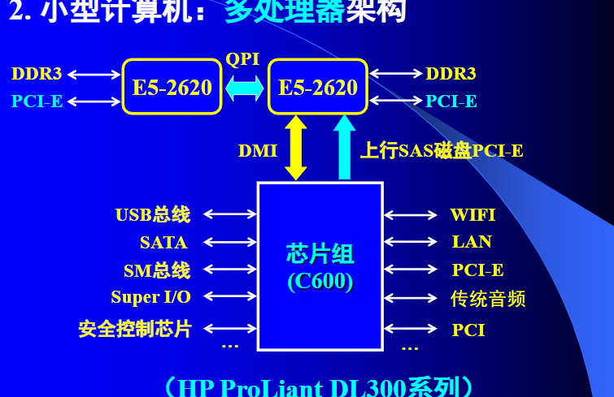


### 数据的表示


#### 十进制转二进制


二进制转化为十进制

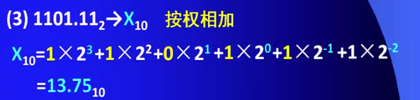


原码与补码转换


一般来说，补码就是原码取反加一，还原成原码的时候应该先减去一再取反 在二进制里，"减一取反"和"取反加一"等价，所以我们可以这么做


#### 浮点数


##### 移位


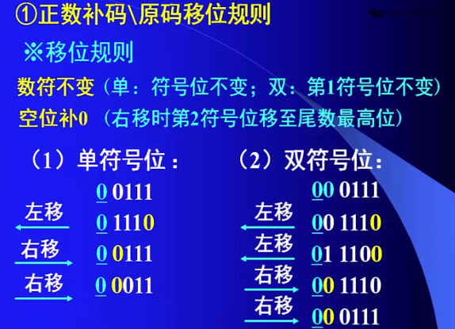


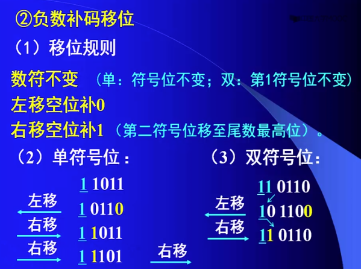


ASCLL码


10111010BA  

左移：11110100 F4

右移：11011101 DD

#### 溢出判断

#### 基本运算方法

##### ①定点加减运算


##### ②溢出判断


#### 常用数据校验方法

###### ASCLL码


###### **汉字点阵**


##### ①奇偶校验码

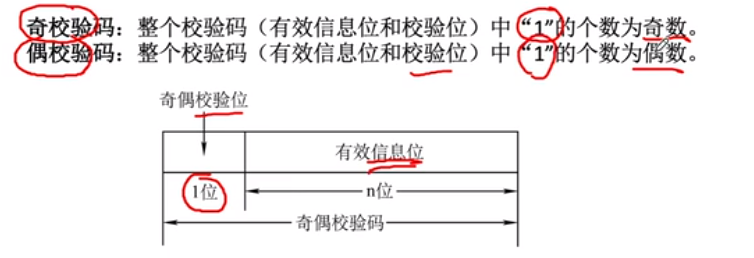


 

##### ②海明校验


 

##### ③循环冗余验证


---


### 3.CPU子系统

#### 3.1

​    **运算部件（** **ALU** **）**

​          **寄存器组**

​           **微命令产生部件**

​           **时序系统**

​          **CPU ** **内部数据通路**


**、时序系统**
**指令周期**：取出并执行一条指令所需时间。
    通常一个指令周期包含3--4个机器周期。如取指令周期
、取操作数周期、指令执行周期等。
**机器周期(**又称CPU周期或工作周期)：机器周期对应指令
执行的不同阶段，如取指令、取操作数、执行等阶段。各阶
段长短不一，按最长的阶段来划分机器周期。通常一个机器
周期包含4个时钟周期 T1-T4。
**时钟周期**（又称节拍或 T 周期）：对应基本定时信号，
由它确定主时钟频率


**1、CPU的主要功能**
**指令控制**：控制程序执行顺序，如：逐条执行或跳转执行；
**操作控制**：产生每条指令所需的控制命令；
**时间控制**：产生操作时序，按时间顺序启动各类操作；
**数据加工**：对数据进行算术运算和逻辑运算处理
**中断处理**：对计算机中出现的异常情况和特殊请求进行处理

#### PSW

程序状态字寄存器


#### 3.2指令系统


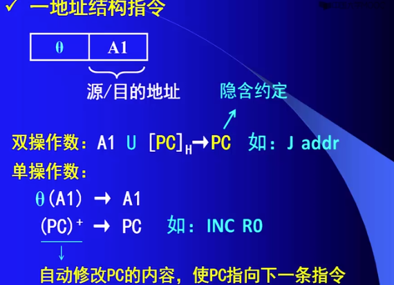


##### 5，PC寻址（相对寻址）


##### 6，页面寻址


有效利用寻址空间


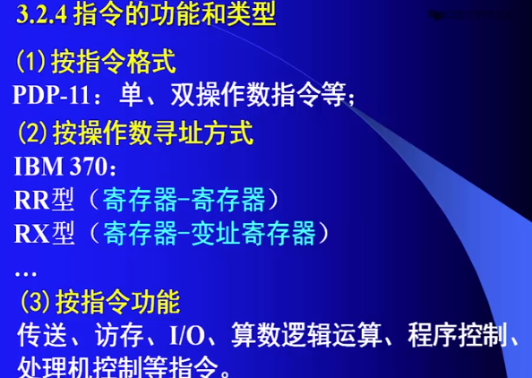


MIPS指令集，寄存器分配


R 寄存器I立即数 J 跳转


##### 11.堆栈寻址


##### 总结 常见寻址


#### 指令系统设计与分析


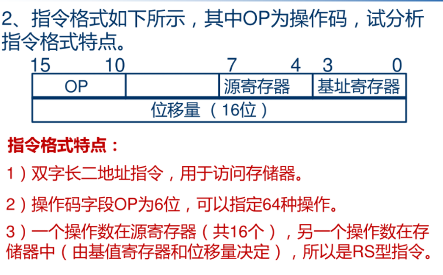

#### 指令字长


#### 操作指令计算

扩展指令格式与数目


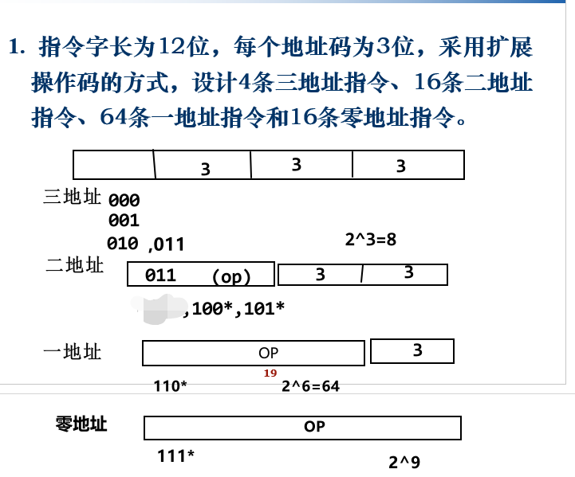


#### 3-3CPU设计模型


##### 逻辑运算实现


32位或运算


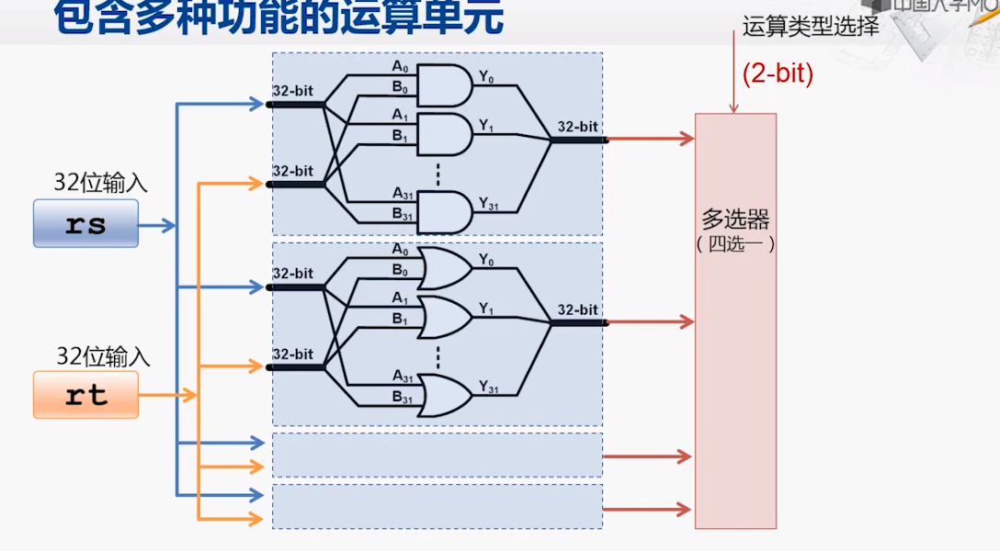

##### 加法实现

半加器


异或门与与门


##### 四位加法器


32位


###### 溢出判断

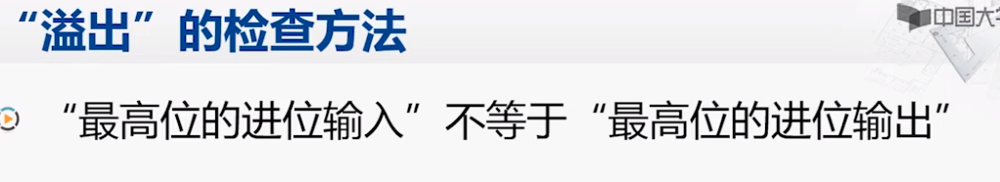


使用异或门判断是否溢出

如果a、b两个值不相同，则异或结果为1。如果a、b两个值相同，异或结果为0


##### 减法运算与实现

补码按位取反末尾加一


##### 加法器的优化


延迟


三级门延迟提前计算进位


**超前进位加法器**


##### 乘法的实现


##### 乘法器的实现

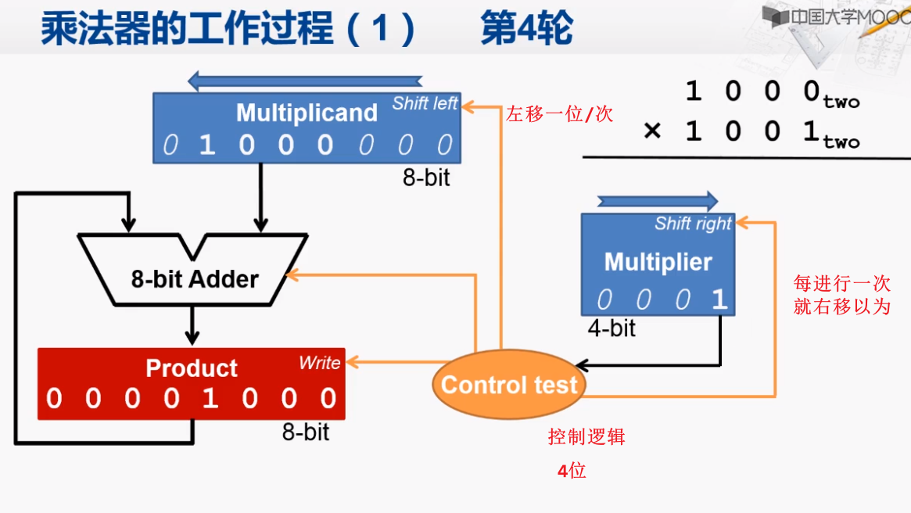


##### 乘法器的优化


#### 3-5 组合逻辑控制方式


  


### 4.存储器

```
1、按存储原理分：（即不同的存储介质）
       （1）半导体存储器
       （2） 磁表面存储器：磁盘、磁带、磁鼓、磁卡等
      （3） 光盘存储器

```

```
2、按存取方式分：
      （1） 随机存取存储器  （RAM）：分为SRAM，DRAM
       （2） 只读存储器 （ROM）：如CM
       （3）顺序存取存储器 （SAM）: 如磁带
       （4）直接存取存储器   （DAM）:如磁盘

```

##### 三级存储体系


****

**虚拟存储技术**


##### 双通道内存条


### 5.总线与I/O子系统


（3）预处理
（4）控制逻辑


##### 中断向量表


、INTO检查是否存在起初中断 INT4 


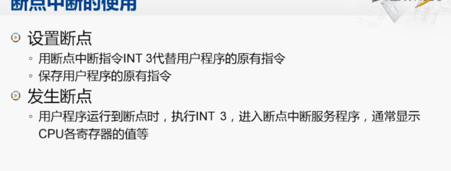

##### 断掉设置


##### 内部中断特点


##### DOS中断调用


#### 外设与外部中断


**标志M/0=0 代表外设**


##### 统一编址

讲内存的部分空间划分给外部I/O


模型机


##### 统一编址的优缺点


##### 程序查询传送方式


##### 数据输入输入中断


#### DMA（直接存储器访问）

直接存储器访问, Direct Memory Access (DMA),数据传送过程不需要CPU干预(不需要执行程序指令)由专门硬件控制电路控制,进行外设与存储器间直接数据传送。

就不需要cpu执行存储器间的数据传输


#### X86体系


##### MIPS RISC


##### 实模式与保护模式


##### CPU如何判断地址还是立即数


问题与疑惑：

为什么cpu字长为32

超级计算机一次能处理多少位是数据

电信号光速对cpu的限制


