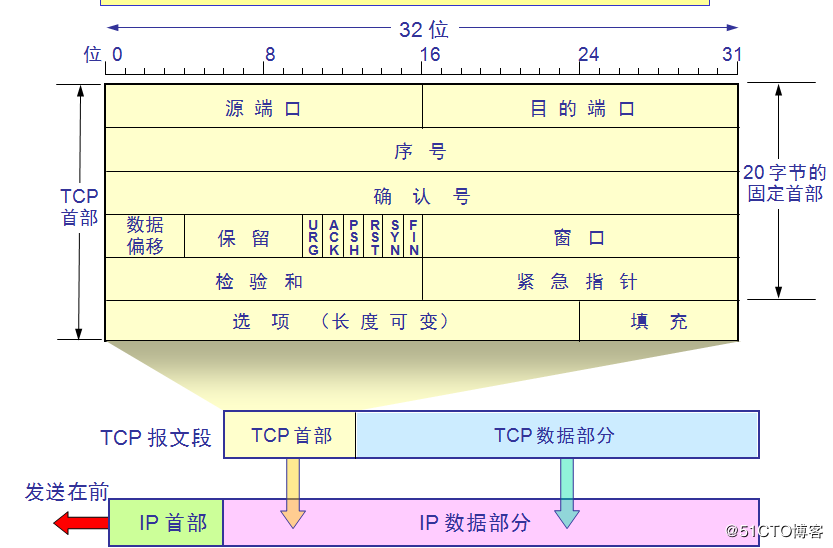
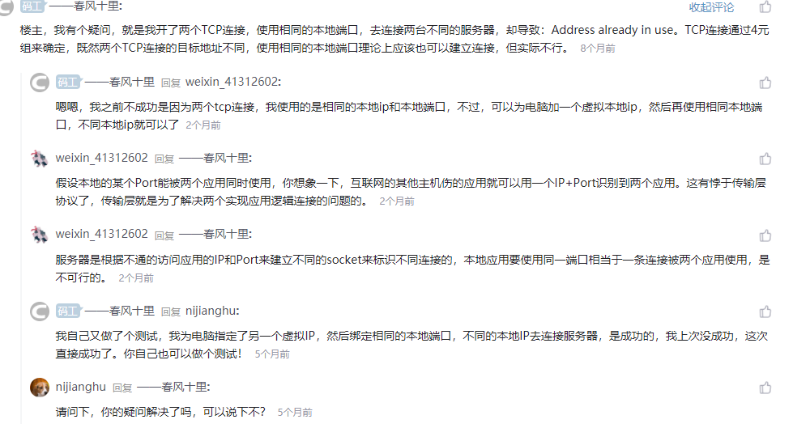

待理解问题：

```
udp与tcp区别，与优势
```


### 计算机网络参考教程：

http://c.biancheng.net/view/6440.html


#### socket


计算机网络分层

https://ip.tool.chinaz.com/ 站长查询

#### RIP


#### ARP

**格式**


#### 透明传输


那么可以伪造数据让数据不透明


#### MAC（数据链路层）


fcs 帧校验序列 
mac帧添加了16个字节

以太网帧最短是64个字节 那么ip数据包的内容就必须在 46（64-18——1500之间

应用传输的流量比实际的大

目的mac应该是下一次网关的mac


##### mac伪造

计算机MAC地址不能修改，但是可以可以不使用这个mac的地址进行通信
通过改mac表也可以使计算用指定的mac地址通信
局域网扫描器可以查看局域网主机ip 与主机名


使用：mac地址欺骗，防止mac验证

#### pathping


这里的ip只有成都和北京，让我有大大的疑惑为什么只有两个城市，原本以为会像火车一样通过整个中国的节点

中间有个网络节点叫**骨干网**，引起我的注意

**骨干网**就是城市与城市之间连接的网络专线


其对应相关的协议


```
1）内部私有地址，Internet上没使用的地址

A类 10.0.0.0--10.255.255.255

B类 172.16.0.0--172.31.255.255

C类 192.168.0.0--192.168.255.255
```

TCP与UDP的区别

**UDP（User Data Protocol）用户数据报协议**

1. 无连接
2. 不可靠（不能保证都送达）
3. 面向报文（UDP数据传输单位是报文，不会对数据进行拆分和拼接操作，只是给上层传来的数据加个UDP头或者给下层来的数据去掉UDP头）
4. 没有拥塞控制，始终以恒定速率发送数据
5. 支持一对一、一对多、多对多、多对一
6. 首部开销小，只有8字节

**TCP（Transmission Control Protocol）传输控制协议**

1. 有连接
2. 可靠的
3. 面向字节流
4. 全双工通信，TCP两端既可以作为发送端也可以作为接收端
5. 连接的两端只能是两个端点，即一对一，不能一对多
6. 至少20个字节，比UDP大的多


#### 1.物理层

规程专指物理层协议

信道复用技术

码分多址CDMA 

#### 2.数据链路层

数据链路层解决了那些问题

**1.数据帧的透明传输**

**2.差错检测**

CRC检验

**3.寻址问题**

但只适用于局域网，没有解决网络互联问题

**DHCP欺骗**：伪装成DHCP服务器，以实现信息劫持，例如将网关地址设为自己的地址，劫持所有发送给网关的信息，实现中间人攻击

2.操纵生成树协议（STP，SpanningTree Protocol）与BPDU防护技术。       
         为防止设备之间不断循环转发相同数据产生广播风暴或MAC地址翻动问题，STP通过阻塞一部分端口获得一个无环的树形拓扑。选举一个根网桥，选择各非根网桥的跟端口来发送和接收流量，选择各个网段的指定端口，非指定端口就是为了避免逻辑环路而阻塞的端口。

```
     STP协议通过桥协议数据单元（BPDU）来判断根网桥、根端口和指定端口，若攻击者制造出一个BPDU赢得根网桥选举，那么可以获得很多重要信息。

     防御策略：一般位于网络末端的设备不应参与根网桥选举，不会生成BPDU信息，这类终端设备的接入端口上适宜部署BPDU防护机制。配置了BPDU的接入端口一旦受到BPDU消息，就会进入err-disabled状态，该端口禁用
```

**网络层以上使用ip地址，链路层及以下使用硬件mac地址！**

220.168.10.10    00-15-C5-C6-CC-07

#### 3.网络层

路由器

### TCP传输


### 模型





深入理解http协议

### UDP报文


arp协议  arp欺骗
ftp协议 


```
7）A、B、C类私有地址**

私有地址(private address)也叫专用地址，它们不会在全球使用，只具有本地意义。

A类私有地址：10.0.0.0/8，范围是：10.0.0.0~10.255.255.255

B类私有地址：172.16.0.0/12，范围是：172.16.0.0~172.31.255.255

C类私有地址：192.168.0.0/16，范围是：192.168.0.0~192.168.255.255
```

### ARP协议

**地址解析协议，即ARP（Address Resolution Protocol），是根据IP地址获取物理地址的一个TCP/IP协议**

**ARP命令可用于查询本机ARP缓存中IP地址和MAC地址的对应关系、添加或删除静态对应关系等。**

#### NAT

#### 三次握手

#### [三次握手面试理解](https://blog.csdn.net/hyg0811/article/details/102366854?ops_request_misc=%257B%2522request%255Fid%2522%253A%2522159008864619726867802193%2522%252C%2522scm%2522%253A%252220140713.130102334.pc%255Fall.%2522%257D&request_id=159008864619726867802193&biz_id=0&utm_medium=distribute.pc_search_result.none-task-blog-2~all~first_rank_v2~rank_v28-1-102366854.first_rank_v2_rank_v28&utm_term=%E4%B8%89%E6%AC%A1%E6%8F%A1%E6%89%8B)


**动图**


### 滑动窗口的概念


### 端口


服务端的端口是固定的，客户端的端口是随机的。
比如百度知道这个网站，它公布域名是zhidao.baidu.com，端口是TCP80，这个就不可以随便变更。如果经常变，你今天问的问题，明天想看答案发现域名不对，或者端口不对，你就打不开百度知道，答案就找不到了。
客户端端口是随机的，我去访问百度知道的80，系统为浏览器分配了个端口1024。过一会重开电脑，我访问了[新浪](https://www.baidu.com/s?wd=%E6%96%B0%E6%B5%AA&tn=SE_PcZhidaonwhc_ngpagmjz&rsv_dl=gh_pc_zhidao)，可能还是用1024端口，我不关浏览器，还要再开一个浏览窗口访问百度知道时，系统就不可能为这个浏览进程分配1024端口了，因为被占用了，分配的可能是1025或者5021端口了。


端口占用问题

### 问题

服务器的一个端口是如何实现多连接应答

为什么通常客户端需要多端口处理

（但是又想了通过一个ip端口代理不就是实现一个端口处理多个应答，因为所有的资源都是一个端口传过来的）

大概其中的过程是由http服务器实现的

可能是因为时间较快处理问题，通过记录表实现


问题巨大 为什么局域网下两个主机可以用相同端口
也就是NAT网络下的虚拟机 也可以
那岂不是路由不是使用对应的ip端口

（可以理解虚拟机的也需要将端口映射到）


### SYN攻击 

### [CC攻击](https://baike.baidu.com/item/cc%E6%94%BB%E5%87%BB/10959545?fr=aladdin)

攻击者借助[代理服务器](https://baike.baidu.com/item/%E4%BB%A3%E7%90%86%E6%9C%8D%E5%8A%A1%E5%99%A8/97996)生成指向受害主机的合法请求，实现[DDOS](https://baike.baidu.com/item/DDOS)和伪装就叫：CC(Challenge Collapsar)。

CC主要是用来攻击页面的。大家都有这样的经历，就是在访问论坛时，如果这个论坛比较大，访问的人比较多，打开页面的速度会比较慢，访问的人越多，论坛的页面越多，数据库压力就越大，被访问的频率也越高，占用的系统资源也就相当可观

### DDOS攻击

[要发动450G/秒的DDoS攻击所需成本是多少？](https://www.zhihu.com/question/31184744)


### http流程（动态网站访问流程）


SSH

[多线程模拟ddos攻击（java源码）](https://my.oschina.net/wangnian/blog/651773)


### 6. 路由选择协议

常见的路由选择协议有：RIP协议、OSPF协议。

**RIP** **协议** ：底层是贝尔曼福特算法，它选择路由的度量标准（metric)是跳数，最大跳数是15跳，如果大于15跳，它就会丢弃数据包。

**OSPF** **协议** ：Open Shortest Path First开放式最短路径优先，底层是迪杰斯特拉算法，是链路状态路由选择协议，它选择路由的度量标准是带宽，延迟。


#### 路由表


****


网络拓扑结构


作者：shotgun

链接：https://www.zhihu.com/question/31184744/answer/51145357

来源：知乎

著作权归作者所有。商业转载请联系作者获得授权，非商业转载请注明出处。

严正申明，本文是一本道，请不要再继续引用里面的数据了。

（难道原先看起来不像是一本道吗？

=======

谢 

[@王大帅X](http://www.zhihu.com/people/4036689d27220575fb55a6c1ec15b688)

 邀请，刚好手上有一份资料，分享出来大家看看：

**迪蒂奥斯公司商业计划书**

内部资料 请勿泄密

**1 背景**

1.1**市场容量**

2014年，全球拒绝服务攻击的收入达到6亿美元，我国拒绝服务攻击的总收入为3千万美元，各项统计指标均创历史新高。

在未来5年间，我国每年拒绝服务攻击收入将以25%的速度持续增长，到2020年，我国拒绝服务攻击的收入将达到1亿美元，届时中国将成为全球最大、最令人瞩目的拒绝服务攻击市场。

*中国拒绝服务攻击的市场分析*


**市场给我们提供的机会**

到目前为止，国际国内还尚无一家专业提供拒绝服务攻击的公司，迪蒂奥斯的出现填补了市场空白，具有很大的想象空间。

**2 战略定位**

迪蒂奥斯公司通过网站以及线下的产品服务，专门提供拒绝服务攻击。公司通过对客户需求，攻击资源，第三方服务机构，信息安全资讯等资源的整合，为国内的客户提供一个线上线下的互动平台，帮助国内客户通过资讯和线上的服务完成拒绝服务计划。

2.1 公司愿景

公司计划用3年时间，成为国内拒绝服务攻击的门户，提供客户精确丰富的拒绝服务咨询服务。占据国内拒绝服务市场的30％，占国内信息安全市场份额的1/100，并从第三年开始开拓国际拒绝服务市场业务.

2.2 宗旨

通过优质的拒绝服务业务，强大的互联网互动交流平台，给客户提供更快捷，更周到，更有价值的拒绝服务攻击体验。

2.3 市场定位

拒绝服务攻击服务的目标用户包括但不限制于各种大型互联网公司、电子商务、在线金融机构、在线游戏公司等等。

1、战略阻击竞争对手

2、快速扩张期间拉开差距

3、报仇雪恨

4、打击山寨私服

3 产品定位以及功能

采用SaaS（Security as a Service）的理念，打造中国最大的拒绝服务咨询以及相关服务网站，整合行业资源，提供客户各种丰富的拒绝服务攻击体验。

3.1 产品以及服务


**4 运营战略与计划**

4.1 整体运营战略

利用3年时间，成为国内主流拒绝服务提供商，国内最大的信息安全资讯门户网站。占有国内拒绝服务攻击份额的30%, 并且从第三年开始开发海外的业务。


**4.2 公司组织架构**


5 收入以及财务预算

5.1 收入构成


**5.2 支出**

该部分分成两个部分，固定费用和变动费用


