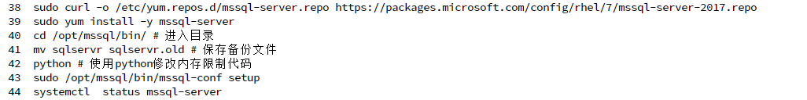

为了尝试部署sqlserver
我觉定停止所有服务

```bash
systemctl stop mysql  #首先停止mysql服务
ps-ef 可以看见mysql停止了
wordpress 网页也没见了,不过我的导航页还在 说明apache 还在运行
然而只释放了0.1G

```


```
我决定查看内存情况，kill掉最大的进程
```

```bash
在docker上安装失败，十分的痛苦，所以我决定直接在我服务器系统上装

sudo curl -o /etc/yum.repos.d/mssql-server.repo https://packages.microsoft.com/config/rhel/7/mssql-server-2017.repo

sudo yum install -y mssql-server
```

参考链接

[mssql for linux](https://blog.csdn.net/weixin_30572613/article/details/95504331) 



[linux下的安装教程](https://www.cnblogs.com/xuanqust/p/11106679.html)

```
中间又出现登录不上去的情况
14.使用以下命令更改 SA 密码：

sudo systemctl stop mssql-server
sudo /opt/mssql/bin/mssql-conf set-sa-password

15.重新启动 SQL Server 服务。

sudo systemctl start mssql-server
```

```
部署之后服务器内存并没有饱满，就这还要求2G
```

