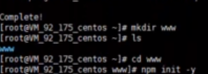
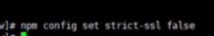
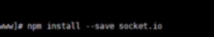
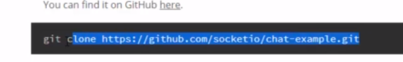

## 基于 NodeJs 搭建 WEB 在线聊天室

### 一.基础环境安装

   #### 1.centos中使用yum安装nodejs

```
yum install nodejs -y
```

#### 2.安装npm包管理器

```
yum install npm -y
```

#### 3.搭建express环境

创建web环境目录

```
mkdir www
```

```
cd www
```

初始化环境目录（回车即可）

```
npm init -y
```

关闭npm的https强制效验

```
npm config set strict-ssl false
```

安装 express

```
npm install express --save
```

#### 4.搭建拉取 socket.io

npm 拉取 socket.io

```
npm install --save socket.io
```

安装 git

```
yum install git -y
```

拉取 socket demo

```
git clone https://github.com/socketio/chat-example.git
```

```
mv chat-example/* /root/www/
```

修改 package.json 文件

- 定位到 /etc/hosts   文件www/package.json

```
{
  "name": "socket-chat-example",
  "version": "0.0.1",
  "description": "my first socket.io app",
  "dependencies": {
    "express": "^4.15.2",
    "socket.io": "^1.7.3"
  },
  "scripts": {
    "start": "node index.js"
  }
}
```

安装 npm 依赖

```
npm install
```

运行 Socket.IO

```
node index.js
```

访问 socket 并测试 demo

访问 [106.53.207.137:3000](http://106.53.207.137:3000/)


### 二.搭建ecpress

#### 1.搭建express

```
npm intsall express --save
```

#### 2.安装npm包管理器

```
yum intsall npm -y
```




全部回车，再关闭npm的校验

查看版本号


socket.io安装


查看socket.io的版本


安装git

```
yum install git -y
```

拉取仓库

```
git clone  https://github.com/socketio/chat/example.git
```




移动位置

```
mv chat-example/* /root/www/
```


npm安装一个整体依赖

```
npm install
```


```
node index.js
```

