```
处理机：计算机系统中存储程序和数据，并按照程序规定的步骤执行指令的部件。
处理机包括中央处理器，主存储器, I/O 接口。处理机再加上外围设备eg:鼠标？键盘？等构成完整的计算机系统。
```


计算机资源主要分为四类
处理机，储存器，i/o设备，以及文件

操作系统分类

* 多批道处理系统
* 分时系统
* 事实系统

基本特征
并发与并行

并行:两个和多个事件同一时间发生
并发:两个或者多个在同一时间间隔内发生


进程是可拥有资源的独立单位

进程与程序是两个截然不同的概念

进程由程序段，相关数据段，和PCB三部分组成

进程具有动态性，并发性，独立性，异步性

进程有三种基本状态
（1）就绪状态

（2）执行状态

（3）阻塞状态


进程控制块的基本信息

（1）进程标识符

（2）处理机状态

​    ① 通用寄存器

​    ② 指令寄存器
​    ③ 程序状态字
​    ④ 用户栈指针

（3）进程调度信息 

   ①  进程状态

   ② 进程优先级

（4）进程控制信息

控制进程快的组织方式
（1）线性方式
（2）链接方式
（3）索引方式

操作系统内核两大重要功能

**支撑功能**
（1）中断处理
（2）时钟管理
（3）原语操作
**资源管理功能**
（1）进程管理
（2）存储器管理
（3）设备管理


引起进程创建的事件
（1）用户登陆
（2）作业调度
（3）提供服务
（4）应用请求

**进程的创建**

（1）申请空白的PCB
（2）为新进程分配其运行的所需的资源
（3）初始化进程控制块 PCB
（4）如果就绪队列能容纳新进程就，便将新进程插入就绪队列

**进程的终止**
（1）正常结束
（2）异常结束
（3）外界干预
进程的阻塞与唤醒
（1）向系统请求共享资源失败
（2）等待某种操作完成
（3）新数据尚未到达
（4）等待新任务的到达


## 进程管理


进程的定义


### 进程与程序的比较


### 进程特征


### 进程的状态


### 进程的状态变迁


### 进程控制块


中断之后再执行既是将 pcb的数据载入相应的寄存器


pcb 是系统感知进程的存在进行控制的唯一标志

### PCB的内容


### PCB的组织


### 进程控制原语


进程创建


进程终止


### **进程同步**


### 生产者与消费者问题


### 信号量机制


以一个停车场的运作为例。简单起见，假设停车场只有三个车位，一开始三个车位都是空的。这时如果同时来了五辆车，看门人允许其中三辆直接进入，然后放下车拦，剩下的车则必须在入口等待，此后来的车也都不得不在入口处等待。这时，有一辆车离开停车场，看门人得知后，打开车拦，放入外面的一辆进去，如果又离开两辆，则又可以放入两辆，如此往复。

在这个停车场系统中，车位是公共资源，每辆车好比一个[线程](https://baike.baidu.com/item/%E7%BA%BF%E7%A8%8B)，看门人起的就是信号量的作用。


信号量起到了一个临界区管理的作用 

临界资源是一段时间只允许一个程序访问的资源

访问临界资源的代码叫临界区 如已经访问了打印机，别的机器就不能访问，不然会出现打印错误（硬件临界资源）


S在这里是表示资源数目，如果打印机是空闲的，就会执行下一操作，即执行打印
在这里P操作（wite(S)）执行完之后程序让出打印机资源就会加一

这个场景让我想起了上厕所，人就好比进程，处于等待厕所与排除废物  两种状态
这样让我想到了一个国家可以类比电脑操作系统，绝妙

**记录信号量**

让权等待 当进程不能进入临界区，应该立即释放处理机，防止进程忙等待。


直接减1,S<0，进程就进入缓存区等待资源，处于堵塞状态


j结束了就释放资源，让给下一位


AND信号量


AND同步机制将进程需要的所有资源一次性的分配给进程，等他使用完了再释放
场景：扫描机扫描——》打印机打印
一个进程一下两个都拥有了，就等他用完

就好比上厕所坑位和卫生纸都在他那里，你想用卫生纸擦嘴都不行

上面的进程A B 就是

都想使用打印机与扫描器，但是由于顺序不一样，使得两个资源都被用了

但进程又没有结束，导致A 结束打印后等待扫描（但是他是进程没释放打印机）
B同理，两个就都阻塞了，发生死锁

而AND信号量就很好的处理了，就是两个一起分，两个一起释放，就不会导致同一时刻A用打印机 B用扫描仪


只要有一个资源处于忙碌状态，进程就不会开始

同个进程对同个资源的访问


信号量集机制


如果一次性需要多个同类资源，比如需要多台打印机同时运行，引入这个信号量集再一次原语将所有资源进行分配

Swait(S1, t1 ,d1)

t1是资源分配下限，低于这个量就不会分配资源给进程

信号量大于低于进程需要的量d1就不会分配

分配后Si=Si - di


还有几个特殊状态

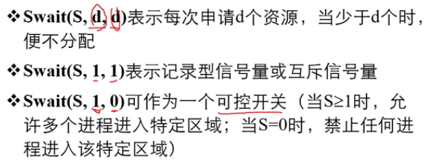


s 开始   F 结束


一个是表示前面是否执行完成，一个是后面的是否能开始


第一类是是否能开始，直接对其释放（或者应该说加一个资源，s+1），后面的就能直接开始


理解这相当与把后驱的进程当作临界资源


生产者，消费者问题


2-3-3


管程机制

解决生产者-消费者问题


### **进程通信  IPC**


windows进程通信：管道，套接字，剪贴板


**消息就是有格式的信息**


线程运行的三个状态

执行 就绪 与阻塞

线程控制块 TCB

### 什么是线程？
   线程是一个程序内部的顺序控制流。线程本身不能运行，它只能用于程序中，只能使用分配给程序的资源和环境。

线程是进程的一个实体，是CPU调度和分派的基本单位，它是比进程更小的能独立运行的基本单位,可以看成是轻量级的进程

什么是多线程？
       多线程则指的是在单个程序中可以同时运行多个不同的线程执行不同的任务。

处理机调度 与死锁


2


web服务进程

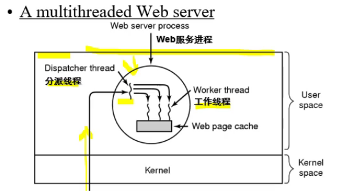

### 处理机调度与死锁


CPU利用率高


### 调度服务

####  *周转时间*=作业完成时刻—作业到达时刻

带权周转时间=周转时间/服务时间；

平均周转时间=作业周转总时间/作业个数；

平均带权周转时间=带权周转总时间/作业个数；


  


 


根据一个动态的值区响应


### HRRN

比是先来先服务与短作业优先服务的一种折中算法

第一个作业完成后求响应比 ，第二个作业完成后继续求响应比


### RP时间片调度算法


UNIX系统中，进程调度采用的技术是（ ）

动态优先数 

### 这里点问题 


环路也不是很懂

### 实时调度


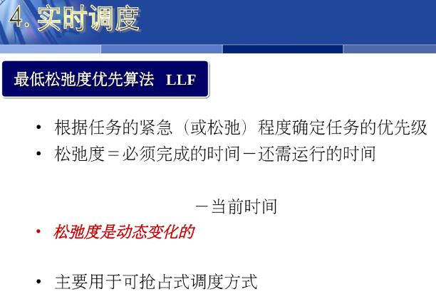


### 死锁的基本概念


 


2


### 死锁的预防


打印机是互斥的


死锁避免

找到一个顺序保证所有进程都拥有足够资源


### 银行家算法


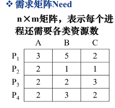


### 安全性检测


死锁检测与解除


#### 死锁解除方法


不可化简就是死锁


通常不采用(   从非死锁进程处抢夺资源   )方法来解除死锁。

### 存储器管理概述


存储管理的目的是（    ）。、

方便用户和提高内存利用率

若处理器有32位地址，则它的虚拟地址空间为（  4GB  ）字节

### 程序的装入与链接


、


### 连续分配方式


#### 动态分区分配


解决了固定分区的浪费问题


分区释放


#### 空闲分区

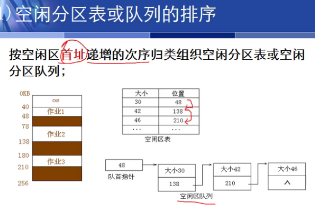


#### FF&NF


#### BF


#### 三种算法形成的队列


#### 碎片问题

固定分区会产生碎片


### 分页技术


每一页大小可以有4K

可以拥有1M的页面


地址映射

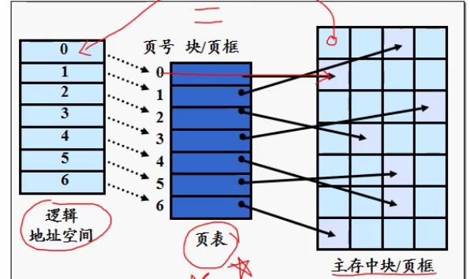


逻辑上连续的页被离散的分配在物理内存上


#### 页映射


分页式存储管理中，地址转换工作是由（ 硬件）完成的


页面长度固定并且是硬件的设计特性

#### 页信息保护


#### 快表&TLB


多级页表


二级


页地址映射过程中，内存越界保护的判断方法是将访问的逻辑地址的页号与（   页表长度寄存器   ）比较。

在页式存储管理方案下，为了加快地址映射速度引入了                        。

第一空： 

快表；TLB；转换检测缓冲

### 分段技术


#### 段表


#### 分页与分段差别


#### 特点

逻辑地址不连续的

页地址是一维，段地址是二维
分页是操作系统进行的，分段是用户确定的
各页可以分散存放在主存，每段必须占用连续的主存空间

### 段页式


### 逻辑扩充内存

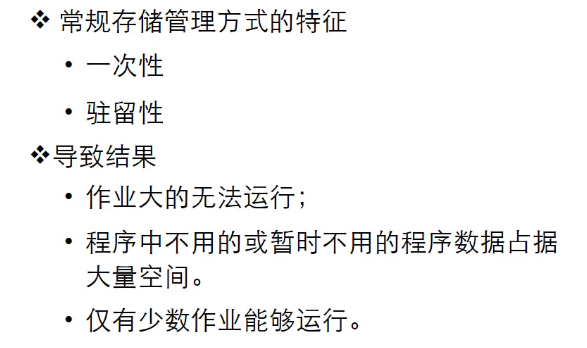


#### SWAP交换


#### 虚拟存储


区别

对换是将暂时不需要的移到外存

而虚拟存储是部分程序

### 请求分页技术


#### 中断区别

中断是程序不连续


产生六次缺页中断


---

---

调入页面来源


分配策略


#### 分配策略


请求分页存储管理中，若把页面尺寸增加一倍，在程序顺序执行时，则一般缺页中断次数会（减少）。

### 请求分页之页面置换算法

## IO系统

### 设备管理


#### I/O系统模型


#### 设备分类


####　设备控制器


通道用于内存与外设的信息传输

#### 中断处理


为不同的设备规定不同的优先级


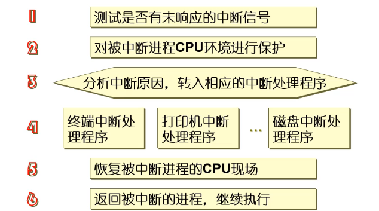

算机系统中判别是否有中断事件发生应是在(执行完一条指令后      )


当用户程序执行访管指令时，中断装置将使中央处理器（    从目态转换到管态）工作。

各类中断中，优先级高的三个中断应是（     ）。

- A、硬件故障 B、程序 C、外部 D、I/OE、访管

正确答案： ACD 我的答案：ACD

#### DMA

[DMA](https://baike.baidu.com/item/DMA/2385376)（Direct Memory Access）控制器是一种在系统内部转移数据的独特外设，可以将其视为一种能够通过一组专用总线将内部和外部存储器与每个具有DMA能力的外设连接起来的控制器。它之所以属于外设，是因为它是在处理器的编程控制下来 **执行传输的**

#### 设备驱动程序

中央处理器启动通道工作时，通过通道程序执行通道命令，这时第一条通道命令是由( CAW　）来指示的。

启动外设前必须组织好通道程序，通道程序是由若干(    CCW  )组成

通常把通道程序的执行情况记录在（   CSW）中

硬件采用了中断和通道技术，使得（ CPU 与外设能并行工作    ） 。

DMA控制方式相比中断控制方式，大大降低了中断次数，简化了中断处理工作。


#### 设备独立性与分配

为了实现设备的独立性，操作系统让用户使用（　逻辑设备名　）。

设备管理的主要程序之一是设备分配程序，当进程请求在内存和外设之间传送信息时，设备分配程序分配设备的过程通常是（  先分配设备，再分配控制器，最后分配通道  ）


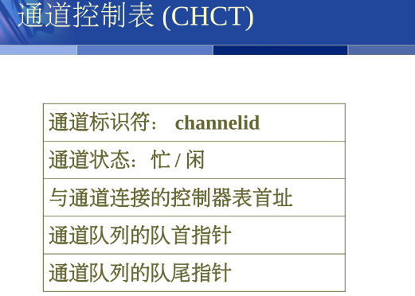


#### 缓冲技术

引入缓冲技术的主要目的是(提高CPU与设备之间的并行程度    )。

CPU输出数据的速度远远高于打印机的打印速度，为了解决这一矛盾，可采用（缓冲技术    ）。

【单选题】

操作系统采用缓冲技术，能够减少对CPU的（   中断 ）次数，从而提高资源的利用率。

软件缓冲技术包括（ 单缓冲技术 双缓冲技术 循环缓冲   缓冲池）

#### 用户IO层软件


并没有为程序分配设备，而是将输出写u人磁盘物理块

采用假脱机技术的目的是（   提高外设和主机的利用率  ）。

Spool 技术是一种实现虚拟（设备   ）的技术。

（ 通道   ）程序不是spool 系统的组成部分

## 磁盘管理

#### 磁盘组成


#### 磁盘调度


## 文件系统


分类


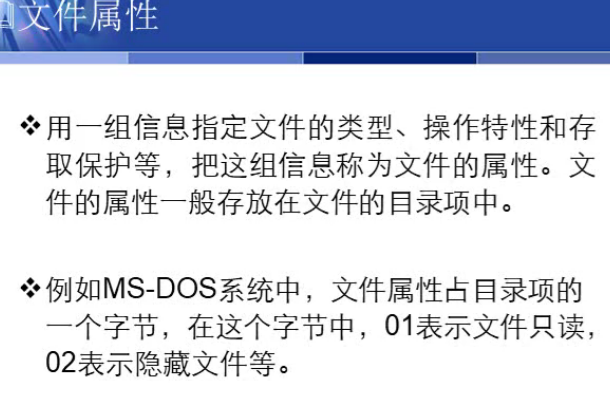


文件系统与（存储管理   ）密切相关，它们共同为用户使用文件提供方便

特别文件是与（   硬件设备 ）有关的文件

文件系统是指（  ）。文件、管理文件的软件及数据结构的总体


#### 文件逻辑结构


#### 存取方法


   从用户观点看 ）的文件组织形式称为文件的逻辑组织

UNIX系统中，采用的文件逻辑结构是（　流式文件　　）。

#### 文件物理结构


逻辑文件存放在到存储介质上时，采用的组织形式是与(    存储介质特性  )有关的。

索引式（随机）文件组织的一个主要优点是（ 能实现物理块的动态分配 ）

### 目录管理


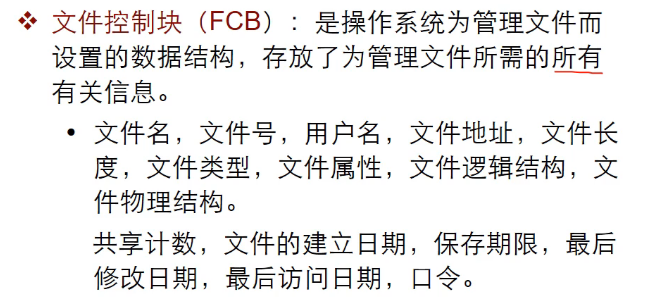


文件的存储空间管理实质上是对（ 外存空白块  ）的组织和管理的问题。

位示图法使用一个向量描述整个磁盘，向量的每一位表示一个（   物理块    ）的状态，用0或1表示该块的使用与否。

unix的磁盘空间管理方法是成组链接法。

当CPU执行操作系统代码时，称处理机处于（   A、

管态

单任务操作系统不需要进行进程上下文切换
															                                                                    	                                							    <!-- 第三级级开始  -->
																			                            									<!-- 第三级结束  -->
						                