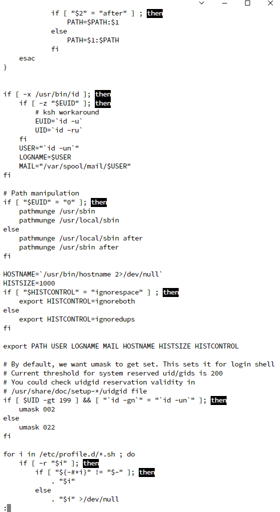

[腾讯的练习实验室](https://cloud.tencent.com/developer/labs/)

## 运维常用命令

#### ping命令 

```
ping -c 4 cloud.tencent.com
```

#### netstat 命令
netstat 命令用于显示各种网络相关信息，如网络连接, 路由表, 接口状态等等
列出所有处于监听的tcp端口

```
netstat -lt
```

查看所有的端口信息, 包括 PID 和进程名称

```
netstat -tulpn
```

#### **ps 命令**

过滤得到当前系统中的 ssh 进程信息

```
ps aux | grep 'ssh'
```

### 查询内核版本与发行商

```shell
输入"uname -a ",可显示电脑以及操作系统的相关信息。 

cat /proc/version 说明正在运行的内核版本

cat /etc/issue  说明发行商版本

lsb_release -a (适用于所有的linux，包括Redhat、SuSE、Debian等发行版，但是在debian下要安装lsb)
```


```
bash的常用功能

tab键自动补齐
管道操作

```

```
g++编译c++程序
g++ test.cpp

linux上退出python 又两种方式
exit() 与 quit ()
```



```shell
建立一个文本文件 touch test
vi  {this is test}
ln test testln 硬链接  指向的是那块区域
ln -s test testlns 软连接
ln -l
cat testln
cat testlns
```

```
tar -czvf test.tar.gz /root  创建归档文件

tar -xzf test.tar,gz -c/解压摁键
```

```
错误信息追加到test 
ls  2>test
```

```
$   PS1='[muyinchuan \w:]\$'
```

```
chmod 777  修改权限
```

```
查找文件日期比其 etc/passwd 新的文件并列出来
find /etc newer /etc/passwd
```


### 用户管理

```
useradd exam01
tail -2 /etc/passwd
```

```
#include <stdio.h>
main()
{
    for i,j,k;
    for(i=1;i<=6;i++)
    {
        for (j=1;j<=6;j++)
        {
            if(i>=j)
            {
                k=i+j;
                printf("%d+%d=%d\t",i,j,k);
            }
        }
        printf("\n");
    }
}
```

