关机命令

```
shutdown -h now
halt
init 0
```

**shell基本操作**

```
cat /etc/shells
```


`tab` 键自动补齐

`\`键强制换行

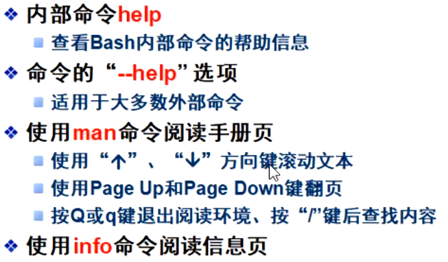

```
man +命令
查看命令手册
/字符  就是查找
```

pwd  查看工作目录

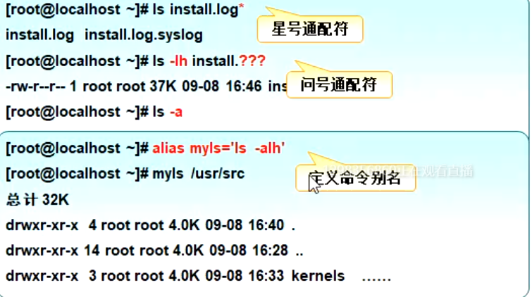


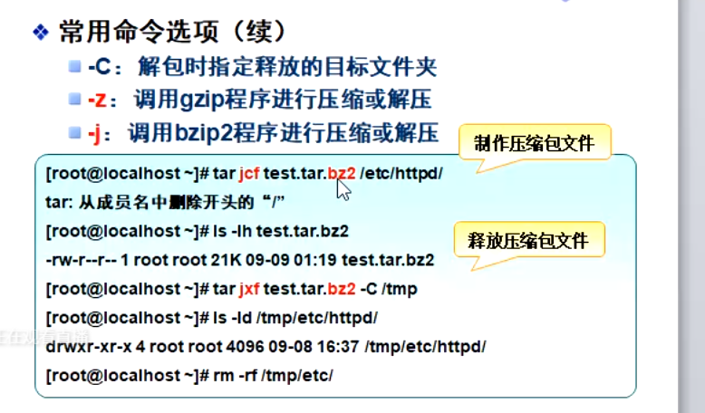

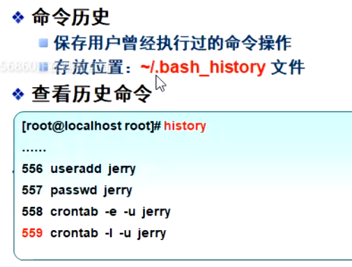

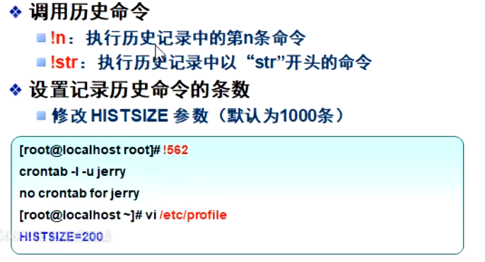

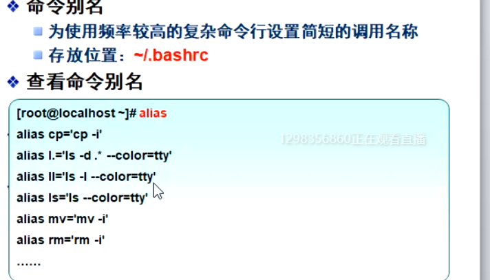


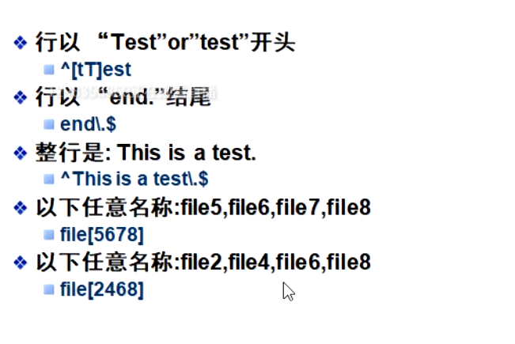


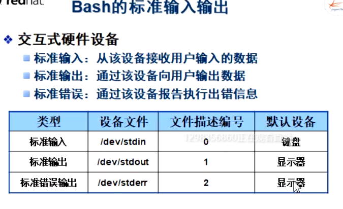

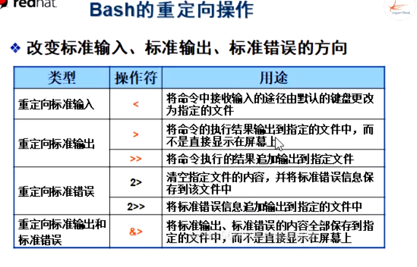

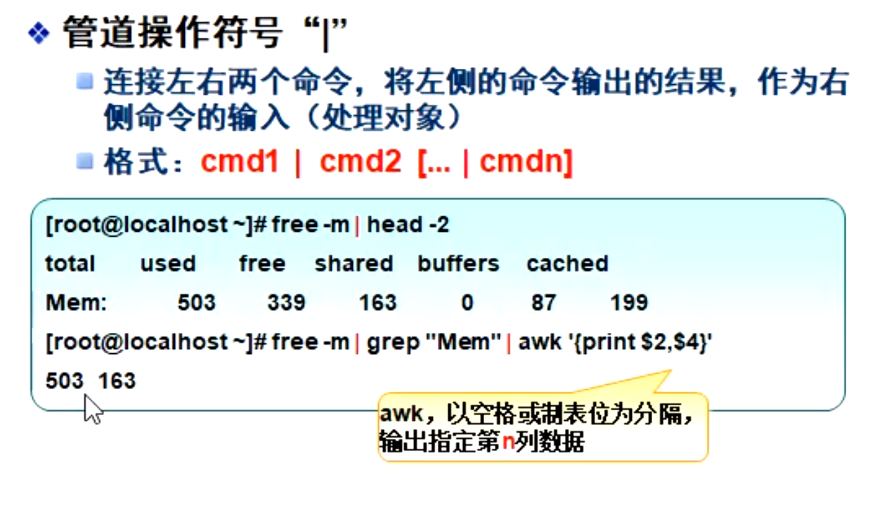


```
1. ls grep /usr/share/doc '4$'
2. grep '[0-9]' /etc/hosts
3. grep '127\.0\.0\.1' /etc/hosts
```


```
4.grep':[0-9][0-9][0-9]:'/etc/passwd
```


```
:/ TEST   查找
```


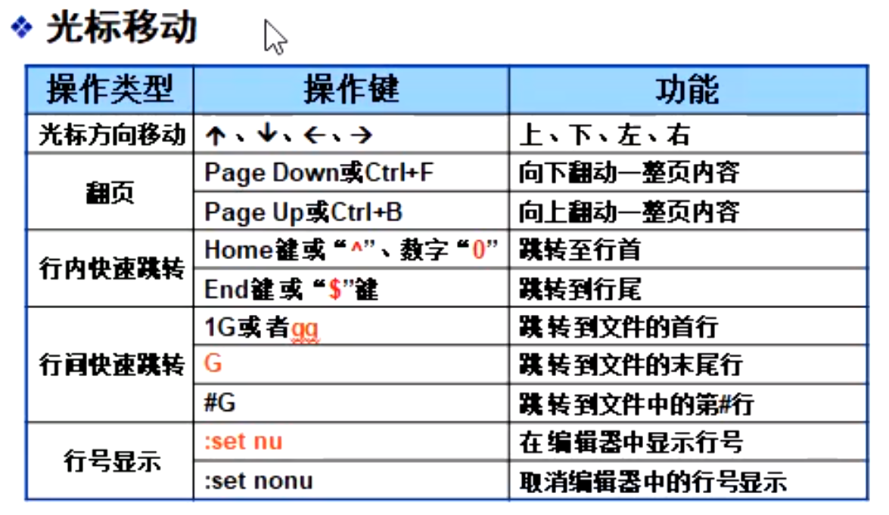


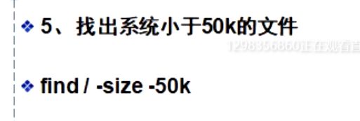

## 用户账户权限管理


#### shadow


#### useradd


#### gpasswd

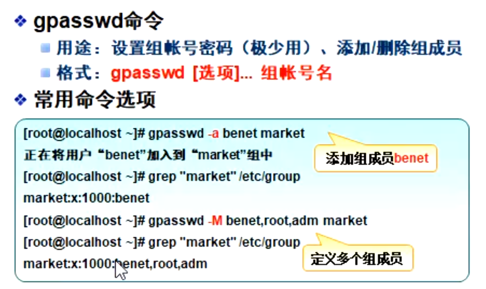


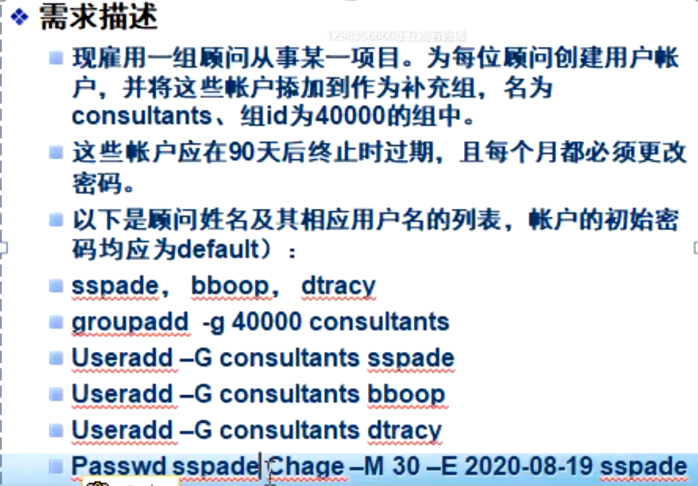


#### /etc/

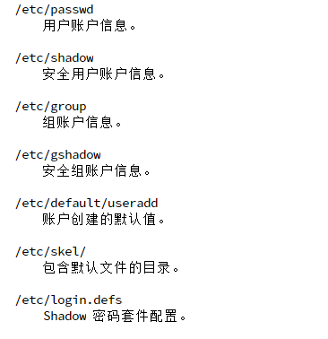

#### chown

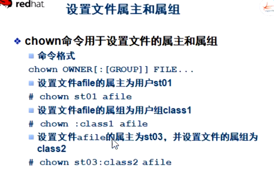


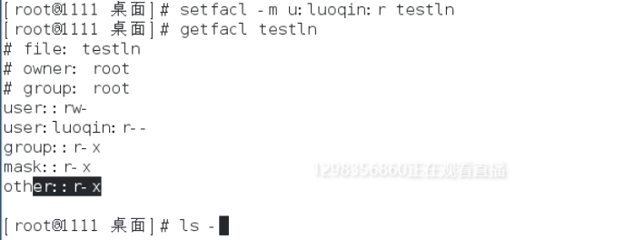


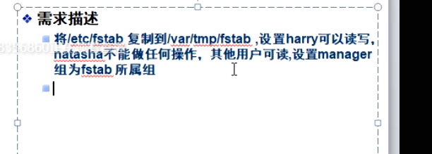


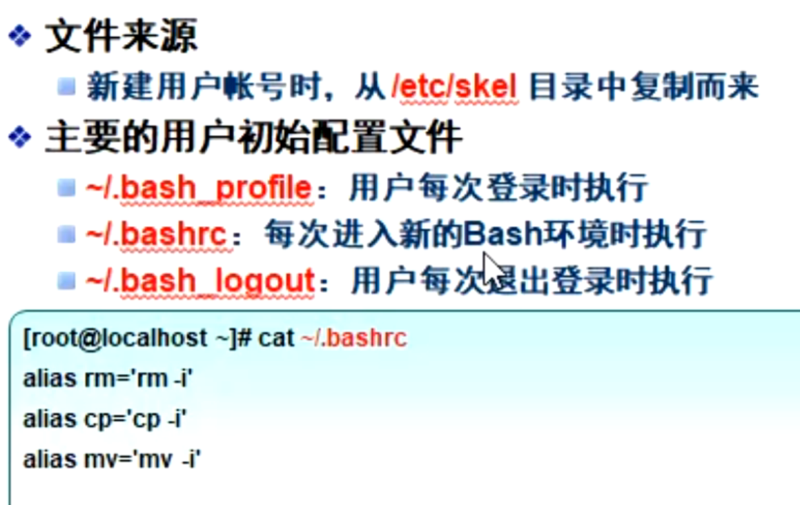


#### 密码修改passwd

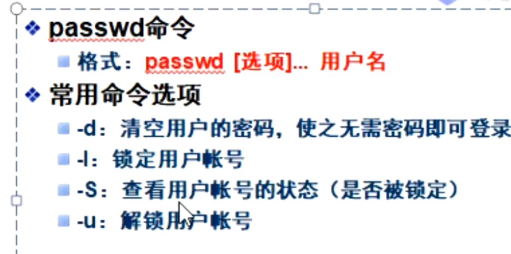


### 用户


## 第六章 磁盘与文件系统管理


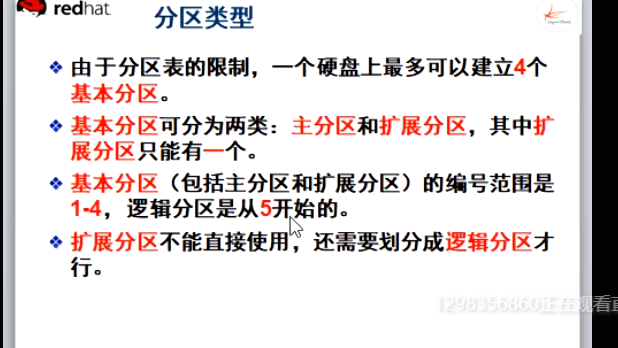

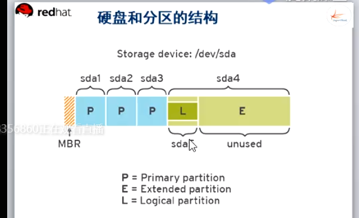


/sda1有引导分区


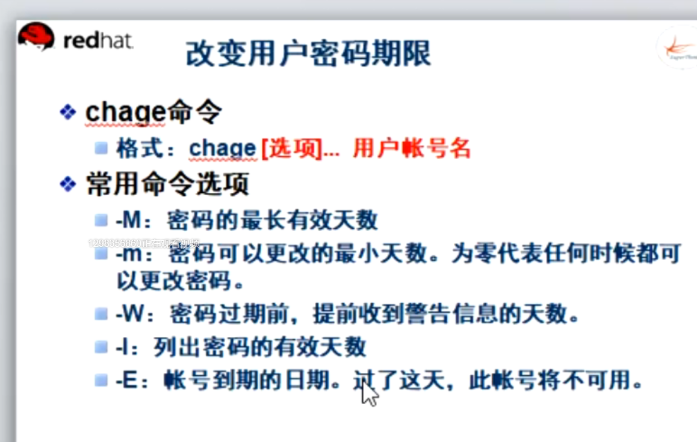


#### 挂载文件系统

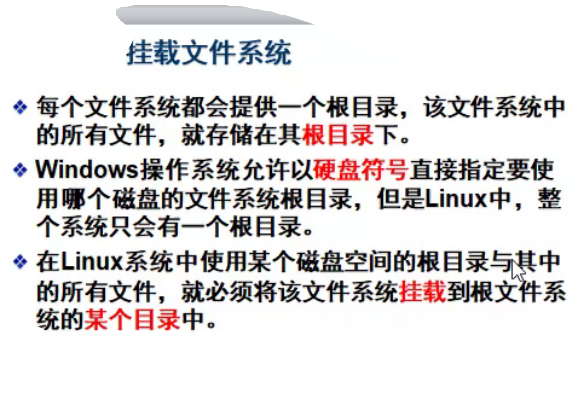


