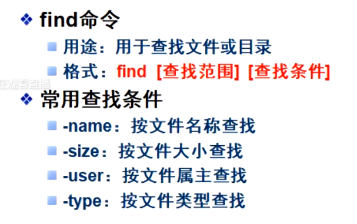
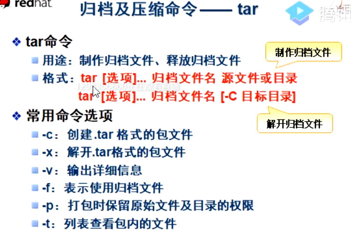
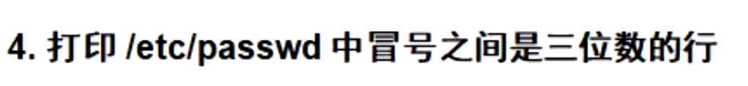
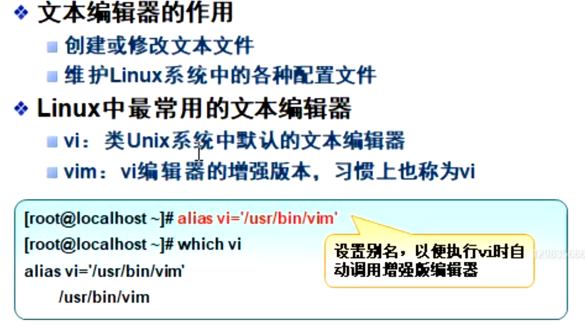
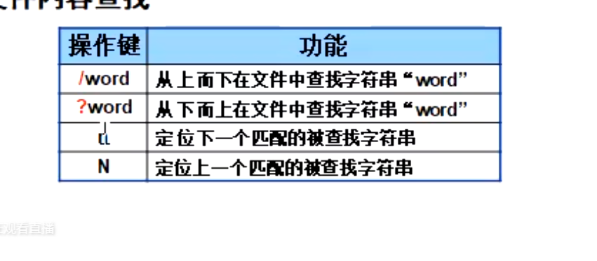
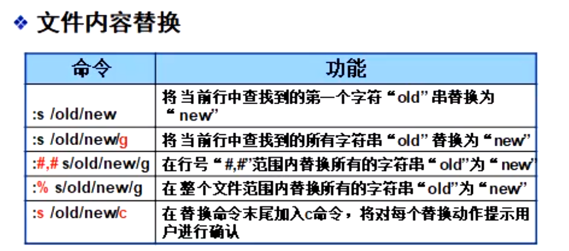
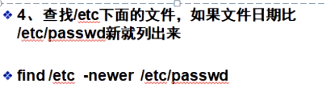
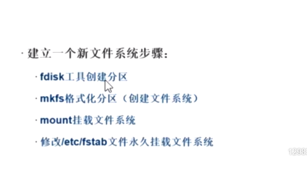
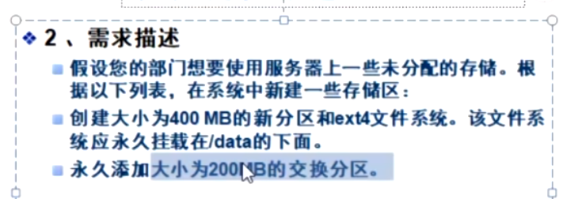
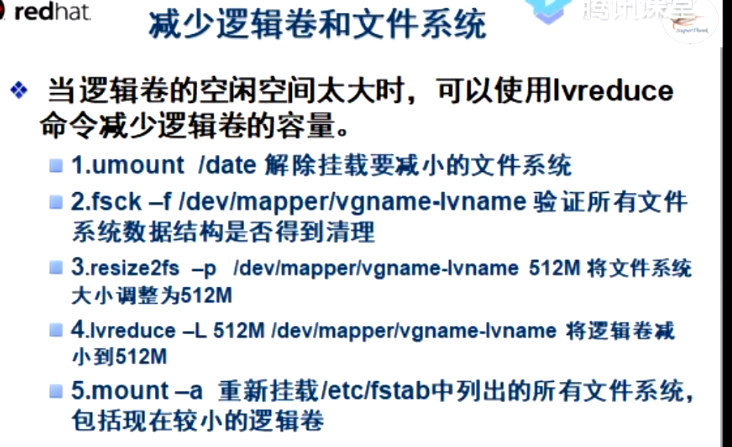

关机命令

```
shutdown -h now
halt
init 0
```

**shell基本操作**

```
cat /etc/shells
```


`tab` 键自动补齐

`\`键强制换行


```
man +命令
查看命令手册
/字符  就是查找
```

pwd  查看工作目录








```
1. ls grep /usr/share/doc '4$'
2. grep '[0-9]' /etc/hosts
3. grep '127\.0\.0\.1' /etc/hosts
```



```
4.grep':[0-9][0-9][0-9]:'/etc/passwd
```




```
:/ TEST   查找
```










## 用户账户权限管理


#### shadow


#### useradd


#### gpasswd


#### /etc/


#### chown


#### 密码修改passwd


### 用户


##### 添加用户 
ueradd  


```
passwd exam01
passwd -S exam01


```


```
usermod -l # 修改 用户名
```


#### chage


tail -3 /etc/group

可以将用户放到不同的组
groupadd 增加组


``` 
gpasswd -d  user1 luoqin
grep "luoqin "  /etc/group


```

图形化界面管理用户与组


```
system -config-users
```


```
useradd -s /sbin/nologin strit #创建一个用户不允许登录
```

文件权限


### 文件权限


用户，所属组，其他用户

### 设置目录权限


```
chmod g+x testln  # 组

chmod u+x testln  #用户

chmod o+x testln #其他
```

三位八进制

```
chmod 777
```

### chmod 设置权限


#### 场景

一个文件夹很多用户上去使用


```
setfacl -m u:muyinchuan: r testln   设置一个特权
getfcal testln
setfcal -x u:luoqin testln  
```


SUID  
chmod user s


## 第六章 磁盘与文件系统管理


/sda1有引导分区


#### 挂载文件系统


##  进程管理命令


计划任务

#### at


计划任务管理


cron 计划任务


managere 设置所宿组


## 管理交换内存


### 文件系统


linux文件系统时ext3


linux没有装文件系统,优盘


没有gcc
yum

安装文件 本地得，iosmount到文件夹


普通用户文件夹都在home/


挂载文件系统




第八次课




/dev/zero  输出全为0得文件


cat file1 file1 >file3

至少包含一个点号


## 第七章 逻辑卷


卷组至少一个pv,建好后依然可以添加pv到vg


### 逻辑卷与自动挂载





生成逻辑卷快照


第九次课最后就是进程管理


进程后台运行


#### kill


```
systemctl starrt sshd
rm-rf /avr/fyp/pub
systemctl restart 
tar -z
```


#### 网络管理

虚拟网卡打开


### 文件作为swap分区


#### /lostfound


相对路径


LVM管理命令


