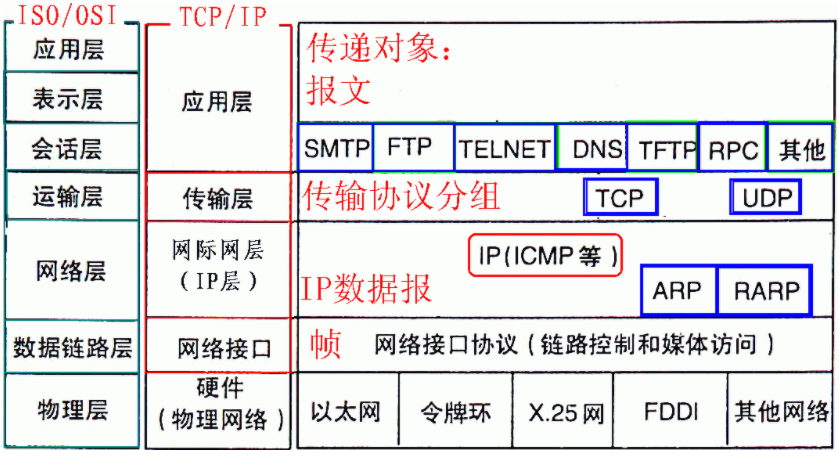

计算机网络分层


其对应相关的协议


```
1）内部私有地址，Internet上没使用的地址

A类 10.0.0.0--10.255.255.255

B类 172.16.0.0--172.31.255.255

C类 192.168.0.0--192.168.255.255
```

TCP与UDP的区别

**UDP（User Data Protocol）用户数据报协议**

1. 无连接
2. 不可靠（不能保证都送达）
3. 面向报文（UDP数据传输单位是报文，不会对数据进行拆分和拼接操作，只是给上层传来的数据加个UDP头或者给下层来的数据去掉UDP头）
4. 没有拥塞控制，始终以恒定速率发送数据
5. 支持一对一、一对多、多对多、多对一
6. 首部开销小，只有8字节

**TCP（Transmission Control Protocol）传输控制协议**

1. 有连接
2. 可靠的
3. 面向字节流
4. 全双工通信，TCP两端既可以作为发送端也可以作为接收端
5. 连接的两端只能是两个端点，即一对一，不能一对多
6. 至少20个字节，比UDP大的多




