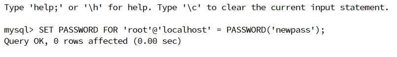

```shell
docker pull infoslack/dvwa   #拉取镜像
docker run -dt -P -e MYSQL_PASS="mypass" infoslack/dvwa # -d 后台运行 -P（大写） 随机映射端口 -e 设置环境变量 
默认账户admin 密码mypass
#-t: 为容器重新分配一个伪输入终端，通常与 -i 同时使用
#--name="nginx-lb": 为容器指定一个名称；
docker ps #查看容器id
docker start <id>#启动这个容器
docker port <id>#查看这个容器的端口映射，由于是这个随机的
```



中间访问不了数据库，于是用这个修改密码

```mysql
mysql -u root -p

SET PASSWORD FOR 'root'@'localhost' = PASSWORD('newpass');
```

其中mysql由于灭有授权远程访问

```mysql
use mysql;
select host,user from user; #查询用户权限
 update user set host = '%' where user = 'root';#给root账户开通一个所有地址访问的权限
# 此时会出现一个error ERROR 1062 (23000): Duplicate entry '%-root' for key #'PRIMARY'不用在意
flush privileges;#刷新MySQL的系统权限
quit #退出
```

