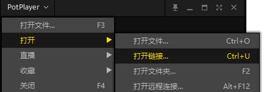

首先是下载obs直播推流软件 [OBS下载地址](https://obsproject.com/zh-cn) 

[推流工具 OBS 使用指南](https://blog.csdn.net/xinyflove/article/details/79806543)

可以通过迅雷增快下载速度

因为直播传输的是流媒体
而流媒体就需要一个软件时刻推流

然后又需要一台服务器部署rtmp直播流服务

来实现访问我们简化操作
直接利用docker拉取已经存在的镜像！

准备：你的Linux服务器上已经安装了docker

## 1 安装镜像

```
docker pull alfg/nginx-rtmp
```

## 2运行容器

```
#直接运行
docker run -it -p 1935:1935 -p 8080:80 --rm alfg/nginx-rtmp
#后台运行
docker run -it -d -p 1935:1935 -p 8080:80 --rm alfg/nginx-rtmp
```

**二、推流方式**

ok rtmp服务器 搭建成功，接下来就是推流了（这里列举三种方式）

第一种：利用OBS Studio推送直播到这个地址

rtmp://服务器ip:1935/stream/自定义名称

第二种：ffmpeg推送本地视频为直播流

ffmpeg -re -i /home/holle.flv -vcodec copy -acodec aac -ar 44100 -f flv rtmp://192.168.1.201:1935/stream/example


播放方法
1.VLC播放器可以打开
2.potplayer打开中打开链接（没有的话快去下载，十分好的一个播放器）



```
#rtmp在线播放
http://www.cutv.com/demo/live_test.swf
#上面那个好像在我测试之后就不管用了
http://www.ossrs.net/players/srs_player.html
```

```
测试地址
广东卫视：rtmp://58.200.131.2:1935/livetv/gdtv
湖南卫视：rtmp://58.200.131.2:1935/livetv/hunantv
```

```
1，RTMP协议

（1）是流媒体协议。

（2）RTMP协议是 Adobe 的私有协议，未完全公开。

（3）RTMP协议一般传输的是 flv，f4v 格式流。

（4）RTMP一般在 TCP 1个通道上传输命令和数据。
```

参考博客：

[利用docker搭建rtmp直播流](https://blog.csdn.net/lipei1220/article/details/80234281?utm_medium=distribute.pc_relevant.none-task-blog-BlogCommendFromMachineLearnPai2-1.nonecase&depth_1-utm_source=distribute.pc_relevant.none-task-blog-BlogCommendFromMachineLearnPai2-1.nonecase)

[dockers中搭建rtmp直播流](https://blog.csdn.net/wang3375/article/details/92442672)

[快速搭建自己的直播服务器](https://blog.csdn.net/wjwj1203/article/details/82664981)

[快速搭建自己的直播服务器，完成属于你的直播服务](https://blog.csdn.net/wjwj1203/article/details/104608243)

```
#github代下载服务
https://g.widora.cn/
http://gg.widyun.com/
```

问题，如何将这个网页放在html上

这个好像可以在服务器上利用videoJs实现

本人参考了很多博客但没有去实现！（主要是太菜了）
提供几个参考博客的点

[HTML 直播 RTMP流实时播放](https://blog.csdn.net/qq_27933251/article/details/100934296)

[videojs rtmp码流播放](https://blog.csdn.net/qq_27404929/article/details/95305644)

[jw player 视频播放使用入门](https://www.jianshu.com/p/53b2a12779a5)


进阶博客参考

[利用nginx搭建RTMP视频点播、直播、HLS服务器](http://www.voidcn.com/article/p-pwuwzcpa-hh.html)

**[手把手教你搭建一个直播服务器(Nginx+Rtsp)](https://blog.csdn.net/IOT_SHUN/article/details/79684856)**

[Android 如何直播RTMP流](https://blog.csdn.net/bboyfeiyu/article/details/45719089#reply)


高阶教程
[1.本地直播平台搭建的四种方法 ](https://blog.csdn.net/weixin_41010198/article/details/84141512?utm_medium=distribute.pc_relevant.none-task-blog-BlogCommendFromMachineLearnPai2-3.nonecase&depth_1-utm_source=distribute.pc_relevant.none-task-blog-BlogCommendFromMachineLearnPai2-3.nonecase)

[2.window下搭建教程](https://blog.csdn.net/never715/article/details/74078954)

[3.window下的简介部署](https://blog.csdn.net/u012359498/article/details/93981933)  （推荐本地搭建参考这个博客）

[4.nginx.conf中关于nginx-rtmp-module配置指令详解](https://www.cnblogs.com/lidabo/p/7099501.html)（详细介绍了rtmp config中的代码含义）

这里介绍一下window本地局域网搭建的问题
[1. 本地没有在防火墙中开放端口](https://jingyan.baidu.com/article/86fae3460992de3c49121a0d.html)

2.本地不能在除外服务器外的电脑上推流

可能是config配置 没有开放其他地址推送的权限(下面这个代码很明显就是没有开)

```
rtmp {
    server {
        listen 1935;#监听端口,若被占用,可以更改
        chunk_size 4000;#上传flv文件块儿的大小
        application live { #创建一个叫live的应用
             live on;#开启live的应用
             allow publish 127.0.0.1;#只允许本地推流
             allow play all;#允许所有地址播放
             #这里有问题还是参考高阶教程的第四点
        }
    }
}
```

**allow publish 127.0.0.1;** 不妨添加一个all publish all

**all publish all;**


推流测试地址


免费开放本人服务器

[rtmp://101.200.46.43:1935/stream/](rtmp://101.200.46.43:1935/stream/)

（本人采用轻量级应用服务器，自己搞了很多东西，延迟很高）

好像你也可以向那些开放测试的rtmp推流


比如上面那个湖蓝卫视测试地址去掉后面那个密钥。不就是推流地址（手动狗头🐕）

```
rtmp://58.200.131.2:1935/livetv/
```

不过我试了下好像能推流但是播放不了！