#### 导出表

导出表的结构体

前四个字节是地址，后四个字节是大小

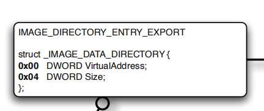


#### 扩大节

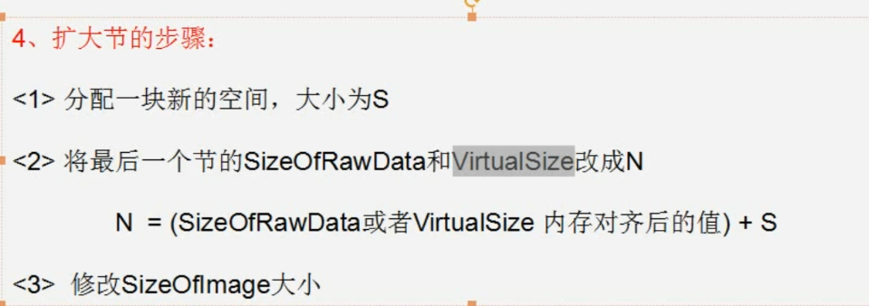


#### PE头


文件属性


#### 扩展PE头


1.可执行文件
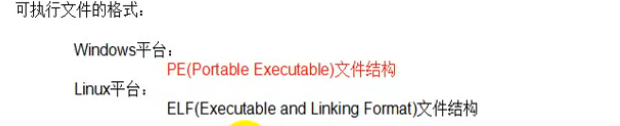

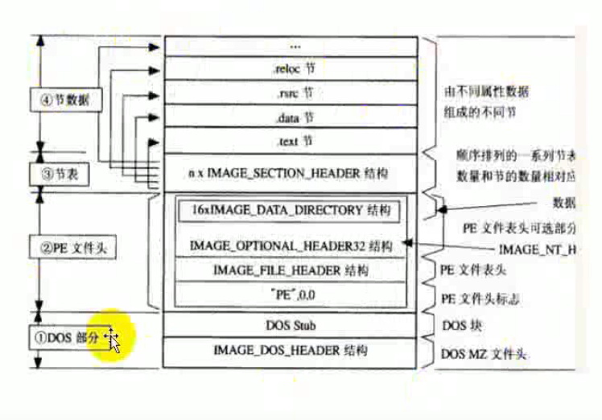

#### dos_header结构体（共64字节）

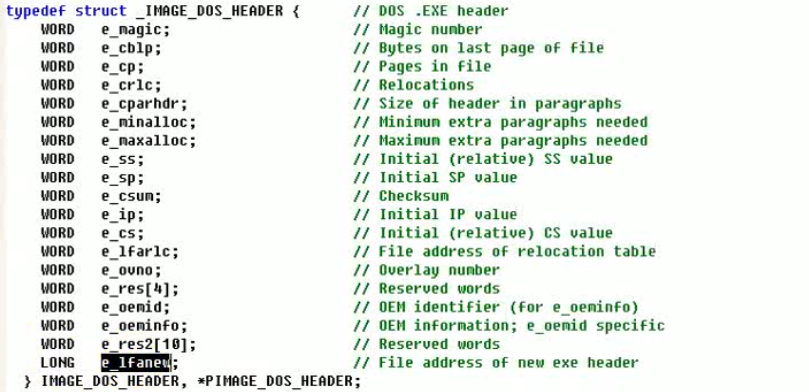

最后四个字节就是pe头的位置

与pe头的中间位置就是这个DOS块，可以随便改

#### PE文件头

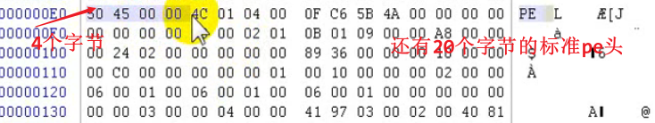

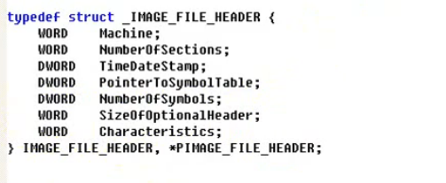

标准pe头占20个字节

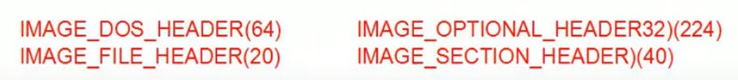

之后是224个字节的扩展PE头

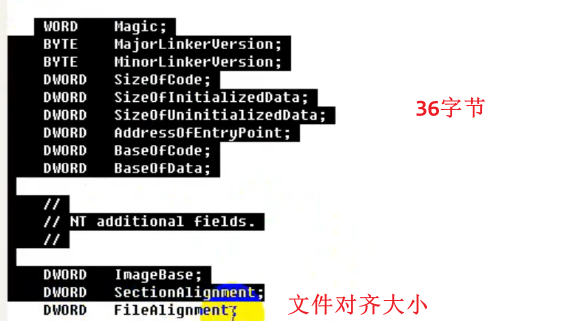

大于200就是400，文件对齐便于数据处理

#### 节表

一个节表是40个字节

size of rawdata 文件中对齐的大小

```
1、Name	8个字节 一般情况下是以"\0"结尾的ASCII吗字符串来标识的名称，内容可以自定义.									
										
注意：该名称并不遵守必须以"\0"结尾的规律，如果不是以"\0"结尾，系统会截取8个字节的长度进行处理.										
										
2、Misc  双字 是该节在没有对齐前的真实尺寸,该值可以不准确。										
										
3、VirtualAddress 节区在内存中的偏移地址。加上ImageBase才是在内存中的真正地址.										
										
4、SizeOfRawData  节在文件中对齐后的尺寸.										
										
5、PointerToRawData 节区在文件中的偏移.										
										
6、PointerToRelocations 在obj文件中使用 对exe无意义										
										
7、PointerToLinenumbers 行号表的位置 调试的时候使用										
										
8、NumberOfRelocations 在obj文件中使用  对exe无意义										
										
9、NumberOfLinenumbers 行号表中行号的数量 调试的时候使用										
										
10、Characteristics 节的属性	
```

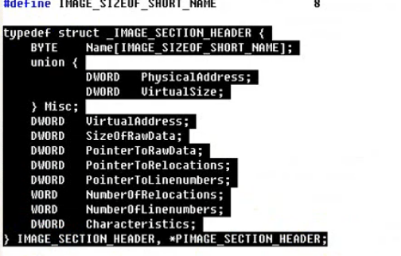


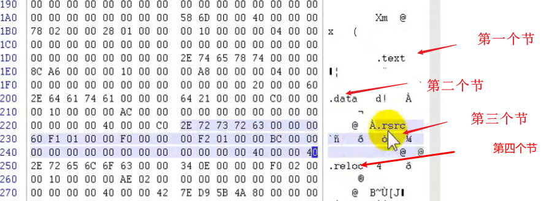

4个节表后面就是编译器插入的一些东西

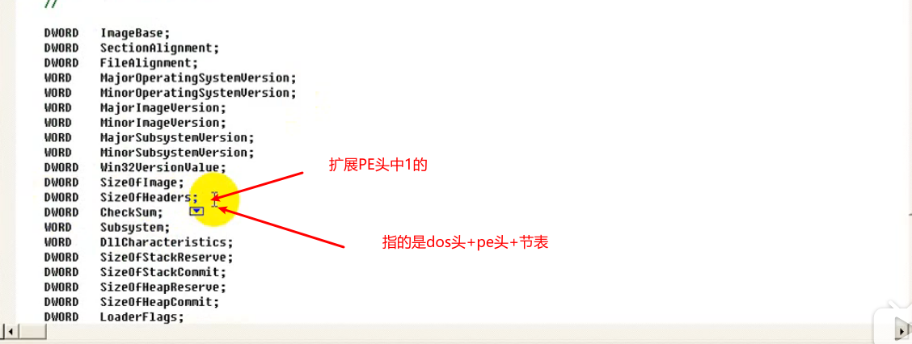

按照文件对齐分配空间

内存对齐

#### 新增节的步骤

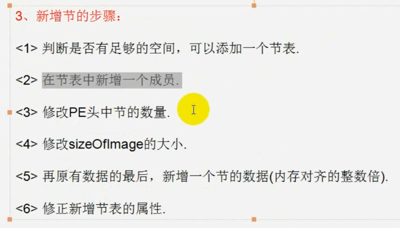

#### shellcode

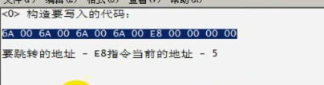

#### 合并节