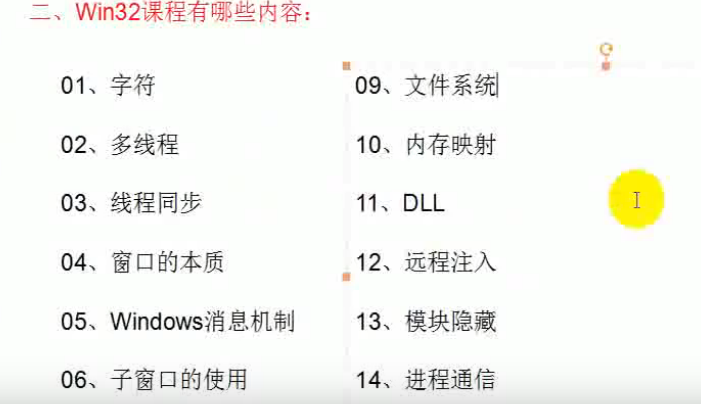

#### win32api


**Kernel32.dll**  核心模块，进程管理，线程管理

**User32.dll**   window用户界面相关程序接口

**Gdi32.dll**   windows船舰窗口 图形化设备接口


```
#include<windows.h>
```


#### 字符编码

##### 1.ASCLL编码

简体中文下ascll扩展gb2312

在不同国家流传会出现乱码

##### 2.UNICODE编码

包含全世界的所有文字符号

编码范围：0-0x10f  

问题：unicode 仅仅是个符号集 ，没有解决存储问题

一般默认的存储方式位utf-16

##### 3.utf-8,utf-16

unicode 通过八位或者十六位存储

**utf-16** 编码以16位无符号整数为单位 ，占两个字节

###### utf-8

编码形式


###### utf-32

32位为一组

##### 判断文件的存储格式

| utf-8    | EF BB BF |
| -------- | -------- |
| utf-16LE | FF FE    |
| utf-16BE | FE FF    |


#### 2.c语言中的字符

